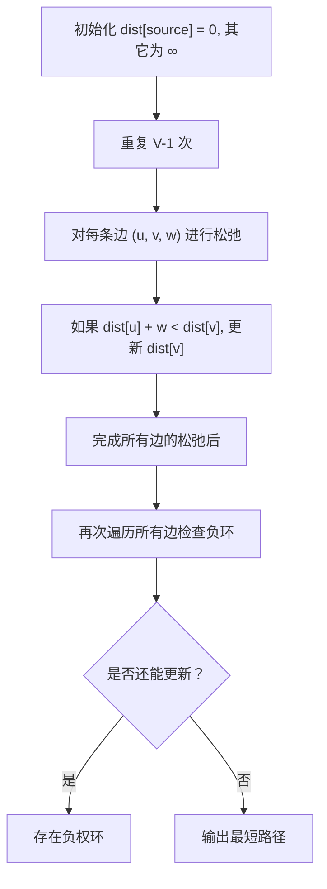
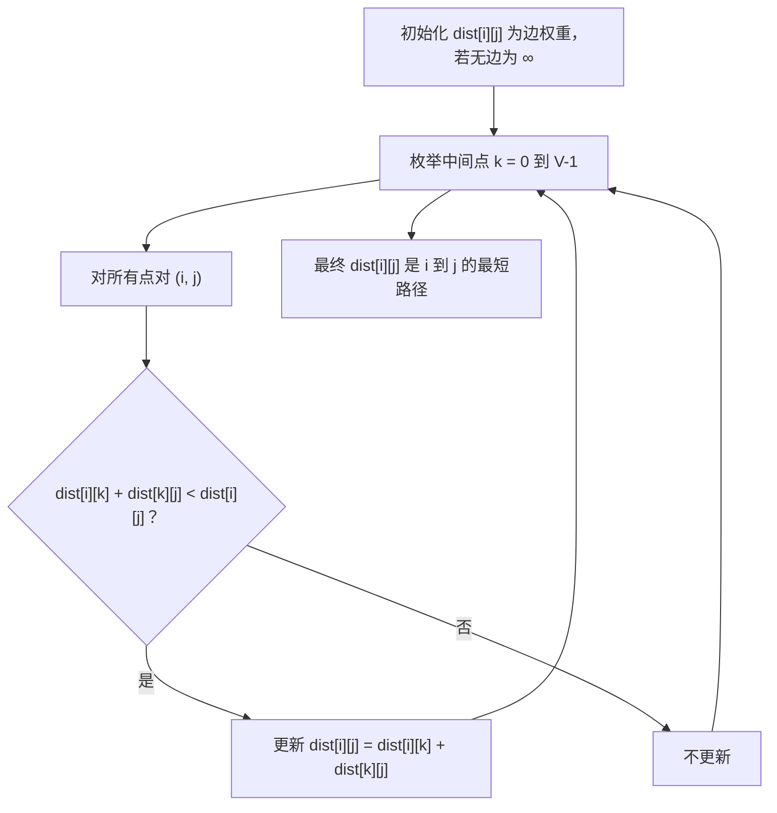

# Week9~12 图论：连接万物的图

*Updated 2026-04-24 22:30 GMT+8*  
 *Compiled by Hongfei Yan (2025 winter)*  


> Logs:
>
> 2025/5/5 重构了Bellman-Ford算法、Floyd-Warshall算法。让示例或者练习程序，尽量贴近算法讲解文字。
>
> 2024/4/17 重构了目录，主要是把图算法分成了 基本图算法、更多图算法
>
> 2024/4/7 打*的章节，可以跳过，可能超纲了。
>
> 2024/4/5 数算重点是树、图、和算法。图这部分重点是算法，因为图的主要表示方式——邻接表，树也使用。
>
> 其中涉及到矩阵存储的图遍历，基本都是计概题目。


**图论 (Graph theory)** 是数学的一个分支，图是图论的主要研究对象．**图 (Graph)** 是由若干给定的顶点及连接两顶点的边所构成的图形，这种图形通常用来描述某些事物之间的某种特定关系．顶点用于代表事物，连接两顶点的边则用于表示两个事物间具有这种关系．

假设正在开发一个类似微信的社交应用。在微信中，用户之间可以互加“好友”——这种关系是**双向的**：如果 Alice 是 Bob 的好友，那么 Bob 也一定是 Alice 的好友。

那么，如何高效地存储和查询这些关系呢？

一种朴素的做法是用一个二维列表来记录每一对好友关系：

```python
relationships = [
    ["Alice", "Bob"],
    ["Bob", "Cynthia"],
    ["Alice", "Diana"],
    ["Bob", "Diana"],
    ["Elise", "Fred"],
    ["Diana", "Fred"],
    ["Fred", "Alice"]
]
```

但这种方法存在明显缺陷：若想找出 Alice 的所有好友，必须遍历整个列表，逐条检查是否包含 "Alice"，再把另一方收集到结果中（例如 Bob、Diana 和 Fred）。判断 Elise 是否是 Alice 的好友，同样需要完整扫描。这种操作的时间复杂度是 **O(N)**，当用户量庞大时，效率极低。

其实，有一种更优的数据结构可以解决这个问题——**图（Graph）**。借助图，我们可以在 **O(1)** 时间内快速获取任意用户的所有好友。

------

**图：表达关系的天然工具**

图是一种专门用于表示“关系”的数据结构，由**顶点（Vertex）**和**边（Edge）**组成。在微信的语境下：

- 每个用户是一个**顶点**；
- 每对互为好友的关系是一条**无向边**（因为好友关系是相互的）；
- 若两个用户通过一条边相连，就称他们是**相邻的**。

实现图的方式有很多，其中最直观的一种是使用**字典（哈希表）**。例如，用 Python 表示上述微信好友网络：

```python
friends = {
    "Alice":   ["Bob", "Diana", "Fred"],
    "Bob":     ["Alice", "Cynthia", "Diana"],
    "Cynthia": ["Bob"],
    "Diana":   ["Alice", "Bob", "Fred"],
    "Elise":   ["Fred"],
    "Fred":    ["Alice", "Diana", "Elise"]
}
```

现在，只需一行代码即可在常数时间内查出 Alice 的所有好友：

```python
friends["Alice"]  # → ['Bob', 'Diana', 'Fred']
```

------

**有向关系：微信公众号的关注模型**

除了双向好友关系，微信还支持**单向关注**——比如用户关注公众号。此时，关系不再是相互的：用户可以关注“科技前沿”公众号，但公众号不会“关注回”用户。

这类关系需要用**有向图**来建模，边带有方向性。例如：

- Alice 关注了 “TechNews” 和 “健康生活”；
- “TechNews” 被 Bob 和 Cynthia 关注；
- 但 “TechNews” 本身不关注任何人。

用字典表示如下：

```python
subscriptions = {
    "Alice": ["TechNews", "健康生活"],
    "Bob":   ["TechNews"],
    "Cynthia": ["TechNews"]
}
```

注意：这里只记录“谁关注了谁”，而不反向建立连接，体现了关系的**单向性**。

------

**更健壮的面向对象实现**

虽然字典足够简洁，但在实际系统中，使用类（Class）封装会更灵活、可扩展。以下是一个基于微信好友关系的面向对象实现：

```python
class WeChatUser:
    def __init__(self, name):
        self.name = name
        self.friends = set()      # 好友集合（无向）
        self.subscriptions = set() # 关注的公众号（有向）

    def add_friend(self, other):
        """添加双向好友关系"""
        self.friends.add(other)
        other.friends.add(self)

    def subscribe(self, official_account):
        """关注公众号（单向）"""
        self.subscriptions.add(official_account)
```

使用示例：

```python
alice = WeChatUser("Alice")
bob = WeChatUser("Bob")
tech_news = "TechNews"

alice.add_friend(bob)           # 互为好友
alice.subscribe(tech_news)      # 关注公众号

print([f.name for f in alice.friends])       # → ['Bob']
print(list(alice.subscriptions))             # → ['TechNews']
```

------

通过图结构，无论是处理微信中的双向好友，还是单向的公众号关注，都能以高效、清晰的方式建模现实世界的复杂关系。这正是图作为“连接万物”的数据结构的强大之处。


> 这可以是笔试判断题：
>
> 计算机存储器线性编址的简单性与程序逻辑的复杂性之间的鸿沟，导致了数据结构的必要性。✅
>
> 取自：李晓明. 为什么会有“数据结构”？计算机教育，2019-01-18 


<center>图的知识图谱</center>


# 一、图的概念、表示方法

图论是数学的一个分支，主要研究图的性质以及图之间的关系。在与数据结构和算法相关的内容中，图论涵盖了以下几个方面：

1. **图的表示**：图可以用不同的数据结构来表示，包括邻接矩阵、邻接表、关联矩阵等。这些表示方法影响着对图进行操作和算法实现的效率。

2. **图的遍历**：图的遍历是指从图中的某个顶点出发，访问图中所有顶点且不重复的过程。常见的图遍历算法包括深度优先搜索（DFS）和广度优先搜索（BFS）。

3. **最短路径**：最短路径算法用于找出两个顶点之间的最短路径，例如 Dijkstra 算法和 Floyd-Warshall 算法。这些算法在网络路由、路径规划等领域有广泛的应用。

4. **最小生成树**：最小生成树算法用于在一个连通加权图中找出一个权值最小的生成树，常见的算法包括 Prim 算法和 Kruskal 算法。最小生成树在网络设计、电力传输等领域有着重要的应用。

   > **生成树（spanning tree）**：一个连通无向图的生成子图，同时要求是树．也即在图的边集中选择 𝑛 −1 条，将所有顶点连通．

5. **拓扑排序**：拓扑排序算法用于对有向无环图进行排序，使得所有的顶点按照一定的顺序排列，并且保证图中的边的方向符合顺序关系。拓扑排序在任务调度、依赖关系分析等领域有重要的应用。

6. **图的连通性**：图的连通性算法用于判断图中的顶点是否连通，以及找出图中的连通分量。这对于网络分析、社交网络分析等具有重要意义。

这些内容是图论在数据结构与算法领域的一些重要内容，它们在计算机科学和工程领域有广泛的应用。


## 1 术语和定义

图是更通用的结构；事实上，可以把树看作一种特殊的图。图可以用来表示现实世界中很多有意思的事物，包括道路系统、城市之间的航班、互联网的连接，甚至是计算机专业的一系列必修课。<mark>图一旦有了很好的表示方法，就可以用一些标准的图算法来解决那些看起来非常困难的问题</mark>。

尽管我们能够轻易看懂路线图并理解其中不同地点之间的关系，但是计算机并不具备这样的能力。不过，我们也可以将路线图看成是一张图，从而使计算机帮我们做一些非常有意思的事情。用过互联网地图网站的人都知道，计算机可以帮助我们找到两地之间最短、最快、最便捷的路线。例如：燕园校区→新燕园校区


计算机专业的学生可能会有这样的疑惑：自己需要学习哪些课程才能获得学位呢？图可以很好地表示课程之间的依赖关系。图1展示了要获得计算机科学学位，所需学习课程的先后顺序。


<center>图1 计算机课程的学习顺序</center>


抽象出来看，**图（Graph）**由**顶点（Vertex）**和**边（Edge）**组成，每条边的两端都必须是图的两个顶点(可以是相同的顶点)。而记号 G(V,E)表示图 G 的顶点集为 V、边集为 E。图 2 是一个抽象出来的图。


<center>图2 抽象出来的图</center>


一般来说，图可分为有向图和无向图。有向图的所有边都有方向，即确定了顶点到顶点的一个指向；而无向图的所有边都是双向的，即无向边所连接的两个顶点可以互相到达。<mark>在一些问题中，可以把无向图当作所有边都是正向和负向的两条有向边组成</mark>，这对解决一些问题很有帮助。图 3是有向图和无向图的举例。


<center> 图3 无向图与有向图 </center>


**顶点Vertex**
顶点又称节点，是图的基础部分。它可以有自己的名字，称作“键”。顶点也可以带有附加信息，称作“有效载荷”。

**边Edge**
边是图的另一个基础部分。两个顶点通过一条边相连，表示它们之间存在关系。边既可以是单向的，也可以是双向的。如果图中的所有边都是单向的，称之为有向图。图1明显是一个有向图，因为必须修完某些课程后才能修后续的课程。

**度Degree**

顶点的度是指和该顶点相连的边的条数。特别是对于有向图来说，顶点的出边条数称为该顶点的出度，顶点的入边条数称为该顶点的入度。例如图 3 的无向图中，V1的度为 2,V5的度为 4；有向图例子中，V2的出度为 1、入度为 2。

**权值Weight**

顶点和边都可以有一定属性，而量化的属性称为权值，顶点的权值和边的权值分别称为点权和边权。权值可以根据问题的实际背景设定，例如点权可以是城市中资源的数目，边权可以是两个城市之间来往所需要的时间、花费或距离。

有了上述定义之后，再来正式地定义**图Graph**。图可以用G来表示，并且G = (V, E)。其中，V是一个顶点集合，E是一个边集合。每一条边是一个二元组(v, w)，其中w, v∈V。可以向边的二元组中再添加一个元素，用于表示权重。子图s是一个由边e和顶点v构成的集合，其中e⊂E且v⊂V。

图4 展示了一个简单的带权有向图。我们可以用6个顶点和9条边的两个集合来正式地描述这个图：

$V = \left\{ V0,V1,V2,V3,V4,V5 \right\}$

$\begin{split}E = \left\{ \begin{array}{l}(v0,v1,5), (v1,v2,4), (v2,v3,9), (v3,v4,7), (v4,v0,1), \\
             (v0,v5,2),(v5,v4,8),(v3,v5,3),(v5,v2,1)
             \end{array} \right\}\end{split}$


<center>图4 简单的带权有向图</center>


图4中的例子还体现了两个重要的概念。

**路径Path**
路径是由边连接的顶点组成的序列。路径的正式定义为$w_1, w_2, ···, w_n$，其中对于所有的1≤i≤n-1，有$(w_i, w_{i+1})∈E$。无权重路径的长度是路径上的边数，有权重路径的长度是路径上的边的权重之和。以图4为例，从 V3到 V1的路径是顶点序列 (V3, V4, V0, V1)，相应的边是 {(v3, v4,7), (v4, v0,1), (v0, v1,5)}。

**环Cycle**
环是有向图中的一条起点和终点为同一个顶点的路径。例如，图4中的路径 (V5, V2, V3, V5) 就是一个环。没有环的图被称为无环图，没有环的有向图被称为 <mark>有向无环图，简称为DAG (Directed Acyclic Graph)</mark>。接下来会看到，DAG能帮助我们解决很多重要的问题。


### 1.1 编程题目

#### 示例sy374: <mark>无向图</mark>的度 简单

https://sunnywhy.com/sfbj/10/1/374

现有一个共n个顶点、m条边的无向图（假设顶点编号为从`0`到`n-1`），求每个顶点的度。

**输入**

第一行两个整数n、m（$1 \le n \le 100,0 \le m \le \frac{n(n-1)}2$），分别表示顶点数和边数；

接下来m行，每行两个整数u、v（$0 \le u \le n-1,0 \le v \le n-1, u \ne v$），表示一条边的两个端点的编号。数据保证不会有重边。

**输出**

在一行中输出n个整数，表示编号为从`0`到`n-1`的顶点的度。整数之间用空格隔开，行末不允许有多余的空格。

样例1

输入

```
3 2
0 1
0 2
```

输出

```
2 1 1
```

解释

对应的无向图如下图所示，`0`号顶点的度为`2`，`1`号和`2`号顶点的度为`1`。


为了求解每个顶点的度，创建一个列表来存储每个顶点的度，初始值都为0。然后，对于每条边，将边的两个端点的度都加1。

以下是实现这个过程的Python代码：

```python
n, m = map(int, input().split())
degrees = [0] * n
for _ in range(m):
    u, v = map(int, input().split())
    degrees[u] += 1
    degrees[v] += 1

print(' '.join(map(str, degrees)))
```

这段代码首先读取输入，然后创建一个列表来存储每个顶点的度。然后，它遍历每条边，将边的两个端点的度都加1。最后，它输出每个顶点的度。


#### 示例sy375: <mark>有向图</mark>的度 简单

https://sunnywhy.com/sfbj/10/1/375

现有一个共n个顶点、m条边的有向图（假设顶点编号为从`0`到`n-1`），求每个顶点的入度和出度。

**输入**

第一行两个整数n、m（$1 \le n \le 100,0 \le m \le n(n-1)$），分别表示顶点数和边数；

接下来m行，每行两个整数u、v（$0 \le u \le n-1,0 \le v \le n-1, u \ne v$），表示一条边的两个端点的编号。数据保证不会有重边。

**输出**

输出行，每行为编号从`0`到`n-1`的一个顶点的入度和出度，中间用空格隔开。

样例1

输入

```
3 3
0 1
0 2
2 1
```

输出

```
0 2
2 0
1 1
```

解释

对应的有向图如下图所示。

`0`号顶点有`0`条入边，`2`条出边，因此入度为`0`，出度为`2`；

`1`号顶点有`2`条入边，`0`条出边，因此入度为`2`，出度为`0`；

`2`号顶点有`1`条入边，`1`条出边，因此入度为`1`，出度为`1`。


为了求解每个顶点的入度和出度，我们可以创建两个列表来分别存储每个顶点的入度和出度，初始值都为0。然后，对于每条边，我们将起点的出度加1，终点的入度加1。

以下是实现这个过程的Python代码：

```python
n, m = map(int, input().split())
in_degrees = [0] * n
out_degrees = [0] * n
for _ in range(m):
    u, v = map(int, input().split())
    out_degrees[u] += 1
    in_degrees[v] += 1

for i in range(n):
    print(in_degrees[i], out_degrees[i])
```

这段代码首先读取输入，然后创建两个列表来存储每个顶点的入度和出度。然后，它遍历每条边，将边的起点的出度加1，终点的入度加1。最后，它输出每个顶点的入度和出度。


## 2 图的表示方法


图的抽象数据类型由下列方法定义。

❏ Graph() 新建一个空图。
❏ add_vertex(vert) 向图中添加一个顶点实例。
❏ add_edge(from_vert, to_vert) 向图中添加一条有向边，用于连接图中两个顶点。
❏ add_edge(from_ert, to_vert, weight) 向图中添加一条带权重的有向边，用于连接两个顶点。
❏ get_vertex(vert_key) 在图中找到名为vert_key的顶点。
❏ get_vertices() 以列表形式返回图中所有顶点。
❏ in 通过 vertex in graph 这样的语句，在顶点存在时返回True，否则返回False。

根据图的正式定义，可以通过多种方式在Python中实现图的抽象数据类型（ADT）。在使用不同的表达方式来实现图的抽象数据类型时，需要做很多取舍。有两种非常著名的图实现，它们分别是邻接矩阵 **adjacency matrix** 和邻接表**adjacency list**。本节会解释这两种实现，并且用 Python 类来实现邻接表。


### 引言：dict套list, dict套queue，dict套dict

真好用！

> 确实，Python 中的字典（`dict`）是非常灵活和强大的数据结构，可以用于构建各种复杂的数据结构。
>
> 1. **Dict套List**：
>   - 可以用字典来表示多个对象的集合，其中每个对象都有一个唯一的键，而值则是一个列表，存储相关的数据。
>    - 例如，可以使用字典来表示学生和他们的成绩列表：`{"张三": [90, 85, 95], "李四": [88, 92, 90]}`。
> 
> 2. **Dict套Queue**：
>   - 可以用字典来实现队列的功能，其中字典的键可以表示队列中的元素，而值则是用于实现队列操作的相关信息。
>    - 例如，可以使用字典来实现一个任务队列，其中键是任务名称，值是任务的优先级或其他相关信息。
>    - 例如，27925:小组队列，http://cs101.openjudge.cn/practice/27925/
> 
> 3. **Dict套Dict**：
>       - 可以用字典来表示更复杂的数据结构，例如树、图等。其中外层字典的键可以表示节点或顶点，而值则是另一个字典，存储该节点或顶点的属性以及与之相关联的其他节点或顶点。
>    - 例如，可以使用字典来表示图，其中外层字典的键是节点，内层字典的键是该节点与其他节点之间的边，值是边的权重或其他相关信息。
> 
> 使用字典来构建这些复杂的数据结构，使得数据的组织和操作更加方便和高效，同时也提高了代码的可读性和可维护性。因此，dict套list、dict套queue、dict套dict等形式的数据结构在Python中确实是非常好用的。
>
> 
>

<mark>dict的value如果是list/set，是邻接表。dici嵌套dict 是 字典树/前缀树/Trie</mark>

> 是的，你提到的两种数据结构分别是邻接表和字典树（前缀树，Trie）。
>
> 1. **邻接表**：在图论中，邻接表是一种表示图的常见方式之一。如果你使用字典（`dict`）来表示图的邻接关系，并且将每个顶点的邻居顶点存储为列表（`list`），那么就构成了邻接表。例如：
>
> ```python
> graph = {
>     'A': ['B', 'C'],
>     'B': ['A', 'D'],
>     'C': ['A', 'D'],
>     'D': ['B', 'C']
> }
> ```
>


### 示例27928: 遍历树

http://cs101.openjudge.cn/practice/27928/

> 请你对输入的树做遍历。遍历的规则是：遍历到每个节点时，按照该节点和所有子节点的值从小到大进行遍历，例如：
>
> ```
>         7
>     /   |   \
>   10    3     6
> ```
>
> 对于这个树，你应该先遍历值为3的子节点，然后是值为6的子节点，然后是父节点7，最后是值为10的子节点。
>
> 本题中每个节点的值为互不相同的正整数，最大不超过9999999。
>
> **输入**
>
> 第一行：节点个数n (n<500)
>
> 接下来的n行：第一个数是此节点的值，之后的数分别表示它的所有子节点的值。每个数之间用空格隔开。如果没有子节点，该行便只有一个数。
>
> **输出**
>
> 输出遍历结果，一行一个节点的值。
>
> 样例输入
>
> ```
> sample1 input:
> 4
> 7 10 3 6
> 10
> 6
> 3
> 
> sample1 output:
> 3
> 6
> 7
> 10
> ```
>
> 样例输出
>
> ```
> sample2 input:
> 6
> 10 3 1
> 7
> 9 2 
> 2 10
> 3 7
> 1
> 
> sample2 output:
> 2
> 1
> 3
> 7
> 10
> 9
> ```
>
> 来源：2024spring zht
>
> 
>
> 思路：
>
> - 读入节点个数 n，然后依次读入 n 行，每一行的第一个数为该节点的值，后续数为它的所有直接孩子的值。
> - <mark>使用字典存储各节点与它们子节点的关系</mark>。同时记录所有出现在“孩子”位置的节点，这样可以通过集合差运算找到根节点（根节点不会作为孩子出现）。
> - 如果某个元素等于当前节点，则直接输出该节点的值；如果某个元素是子节点，则递归地遍历该子节点。
>
> 
>
> <mark>递归天然是深度优先</mark>
>
> ```python
> def traverse(x, tree):
>     # 当前节点及其所有子节点值
>     group = [x] + tree[x]
>     # 从小到大排序
>     for val in sorted(group):
>         if val == x:
>             print(x)
>         else:
>             traverse(val, tree)
> 
> 
> n = int(input())
> tree = {}
> all_children = set()
> 
> for _ in range(n):
>     line = list(map(int, input().split()))
>     val = line[0]
>     tree[val] = line[1:]
>     all_children.update(line[1:])
> 
> # 根节点 = 未作为子节点出现的节点
> root = (set(tree.keys()) - all_children).pop()
> 
> traverse(root, tree)
> 
> ```
>
> 
>
> 2. **字典树（前缀树，Trie）**：<mark>字典树是一种树形数据结构，用于高效地存储和检索字符串数据集中的键</mark>。如果你使用嵌套的字典来表示字典树，其中每个字典代表一个节点，键表示路径上的字符，而值表示子节点，那么就构成了字典树。例如：
>
> ```python
> trie = {
>     'a': {
>         'p': {
>             'p': {
>                 'l': {
>                     'e': {'is_end': True}
>                 }
>             }
>         }
>     },
>     'b': {
>         'a': {
>             'l': {
>                 'l': {'is_end': True}
>             }
>         }
>     },
>     'c': {
>         'a': {
>             't': {'is_end': True}
>         }
>     }
> }
> ```
>
> 这样的表示方式使得我们可以非常高效地搜索和插入字符串，特别是在大型数据集上。
>
> https://www.geeksforgeeks.org/trie-insert-and-search/
>
> **Definition:** A trie (prefix tree, derived from retrieval) is a multiway tree data structure used for storing strings over an alphabet. It is used to store a large amount of strings. The pattern matching can be done efficiently using tries.
>
> 使用字典实现的字典树（Trie）。它的主要功能是插入和搜索字符串。
>
> 

### 示例04089:电话号码

http://cs101.openjudge.cn/practice/04089/

> 给你一些电话号码，请判断它们是否是一致的，即是否有某个电话是另一个电话的前缀。比如：
>
> Emergency 911
> Alice 97 625 999
> Bob 91 12 54 26
>
> 在这个例子中，我们不可能拨通Bob的电话，因为Emergency的电话是它的前缀，当拨打Bob的电话时会先接通Emergency，所以这些电话号码不是一致的。
>
> **输入**
>
> 第一行是一个整数t，1 ≤ t ≤ 40，表示测试数据的数目。
> 每个测试样例的第一行是一个整数n，1 ≤ n ≤ 10000，其后n行每行是一个不超过10位的电话号码。
>
> **输出**
>
> 对于每个测试数据，如果是一致的输出“YES”，如果不是输出“NO”。
>
> 样例输入
>
> ```
> 2
> 3
> 911
> 97625999
> 91125426
> 5
> 113
> 12340
> 123440
> 12345
> 98346
> ```
>
> 样例输出
>
> ```
> NO
> YES
> ```
>
> 
>
> 
>
> **最优解（不需要Trie）**：排序+相邻比较。<mark>排序后所有前缀关系只可能出现在相邻元素之间</mark>。
>
> ```python
> t = int(input())
> for _ in range(t):
>     n = int(input())
>     nums = [input().strip() for _ in range(n)]
>     nums.sort()                           # 字典序排序
> 
>     ok = True
>     for i in range(n-1):
>         # 如果前一个是后一个的前缀 → 冲突
>         if nums[i+1].startswith(nums[i]):
>             ok = False
>             break
> 
>     print("YES" if ok else "NO")
> 
> ```
>
> 
>
> 
>
> **Trie思路**，逻辑：
>
> - 插入号码时，如果你的路径上遇到“终止标记”，则表示已有短号码是你的前缀 → 冲突
> - 插入完毕后，如果你自己是前缀（有子节点）→ 冲突
>
> ⚠️：如果有重复号码存在，→ 冲突
>
> ```python
> class Node:
>     def __init__(self):
>         self.child = {}
>         self.end = False
> 
> def insert(root, s):
>     cur = root
>     for c in s:
>         # 如果在路径上遇到已结束的号码，说明已有短号码是当前号码的前缀 -> 冲突
>         if cur.end:
>             return False
>         if c not in cur.child:
>             cur.child[c] = Node()
>         cur = cur.child[c]
>     # 到达末尾：若这个节点已有结束标记，说明完全相同的号码已存在 -> 冲突
>     if cur.end:
>         return False
>     # 若这个节点有子节点，说明当前号码是已有更长号码的前缀 -> 冲突
>     if cur.child:
>         return False
>     cur.end = True
>     return True
> 
> import sys
> input = sys.stdin.readline
> 
> t = int(input().strip())
> for _ in range(t):
>     n = int(input().strip())
>     nums = [input().strip() for _ in range(n)]
>     nums.sort()  # 升序排序（短的前面）
> 
>     root = Node()
>     ok = True
>     for num in nums:
>         if not insert(root, num):
>             ok = False
>             break
>     print("YES" if ok else "NO")
> 
> ```
>
> 
>


**神奇的dict**

> 字典（dict）是Python中非常强大和灵活的数据结构之一，它可以用来存储键值对，是一种可变容器模型，可以存储任意数量的 Python 对象。
>
> 字典在 Python 中被广泛用于各种场景，例如：
>
> 1. **哈希映射**：字典提供了一种快速的键值查找机制，可以根据键快速地检索到相应的值。这使得字典成为了哈希映射（Hash Map）的理想实现。
>
> 2. **符号表**：在编程语言的实现中，字典常常被用作符号表，用来存储变量名、函数名等符号和它们的关联值。
>
> 3. **配置文件**：字典可以用来表示配置文件中的键值对，例如JSON文件就是一种常见的字典格式。
>
> 4. **缓存**：字典常常用于缓存中，可以将计算结果与其输入参数关联起来，以便后续快速地检索到相同参数的计算结果。
>
> 5. **图的表示**：如前文所述，字典可以用来表示图的邻接关系，是一种常见的图的表示方式。
>
> 由于其灵活性和高效性，字典在Python中被广泛应用于各种场景，并且被称为是Python中最常用的数据结构之一。


### 2.1 邻接矩阵

要实现图，最简单的方式就是使用二维矩阵。在矩阵实现中，每一行和每一列都表示图中的一个顶点。第v行和第w列交叉的格子中的值表示从顶点v到顶点w的边的权重。如果两个顶点被一条边连接起来，就称它们是相邻的。图5展示了图4对应的邻接矩阵。格子中的值表示从顶点v到顶点w的边的权重。


<center>图4 简单的带权有向图</center>


<center>Figure 5: An Adjacency Matrix Representation for a Graph</center>


邻接矩阵的优点是简单。对于小图来说，邻接矩阵可以清晰地展示哪些顶点是相连的。但是，图5中的绝大多数单元格是空的，我们称这种<mark>矩阵是“稀疏”</mark>的。对于存储稀疏数据来说，矩阵并不高效。

邻接矩阵适用于表示有很多条边的图。但是，“很多条边”具体是什么意思呢？要填满矩阵，共需要多少条边？由于每一行和每一列对应图中的每一个顶点，因此填满矩阵共需要|V|^2^条边。当每一个顶点都与其他所有顶点相连时，矩阵就被填满了。在现实世界中，很少有问题能够达到这种连接度。


### 2.2 邻接表

为了实现稀疏连接的图，更高效的方式是使用邻接表。在邻接表实现中，我们为图对象的所有顶点保存一个主列表，同时为每一个顶点对象都维护一个列表，其中记录了与它相连的顶点。在对Vertex类的实现中，我们使用字典（而不是列表），字典的键是顶点，值是权重。图6展示了图4所对应的邻接表


<center>Figure 6: An Adjacency List Representation of a Graph</center>

邻接表的优点是能够紧凑地表示稀疏图。此外，邻接表也有助于方便地找到与某一个顶点相连的其他所有顶点。


### 2.3 编程题目

#### 示例sy376: <mark>无向图</mark>的邻接矩阵 简单

https://sunnywhy.com/sfbj/10/2/376

现有一个共n个顶点、m条边的无向图（假设顶点编号为从`0`到`n-1`），将其按邻接矩阵的方式存储（存在边的位置填充`1`，不存在边的位置填充`0`），然后输出整个邻接矩阵。

**输入**

第一行两个整数n、m（$1 \le n \le 100,0 \le m \le \frac{n(n-1)}2$），分别表示顶点数和边数；

接下来m行，每行两个整数u、v（$0 \le u \le n-1,0 \le v \le n-1, u \ne v$），表示一条边的两个端点的编号。数据保证不会有重边。

**输出**

输出n行n列，表示邻接矩阵。整数之间用空格隔开，行末不允许有多余的空格。

样例1

输入

```
3 2
0 1
0 2
```

输出

```
0 1 1
1 0 0
1 0 0
```

解释

对应的无向图如下图所示。

`0`号顶点有`2`条出边，分别到达`1`号顶点和`2`号顶点；

`1`号顶点有`1`条出边，到达`0`号顶点；

`2`号顶点有`1`条出边，到达`0`号顶点。


思路：为了将无向图按邻接矩阵的方式存储，创建一个n*n的二维列表，初始值都为0。然后，对于每条边，将边的两个端点对应的位置填充为1。

以下是实现这个过程的Python代码：

```python
n, m = map(int, input().split())
adjacency_matrix = [[0]*n for _ in range(n)]
for _ in range(m):
    u, v = map(int, input().split())
    adjacency_matrix[u][v] = 1
    adjacency_matrix[v][u] = 1

for row in adjacency_matrix:
    print(' '.join(map(str, row)))
```

这段代码首先读取输入，然后创建一个n*n的二维列表来存储邻接矩阵。然后，它遍历每条边，将边的两个端点对应的位置填充为1。最后，它输出整个邻接矩阵。


#### 示例sy377: <mark>有向图</mark>的邻接矩阵 简单

https://sunnywhy.com/sfbj/10/2/377

现有一个共n个顶点、m条边的有向图（假设顶点编号为从`0`到`n-1`），将其按邻接矩阵的方式存储（存在边的位置填充`1`，不存在边的位置填充`0`），然后输出整个邻接矩阵。

**输入**

第一行两个整数n、m（$1 \le n \le 100,0 \le m \le n(n-1)$），分别表示顶点数和边数；

接下来m行，每行两个整数u、v（$0 \le u \le n-1,0 \le v \le n-1, u \ne v$），表示一条边的起点和终点的编号。数据保证不会有重边。

**输出**

输出n行n列，表示邻接矩阵。整数之间用空格隔开，行末不允许有多余的空格。

样例1

输入

```
3 3
0 1
0 2
2 1
```

输出

```
0 1 1
0 0 0
0 1 0
```

解释

对应的有向图如下图所示。

`0`号顶点有`2`条出边，分别到达`1`号顶点和`2`号顶点；

`1`号顶点有`0`条出边；

`2`号顶点有`1`条出边，到达`1`号顶点。


为了将有向图按邻接矩阵的方式存储，创建一个n*n的二维列表，初始值都为0。然后，对于每条边，我们将边的起点和终点对应的位置填充为1。

以下是实现这个过程的Python代码：

```python
n, m = map(int, input().split())
adjacency_matrix = [[0]*n for _ in range(n)]
for _ in range(m):
    u, v = map(int, input().split())
    adjacency_matrix[u][v] = 1

for row in adjacency_matrix:
    print(' '.join(map(str, row)))
```

这段代码首先读取输入，然后创建一个n*n的二维列表来存储邻接矩阵。然后，它遍历每条边，将边的起点和终点对应的位置填充为1。最后，它输出整个邻接矩阵。


#### 示例sy378: 无向图的<mark>邻接表</mark> 简单

https://sunnywhy.com/sfbj/10/2/378

现有一个共n个顶点、m条边的无向图（假设顶点编号为从`0`到`n-1`），将其按邻接表的方式存储，然后输出整个邻接表。

**输入**

第一行两个整数n、m（$1 \le n \le 100,0 \le m \le \frac{n(n-1)}2$），分别表示顶点数和边数；

接下来m行，每行两个整数u、v（$0 \le u \le n-1,0 \le v \le n-1, u \ne v$），表示一条边的两个端点的编号。数据保证不会有重边。

**输出**

输出行，按顺序给出编号从`0`到`n-1`的顶点的所有出边，每行格式如下：

```text
id(k) v_1 v_2 ... v_k
```

其中id表示当前顶点的编号，k表示该顶点的出边数量，v1、v2、...、vk 表示k条出边的终点编号（按边输入的顺序输出）。行末不允许有多余的空格。

样例1

输入

```
3 2
0 1
0 2
```

输出

```
0(2) 1 2
1(1) 0
2(1) 0
```

解释

对应的无向图如下图所示。

`0`号顶点有`2`条出边，分别到达`1`号顶点和`2`号顶点；

`1`号顶点有`1`条出边，到达`0`号顶点；

`2`号顶点有`1`条出边，到达`0`号顶点。


为了将无向图按邻接表的方式存储，创建一个列表，其中每个元素都是一个列表，表示一个顶点的所有邻接顶点。然后，对于每条边，将边的两个端点添加到对方的邻接列表中。

以下是实现这个过程的Python代码：

```python
n, m = map(int, input().split())
adjacency_list = [[] for _ in range(n)]
for _ in range(m):
    u, v = map(int, input().split())
    adjacency_list[u].append(v)
    adjacency_list[v].append(u)

for i in range(n):
    num = len(adjacency_list[i])
    if num == 0:
        print(f"{i}({num})")
    else:
        print(f"{i}({num})", ' '.join(map(str, adjacency_list[i])))
```

这段代码首先读取输入，然后创建一个列表来存储邻接表。然后，它遍历每条边，将边的两个端点添加到对方的邻接列表中。最后，它输出整个邻接表。


#### 示例sy379: 有向图的邻接表 简单

https://sunnywhy.com/sfbj/10/2/379

现有一个共n个顶点、m条边的有向图（假设顶点编号为从`0`到`n-1`），将其按邻接表的方式存储，然后输出整个邻接表。

**输入**

第一行两个整数n、m（$1 \le n \le 100,0 \le m \le n(n-1)$），分别表示顶点数和边数；

接下来m行，每行两个整数u、v（$0 \le u \le n-1,0 \le v \le n-1, u \ne v$），表示一条边的起点和终点的编号。数据保证不会有重边。

**输出**

输出行，按顺序给出编号从`0`到`n-1`的顶点的所有出边，每行格式如下：

```text
id(k) v_1 v_2 ... v_k
```

其中id表示当前顶点的编号，k表示该顶点的出边数量，v1、v2、...、vk表示k条出边的终点编号（按边输入的顺序输出）。行末不允许有多余的空格。

样例1

输入

```
3 3
0 1
0 2
2 1
```

输出

```
0(2) 1 2
1(0)
2(1) 1
```

解释

对应的有向图如下图所示。

`0`号顶点有`2`条出边，分别到达`1`号顶点和`2`号顶点；

`1`号顶点有`0`条出边；

`2`号顶点有`1`条出边，到达`1`号顶点。


为了将有向图按邻接表的方式存储，我们可以创建一个列表，其中每个元素都是一个列表，表示一个顶点的所有邻接顶点。然后，对于每条边，我们将边的终点添加到起点的邻接列表中。

以下是实现这个过程的Python代码：

```python
n, m = map(int, input().split())
adjacency_list = [[] for _ in range(n)]
for _ in range(m):
    u, v = map(int, input().split())
    adjacency_list[u].append(v)

for i in range(n):
    num = len(adjacency_list[i])
    if num == 0:
        print(f"{i}({num})")
    else:
        print(f"{i}({num})", ' '.join(map(str, adjacency_list[i])))
```

这段代码首先读取输入，然后创建一个列表来存储邻接表。然后，它遍历每条边，将边的终点添加到起点的邻接列表中。最后，它输出整个邻接表。


### 2.4 图的实现（笔试）

在Python中，通过字典可以轻松地实现邻接表。要创建两个类：Graph类存储包含所有顶点的主列表，Vertex类表示图中的每一个顶点。
Vertex使用字典neighbors来记录与其相连的顶点，以及每一条边的权重。其构造方法简单地初始化key（它通常是一个字符串），以及字典neighbors。set_neighbor方法添加从一个顶点到另一个的连接。get_neighbors方法返回邻接表中的所有顶点。get_neighbor方法返回从当前顶点到以参数传入的顶点之间的边的权重。

代码Vertex类

```python
class Vertex:
    def __init__(self, key):
        self.key = key
        self.neighbors = {}

    def get_neighbor(self, other):
        return self.neighbors.get(other, None)

    def set_neighbor(self, other, weight=0):
        self.neighbors[other] = weight

    def __repr__(self):  # 为开发者提供调试信息
        return f"Vertex({self.key})"

    def __str__(self):  # 面向用户的输出
        return (
                str(self.key)
                + " connected to: "
                + str([x.key for x in self.neighbors])
        )

    def get_neighbors(self):
        return self.neighbors.keys()

    def get_key(self):
        return self.key
```


<center>Figure 6: An Adjacency List Representation of a Graph</center>


Graph类的实现，其中包含一个将顶点名映射到顶点对象的字典。在图6中，该字典对象由灰色方块表示。Graph类也提供了向图中添加顶点和连接不同顶点的方法。get_vertices方法返回图中所有顶点的名字。此外，还实现了`__iter__`方法，使遍历图中的所有顶点对象更加方便。总之，这两个方法使我们能够根据顶点名或者顶点对象本身遍历图中的所有顶点。

代码 Graph类

```python
class Graph:
    def __init__(self):
        self.vertices = {}

    def set_vertex(self, key):
        self.vertices[key] = Vertex(key)

    def get_vertex(self, key):
        return self.vertices.get(key, None)

    def __contains__(self, key):
        return key in self.vertices

    def add_edge(self, from_vert, to_vert, weight=0):
        if from_vert not in self.vertices:
            self.set_vertex(from_vert)
        if to_vert not in self.vertices:
            self.set_vertex(to_vert)
        self.vertices[from_vert].set_neighbor(self.vertices[to_vert], weight)

    def get_vertices(self):
        return self.vertices.keys()

    def __iter__(self):
        return iter(self.vertices.values())
```


下面的Python会话使用Graph类和Vertex类创建了如图6所示的图。首先创建6个顶点，依次编号为0～5。然后打印顶点字典。⚠️，对每一个键，都创建了一个Vertex实例。接着，添加将顶点连接起来的边。最后，用一个嵌套循环验证图中的每一条边都已被正确存储。请按照图6的内容检查会话的最终结果。

```python
if __name__ == "__main__":
    g = Graph()
    for i in range(6):
        g.set_vertex(i)
    print(g.vertices)

    g.add_edge(0, 1, 5)
    g.add_edge(0, 5, 2)
    g.add_edge(1, 2, 4)
    g.add_edge(2, 3, 9)
    g.add_edge(3, 4, 7)
    g.add_edge(3, 5, 3)
    g.add_edge(4, 0, 1)
    g.add_edge(5, 4, 8)
    g.add_edge(5, 2, 1)
    for v in g:
        for w in v.get_neighbors():
            print(f"({v.get_key()}, {w.get_key()})")
"""
{0: Vertex(0), 1: Vertex(1), 2: Vertex(2), 3: Vertex(3), 4: Vertex(4), 5: Vertex(5)}
(0, 1)
(0, 5)
(1, 2)
(2, 3)
(3, 4)
(3, 5)
(4, 0)
(5, 4)
(5, 2)
"""
```


上面类方式定义顶点和图，要求掌握，**数算B-2021笔试出现在算法部分**。在机考中，也可以直接使用二维列表或者字典来表示邻接表。


#### 示例19943: 图的拉普拉斯矩阵

OOP, implementation, http://cs101.openjudge.cn/practice/19943/

在图论中，度数矩阵是一个对角矩阵 ，其中包含的信息为每一个顶点的度数，也就是说，每个顶点相邻的边数。<mark>邻接矩阵是图的一种常用存储方式</mark>。如果一个图一共有编号为0,1,2，…n-1的n个节点，那么邻接矩阵A的大小为n*n，对其中任一元素Aij，如果节点i，j直接有边，那么Aij=1；否则Aij=0。

将度数矩阵与邻接矩阵逐位相减，可以求得图的拉普拉斯矩阵。具体可见下图示意。


现给出一个图中的所有边的信息，需要你输出该图的拉普拉斯矩阵。


**输入**

第一行2个整数，代表该图的顶点数n和边数m。
接下m行，每行为空格分隔的2个整数a和b，代表顶点a和顶点b之间有一条无向边相连，a和b均为大小范围在0到n-1之间的整数。输入保证每条无向边仅出现一次（如1 2和2 1是同一条边，并不会在数据中同时出现）。

**输出**

共n行，每行为以空格分隔的n个整数，代表该图的拉普拉斯矩阵。

样例输入

```
4 5
2 1
1 3
2 3
0 1
0 2
```

样例输出

```
2 -1 -1 0
-1 3 -1 -1
-1 -1 3 -1
0 -1 -1 2
```

来源

cs101 2019 Final Exam


```python
class Vertex:
    def __init__(self, key):
        self.key = key
        self.neighbors = {}

    def get_neighbor(self, other):
        return self.neighbors.get(other, None)

    def set_neighbor(self, other, weight=0):
        self.neighbors[other] = weight

    def __repr__(self):  # 为开发者提供调试信息
        return f"Vertex({self.key})"

    def __str__(self):  # 面向用户的输出
        return (
                str(self.key)
                + " connected to: "
                + str([x.key for x in self.neighbors])
        )

    def get_neighbors(self):
        return self.neighbors.keys()

    def get_key(self):
        return self.key


class Graph:
    def __init__(self):
        self.vertices = {}

    def set_vertex(self, key):
        self.vertices[key] = Vertex(key)

    def get_vertex(self, key):
        return self.vertices.get(key, None)

    def __contains__(self, key):
        return key in self.vertices

    def add_edge(self, from_vert, to_vert, weight=0):
        if from_vert not in self.vertices:
            self.set_vertex(from_vert)
        if to_vert not in self.vertices:
            self.set_vertex(to_vert)
        self.vertices[from_vert].set_neighbor(self.vertices[to_vert], weight)

    def get_vertices(self):
        return self.vertices.keys()

    def __iter__(self):
        return iter(self.vertices.values())

def constructLaplacianMatrix(n, edges):
    graph = Graph()
    for i in range(n):	# 添加顶点
        graph.set_vertex(i)
    
    for edge in edges:	# 添加边
        a, b = edge
        graph.add_edge(a, b)
        graph.add_edge(b, a)
    
    laplacianMatrix = []	# 构建拉普拉斯矩阵
    for vertex in graph:
        row = [0] * n
        row[vertex.get_key()] = len(vertex.get_neighbors())
        for neighbor in vertex.get_neighbors():
            row[neighbor.get_key()] = -1
        laplacianMatrix.append(row)

    return laplacianMatrix


n, m = map(int, input().split())	# 解析输入
edges = []
for i in range(m):
    a, b = map(int, input().split())
    edges.append((a, b))

laplacianMatrix = constructLaplacianMatrix(n, edges)	# 构建拉普拉斯矩阵

for row in laplacianMatrix:	# 输出结果
    print(' '.join(map(str, row)))
```

> **为什么邻接矩阵 A 和度数矩阵 D 都不需要显式构建？**
>
> 因为：
>
> - `len(vertex.neighbors)` → 度数
> - `neighbor in vertex.neighbors` → 是否有边
>
> 所以利用邻接表，也能直接构建出 L = D − A，不必真的建立 A 和 D。
>
> 这就是 OOP 图结构的优势：隐藏复杂性、数据和操作封装在一起。
>
> 
>
> **示例：构造第 1 行（点 0）的拉普拉斯矩阵行**
>
> 点 0 的邻居是：1、2
> 所以：
>
> ```
> row = [0, 0, 0, 0]
> ```
>
> 设置对角线：
>
> ```
> row[0] = 2
> ```
>
> 设置邻居：
>
> ```
> row[1] = -1
> row[2] = -1
> ```
>
> 得到：
>
> ```
> [2, -1, -1, 0]
> ```
>
> 与样例完全一致。


# 二、图算法

## 3 基本图算法

### 3.1 宽度优先搜索（BFS）

我们先给出BFS搜索框架，进而学习用BFS实现词梯问题。

#### 3.1.1 基本图算法：BFS框架

Breadth First Search or BFS for a Graph

https://www.geeksforgeeks.org/breadth-first-search-or-bfs-for-a-graph/

**广度优先搜索（BFS）** 是一种图遍历算法，它会先访问图中当前深度的所有顶点，然后再进入下一层深度的顶点。该算法从指定的起始顶点开始，首先访问其所有相邻顶点，之后再依次访问这些相邻顶点的下一层邻居。**BFS** 常用于<mark>路径查找、连通分量检测以及图中的最短路径</mark>问题等算法中。

BFS 算法的步骤如下：

1. **初始化**：将起始节点加入队列，并将其<mark>标记为已访问</mark>。

2. **探索过程**：

   当队列非空时，重复以下操作：

   - 从队列中取出一个节点并访问它（例如，打印其值）。
   - 遍历该节点的所有未访问邻居：
     - 将每个未访问的邻居加入队列。
     - 将该邻居标记为已访问。

3. **终止条件**：重复第 2 步，直到队列为空。

该算法确保从起始节点出发，以广度优先的方式访问图中的所有节点。

> **Breadth First Search (BFS)** is a graph traversal algorithm that explores all the vertices in a graph at the current depth before moving on to the vertices at the next depth level. It starts at a specified vertex and visits all its neighbors before moving on to the next level of neighbors. **BFS** is commonly used in algorithms for pathfinding, connected components, and shortest path problems in graphs.
>
> The algorithm for the BFS:
>
> 1. **Initialization:** Enqueue the starting node into a queue and mark it as visited.
>
> 2. **Exploration:** 
>
>    While the queue is not empty:
>
>    - Dequeue a node from the queue and visit it (e.g., print its value).
>    - For each unvisited neighbor of the dequeued node:
>      - Enqueue the neighbor into the queue.
>      - Mark the neighbor as visited.
>
> 3. **Termination:** Repeat step 2 until the queue is empty.
>
> This algorithm ensures that all nodes in the graph are visited in a breadth-first manner, starting from the starting node.
>


```python
from collections import defaultdict, deque

# Class to represent a graph using adjacency list
class Graph:
    def __init__(self):
        self.adjList = defaultdict(list)

    # Function to add an edge to the graph
    def addEdge(self, u, v):
        self.adjList[u].append(v)

    # Function to perform Breadth First Search on a graph represented using adjacency list
    def bfs(self, startNode):
        # Create a queue for BFS
        queue = deque()
        visited = set()

        # Mark the current node as visited and enqueue it
        visited.add(startNode)
        queue.append(startNode)

        # Iterate over the queue
        while queue:
            # Dequeue a vertex from queue and print it
            currentNode = queue.popleft()
            print(currentNode, end=" ")

            # Get all adjacent vertices of the dequeued vertex currentNode
            # If an adjacent has not been visited, then mark it visited and enqueue it
            for neighbor in self.adjList[currentNode]:
                if neighbor not in visited:
                    visited.add(neighbor)
                    queue.append(neighbor)

# Create a graph
graph = Graph()

# Add edges to the graph
graph.addEdge(0, 1)
graph.addEdge(0, 2)
graph.addEdge(1, 3)
graph.addEdge(1, 4)
graph.addEdge(2, 4)

# Perform BFS traversal starting from vertex 0
print("Breadth First Traversal starting from vertex 0:", end=" ")
graph.bfs(0)
"""
Breadth First Traversal starting from vertex 0: 0 1 2 3 4 
Process finished with exit code 0

"""
```

分析一下时间复杂度和空间复杂度：

- 时间复杂度：BFS算法的时间复杂度取决于图的顶点数和边数。在最坏情况下，每个节点和边都会被访问一次，因此时间复杂度为O(V + E)，其中V是顶点数，E是边数。

- 空间复杂度：在BFS算法中，使用了一个队列来存储待访问的节点，以及一个集合来存储已经访问过的节点。因此，空间复杂度取决于队列的大小和集合的大小。在最坏情况下，队列的大小可以达到图的顶点数，集合的大小也可以达到图的顶点数。因此，空间复杂度为O(V)，其中V是顶点数。

综上所述，这个程序的时间复杂度为O(V + E)，空间复杂度为O(V)，其中V是顶点数，E是边数。

> **Time Complexity of BFS Algorithm: O(V + E)**
>
> - BFS explores all the vertices and edges in the graph. In the worst case, it visits every vertex and edge once. Therefore, the time complexity of BFS is O(V + E), where V and E are the number of vertices and edges in the given graph.
>
> **Space Complexity of BFS Algorithm: O(V)**
>
> - BFS uses a queue to keep track of the vertices that need to be visited. In the worst case, the queue can contain all the vertices in the graph. Therefore, the space complexity of BFS is O(V), where V and E are the number of vertices and edges in the given graph.

**Applications of BFS in Graphs:**

BFS 在图论和计算机科学中有多种应用，包括：

- **最短路径查找**：BFS 可用于在无权图中查找两个节点之间的最短路径。<mark>通过在遍历过程中记录每个节点的父节点，即可重构出最短路径</mark>。
- **环检测**：BFS 可用于检测图中是否存在环。如果在遍历过程中某个节点被访问了两次，则表明图中存在环。
- **连通分量识别**：BFS 可用于识别图中的连通分量。<mark>每个连通分量是一组彼此可达的节点集合</mark>。
- **拓扑排序**：BFS 可用于对有向无环图（DAG）进行拓扑排序。拓扑排序将节点排列成线性顺序，使得对于任意一条边 (u, v)，节点 u 在顺序中都出现在节点 v 之前。
- **二叉树的层序遍历**：BFS 可用于实现二叉树的层序遍历。该遍历方式会先访问同一层的所有节点，然后再进入下一层。
- **网络路由**：BFS 可用于在网络中查找两个节点之间的最短路径，因此在网络协议中常用于数据包的路由选择。

> BFS has various applications in graph theory and computer science, including:
>
> - **Shortest Path Finding:** BFS can be used to find the shortest path between two nodes in an unweighted graph. <mark>By keeping track of the parent of each node during the traversal, the shortest path can be reconstructed</mark>.
> - **Cycle Detection:** BFS can be used to detect cycles in a graph. If a node is visited twice during the traversal, it indicates the presence of a cycle.
> - **Connected Components:** BFS can be used to identify connected components in a graph. Each connected component is a set of nodes that can be reached from each other.
> - **Topological Sorting:** BFS can be used to perform <mark>topological sorting on a directed acyclic graph (DAG)</mark>. Topological sorting arranges the nodes in a linear order such that for any edge (u, v), u appears before v in the order.
> - **Level Order Traversal of Binary Trees:** BFS can be used to perform a level order traversal of a binary tree. This traversal visits all nodes at the same level before moving to the next level.
> - **Network Routing:** BFS can be used to find the shortest path between two nodes in a network, making it useful for routing data packets in network protocols.
>


#### 3.1.2 词梯问题

从词梯问题开始学习图算法。考虑这样一个任务：将单词FOOL转换成SAGE。在解决词梯问题时，<mark>必须每次只替换一个字母，并且每一步的结果都必须是一个单词</mark>，而不能是不存在的词。词梯问题由《爱丽丝梦游仙境》的作者刘易斯·卡罗尔于1878年提出。下面的单词转换序列是样例问题的一个解。

FOOL
POOL
POLL
POLE
PALE
SALE
SAGE

词梯问题<mark>有很多变体，例如在给定步数内完成转换，或者必须用到某个单词</mark>。在本节中，研究从起始单词转换到结束单词所需的**最小步数**。

由于主题是图，因此自然会想到使用图算法来解决这个问题。以下是大致步骤：

❏ 用图表示单词之间的关系；
❏ 用宽度优先搜索的图算法找到从起始单词到结束单词的最短路径。


##### 1 构建词梯图

第一个问题是如何用图来表示大的单词集合。如果两个单词的区别仅在于有一个不同的字母，就用一条边将它们相连。如果能创建这样一个图，那么其中的任意一条连接两个单词的路径就是词梯问题的一个解。图1展示了一个小型图，可用于解决从 FOOL 到 SAGE 的词梯问题。注意，它是无向图，并且边没有权重。


<center>Figure 1: A Small Word Ladder Graph</center>


创建这个图有多种方式。假设有一个单词列表，其中每个单词的长度都相同。首先，为每个单词创建顶点。为了连接这些顶点，可以将每个单词与列表中的其他所有单词进行比较。如果两个单词只相差一个字母，就可以在图中创建一条边，将它们连接起来。对于只有少量单词的情况，这个算法还不错。但是，假设列表中有3933个单词，将一个单词与列表中的其他所有单词进行比较，时间复杂度为$O( n^2 )$。对于3933个单词来说，这意味着要进行1500多万次比较。

采用下述方法，可以更高效地构建这个关系图。<mark>假设有数目巨大的桶，每一个桶上都标有一个长度为4的单词，但是某一个字母被下划线代替</mark>。图2展示了一些例子，如POP_。当处理列表中的每一个单词时，将它与桶上的标签进行比较。使用下划线作为通配符，我们将POPE和POPS放入同一个桶中。一旦将所有单词都放入对应的桶中之后，我们就知道，同一个桶中的单词一定是相连的。


<center>Figure 2: Word Buckets for Words That are Different by One Letter</center>


可以通过字典来实现上述方法。字典的键就是桶上的标签，值就是对应的单词列表。一旦构建好字典，就能利用它来创建图。首先为每个单词创建顶点，然后在字典中对应同一个键的单词之间创建边。代码清单1展示了构建图所需的代码。

代码清单1 为词梯问题构建单词关系

```python
from pythonds3.graphs import Graph

def build_graph(filename):
    buckets = {}
    the_graph = Graph()
    with open(filename, "r", encoding="utf8") as file_in:
        all_words = file_in.readlines()
    # all_words = ["bane", "bank", "bunk", "cane", "dale", "dunk", "foil", "fool", "kale",
    #              "lane", "male", "mane", "pale", "pole", "poll", "pool", "quip",
    #              "quit", "rain", "sage", "sale", "same", "tank", "vain", "wane"
    #              ]

    # create buckets of words that differ by 1 letter
    for line in all_words:
        word = line.strip()
        for i, _ in enumerate(word):
            bucket = f"{word[:i]}_{word[i + 1:]}"
            buckets.setdefault(bucket, set()).add(word)

    # connect different words in the same bucket
    for similar_words in buckets.values():
        for word1 in similar_words:
            for word2 in similar_words - {word1}:
                the_graph.add_edge(word1, word2)

    return the_graph	
```


这是我们在本节中遇到的第一个实际的图问题，你可能会好奇这个图的<mark>稀疏程度</mark>如何。本例中的单词列表文件 vocabulary.txt 包含 3,933个单词。如果使用邻接矩阵表示，就会有15,468,489个单元格（3933 ＊3933 = 15,468,489）。用buildGraph函数创建的图一共有42,600条边（用邻接表来表示图）。因此，只有0.27%的单元格被填充。这显然是一个非常稀疏的矩阵。


##### 2 BFS实现词梯问题

完成图的构建之后，就可以编写能找到最短路径的图算法。使用的算法叫作宽度优先搜索（breadth first search，以下简称BFS）。<mark>BFS是最简单的图搜索算法之一，也是后续要介绍的其他重要图算法的原型</mark>。

给定图 G 和起点 s , BFS通过边来访问在 G 中与 s 之间存在路径的顶点。BFS的一个重要<mark>特性是，它会在访问完所有与 s 相距为 k 的顶点之后再去访问与 s 相距为 k+1 的顶点</mark>。为了理解这种搜索行为，可以想象BFS以每次生成一层的方式构建一棵树。它会在访问任意一个孙节点之前将起点的所有子节点都添加进来。

为了记录进度，使用<mark>颜色填充法</mark>，BFS会将顶点标记成白色、灰色或黑色。在构建时，所有顶点都被初始化成白色。白色代表该顶点没有被访问过。当顶点第一次被访问时，它就会被标记为灰色；当BFS完成对该顶点的访问之后，它就会被标记为黑色。这意味着一旦顶点变为黑色，就没有白色顶点与之相连。灰色顶点仍然可能与一些白色顶点相连，这意味着还有额外的顶点可以访问。


> ## 94.二叉树的中序遍历
>
> https://leetcode.cn/problems/binary-tree-inorder-traversal/
>
> 给定一个二叉树的根节点 `root` ，返回 *它的 **中序** 遍历* 。
>
>  
>
> **示例 1：**
>
> 
>
> ```
> 输入：root = [1,null,2,3]
> 输出：[1,3,2]
> ```
>
> **示例 2：**
>
> ```
> 输入：root = []
> 输出：[]
> ```
>
> **示例 3：**
>
> ```
> 输入：root = [1]
> 输出：[1]
> ```
>
>  
>
> **提示：**
>
> - 树中节点数目在范围 `[0, 100]` 内
> - `-100 <= Node.val <= 100`
>
> 
>
> 用stack模拟的<mark>“颜色填充法”</mark>，和递归的思路其实很相似。
>
> 核心思想如下：
>
> - 使用颜色标记节点的状态，新节点为白色，已访问的节点为灰色。
> - 如果遇到的节点为白色，则将其标记为灰色，然后将其<mark>右子节点、自身、左子节点依次入栈</mark>。
> - 如果遇到的节点为灰色，则将节点的值输出。
>
> ```python
> # Definition for a binary tree node.
> # class TreeNode:
> #     def __init__(self, val=0, left=None, right=None):
> #         self.val = val
> #         self.left = left
> #         self.right = right
> class Solution:
>     def inorderTraversal(self, root: Optional[TreeNode]) -> List[int]:
>         white, gray = 0, 1
>         res = []
>         stack = [(white, root)]
>         while stack:
>             color, node = stack.pop()
>             if node is None: continue
>             if color == white:
>                 stack.append((white, node.right))
>                 stack.append((gray, node))
>                 stack.append((white, node.left))
>             else:
>                 res.append(node.val)
>         return res
> ```
>
> 


来看看bfs函数如何构建对应于图1的宽度优先搜索树。从顶点fool开始，将所有与之相连的顶点都添加到树中。相邻的顶点有pool、foil、foul，以及cool。它们都被添加到队列中，作为之后要访问的顶点。


```python
import sys
from collections import deque

class Graph:
    def __init__(self):
        self.vertices = {}
        self.num_vertices = 0

    def add_vertex(self, key):
        self.num_vertices = self.num_vertices + 1
        new_vertex = Vertex(key)
        self.vertices[key] = new_vertex
        return new_vertex

    def get_vertex(self, n):
        if n in self.vertices:
            return self.vertices[n]
        else:
            return None

    def __len__(self):
        return self.num_vertices

    def __contains__(self, n):
        return n in self.vertices

    def add_edge(self, f, t, cost=0):
        if f not in self.vertices:
            nv = self.add_vertex(f)
        if t not in self.vertices:
            nv = self.add_vertex(t)
        self.vertices[f].add_neighbor(self.vertices[t], cost)

    def get_vertices(self):
        return list(self.vertices.keys())

    def __iter__(self):
        return iter(self.vertices.values())


class Vertex:
    def __init__(self, num):
        self.key = num
        self.neighbors = {}
        self.color = 'white'
        self.distance = sys.maxsize
        self.previous = None
        self.disc = 0
        self.fin = 0

    def add_neighbor(self, nbr, weight=0):
        self.neighbors[nbr] = weight

    # def __lt__(self,o):
    #     return self.id < o.id

    # def setDiscovery(self, dtime):
    #     self.disc = dtime
    #
    # def setFinish(self, ftime):
    #     self.fin = ftime
    #
    # def getFinish(self):
    #     return self.fin
    #
    # def getDiscovery(self):
    #     return self.disc

    def get_neighbors(self):
        return self.neighbors.keys()

    # def getWeight(self, nbr):
    #     return self.neighbors[nbr]

    # def __str__(self):
    #     return str(self.key) + ":color " + self.color + ":disc " + str(self.disc) + ":fin " + str(
    #         self.fin) + ":dist " + str(self.distance) + ":pred \n\t[" + str(self.previous) + "]\n"


def build_graph(filename):
    buckets = {}
    the_graph = Graph()
    # with open(filename, "r", encoding="utf8") as file_in:
    #     all_words = file_in.readlines()
    all_words = ["BANE", "BANK", "BUNK", "CANE", "DALE", "DUNK", "FOIL", "FOOL", "KALE",
                 "LANE", "MALE", "MANE", "PALE", "POLE", "POLL", "POOL", "QUIP",
                 "QUIT", "RAIN", "SAGE", "SALE", "SAME", "TANK", "VAIN", "WANE"
                 "PAGE", "POPE", "PALL", "COOL", "FALL", "FAIL"
                 ]

    # create buckets of words that differ by 1 letter
    for line in all_words:
        word = line.strip()
        for i, _ in enumerate(word):
            bucket = f"{word[:i]}_{word[i + 1:]}"
            buckets.setdefault(bucket, set()).add(word)

    # connect different words in the same bucket
    for similar_words in buckets.values():
        for word1 in similar_words:
            for word2 in similar_words - {word1}:
                the_graph.add_edge(word1, word2)

    return the_graph


#g = build_graph("words_small")
g = build_graph("vocabulary.txt")
print(len(g))


def bfs(start):
    start.distance = 0
    start.previous = None
    vert_queue = deque()
    vert_queue.append(start)
    while len(vert_queue) > 0:
        current = vert_queue.popleft()  # 取队首作为当前顶点
        for neighbor in current.get_neighbors():   # 遍历当前顶点的邻接顶点
            if neighbor.color == "white":
                neighbor.color = "gray"
                neighbor.distance = current.distance + 1
                neighbor.previous = current
                vert_queue.append(neighbor)
        current.color = "black" # 当前顶点已经处理完毕，设黑色

"""
BFS 算法主体是两个循环的嵌套: while-for
    while 循环对图中每个顶点访问一次，所以是 O(|V|)；
    嵌套在 while 中的 for，由于每条边只有在其起始顶点u出队的时候才会被检查一次，
    而每个顶点最多出队1次，所以边最多被检查次，一共是 O(|E|)；
    综合起来 BFS 的时间复杂度为 0(V+|E|)

词梯问题还包括两个部分算法
    建立 BFS 树之后，回溯顶点到起始顶点的过程，最多为 O(|V|)
    创建单词关系图也需要时间，时间是 O(|V|+|E|) 的，因为每个顶点和边都只被处理一次
"""


#bfs(g.getVertex("fool"))

# 以FOOL为起点，进行广度优先搜索, 从FOOL到SAGE的最短路径,
# 并为每个顶点着色、赋距离和前驱。
bfs(g.get_vertex("FOOL"))


# 回溯路径
def traverse(starting_vertex):
    ans = []
    current = starting_vertex
    while (current.previous):
        ans.append(current.key)
        current = current.previous
    ans.append(current.key)

    return ans


# ans = traverse(g.get_vertex("sage"))
ans = traverse(g.get_vertex("SAGE")) # 从SAGE开始回溯，逆向打印路径，直到FOOL
print(*ans[::-1])
"""
29
FOOL POOL POLL POLE PALE SALE SAGE
"""
"""
3867
FOOL TOOL TOLL TALL SALL SALE SAGE
"""
```

代码及数据在，https://github.com/GMyhf/2024spring-cs201/tree/main/code


Q: "vocabulary.txt"是 3933行单词，**但是build_graph，只有3867个顶点？**检查了vocabulary.txt，没有重复的。

A: 建图过程中，如果桶里只有一个单词，就没有加入顶点集合。


#### 3.1.3 分析宽度优先搜索

在学习其他图算法之前，让我们先分析BFS的性能。

```python
def bfs(start):
    start.distnce = 0
    start.previous = None
    vert_queue = deque()
    vert_queue.append(start)
    while len(vert_queue) > 0:
        current = vert_queue.popleft()  # 取队首作为当前顶点
        for neighbor in current.get_neighbors():   # 遍历当前顶点的邻接顶点
            if neighbor.color == "white":
                neighbor.color = "gray"
                neighbor.distance = current.distance + 1
                neighbor.previous = current
                vert_queue.append(neighbor)
        current.color = "black" # 当前顶点已经处理完毕，设黑色
```


BFS 算法主体是两个循环的嵌套，while-for。while 循环对图中每个顶点最多只执行一次，时间复杂度是 O(|V|)，因为只有白色顶点才能被访问并添加到队列中。嵌套在 while 中的 for，由于每条边只有在其起始顶点u出队的时候才会被检查一次，而每个顶点最多出队1次，所以边最多被检查1次，一共是 O(|E|)。因此两个循环总的时间复杂度为 O(|V|+|E|)。

<mark>词梯问题还包括两个部分算法</mark>。建立 BFS 树之后，回溯顶点到起始顶点的过程，最多为 O(|V|)，因为最坏情况是整个图是一条长链。另外，创建单词关系图也需要时间，时间是 O(|V|+|E|) 的，因为每个顶点和边都只被处理一次。


### 3.2 深度优先搜索（DFS）

先给出DFS搜索框架，进而学习用DFS实现骑士周游问题。

#### 3.2.1 基本图算法：DFS框架

Depth First Search or DFS for a Graph

https://www.geeksforgeeks.org/depth-first-search-or-dfs-for-a-graph/

Last Updated : 29 Mar, 2025

在图的深度优先搜索（DFS）中，会逐个遍历所有相邻的顶点。当<mark>遍历到一个相邻顶点时，会首先彻底完成从该相邻顶点出发可以到达的所有顶点的遍历</mark>。这类似于树的遍历过程，在树中先完全遍历左子树，然后再遍历右子树。**与树不同的是，图中可能包含环路（一个顶点可能会被访问多次）**。为了避免重复处理同一个顶点，使用一个布尔型的 `visited` 数组来记录已经访问过的顶点。

> In Depth First Search (or DFS) for a graph, we traverse all adjacent vertices one by one. When we traverse an adjacent vertex, we completely finish the traversal of all vertices reachable through that adjacent vertex. This is similar to a tree, where we first completely traverse the left subtree and then move to the right subtree. The key difference is that, unlike trees, graphs may contain cycles (a node may be visited more than once). To avoid processing a node multiple times, we use a boolean visited array.


递归实现DFS

```python
from collections import defaultdict


class Graph:
    def __init__(self):
        self.graph = defaultdict(list)

    def addEdge(self, u, v):
        self.graph[u].append(v)

    def DFS(self, v, visited=None):
        if visited is None:
            visited = set()
        visited.add(v)
        print(v, end=' ')
        for neighbour in self.graph[v]:
            if neighbour not in visited:
                self.DFS(neighbour, visited)


# Driver's code
if __name__ == "__main__":
    g = Graph()
    g.addEdge(0, 1)
    g.addEdge(0, 2)
    g.addEdge(1, 2)
    g.addEdge(2, 0)
    g.addEdge(2, 3)
    g.addEdge(3, 3)

    print("Following is Depth First Traversal (starting from vertex 2)")

    # Function call
    g.DFS(2)
"""
Following is Depth First Traversal (starting from vertex 2)
2 0 1 3 
"""
```

在这个递归实现的深度优先搜索（DFS）算法中，来分析一下时间复杂度和空间复杂度：

- 时间复杂度：DFS算法的时间复杂度取决于图的顶点数和边数。在最坏情况下，每个节点和边都会被访问一次，因此时间复杂度为O(V + E)，其中V是顶点数，E是边数。

- 空间复杂度：在递归实现的DFS中，使用了一个集合来存储已经访问过的节点。在最坏情况下，集合的大小可能会达到图的顶点数，因此空间复杂度为O(V)，其中 V 是顶点数。此外，由于递归调用会产生函数调用栈，因此在最坏情况下，递归调用栈的深度可能会达到图的最大深度，所以空间复杂度还会受到递归深度的影响，但通常情况下，递归深度不会超过图的顶点数，因此仍然将空间复杂度视为O(V)。

综上所述，这个递归实现的DFS算法的时间复杂度为O(V + E)，空间复杂度为O(V)。


<mark>DFS 中栈的实现</mark>方式如下：

1. 选择一个起始节点，将其标记为已访问，并压入栈中。 
2. 从起始节点的相邻节点中任选一个未访问的节点进行探索。 
3. 将该未访问节点标记为已访问，并将其压入栈中。 
4. 重复上述过程，直到图或树中的所有节点都被访问。 
5. 当所有节点都访问完毕后，依次弹出栈中的所有元素，直到栈变为空。

> How stack is implemented in DFS:-
>
> 1. Select a starting node, mark the starting node as visited and push it into the stack.
> 2. Explore any one of adjacent nodes of the starting node which are unvisited.
> 3. Mark the unvisited node as visited and push it into the stack.
> 4. Repeat this process until all the nodes in the tree or graph are visited.
> 5. Once all the nodes are visited, then pop all the elements in the stack until the stack becomes empty.
>

```python
from collections import defaultdict


class Graph:
    def __init__(self):
        self.graph = defaultdict(list)

    def addEdge(self, u, v):
        self.graph[u].append(v)

    def DFS(self, v):
        visited = set()
        stack = [v]

        while stack:
            current = stack.pop()
            if current not in visited:
                print(current, end=' ')
                visited.add(current)
                stack.extend(reversed(self.graph[current]))


# Driver's code
if __name__ == "__main__":
    g = Graph()
    g.addEdge(0, 1)
    g.addEdge(0, 2)
    g.addEdge(1, 2)
    g.addEdge(2, 0)
    g.addEdge(2, 3)
    g.addEdge(3, 3)

    print("Following is Depth First Traversal (starting from vertex 2)")

    # Function call
    g.DFS(2)
"""
Following is Depth First Traversal (starting from vertex 2)
2 0 1 3 
"""
```


> 如果需要记录路径的DFS，可以这样写
>
> **Algorithm for DFS**
>
> https://www.codespeedy.com/depth-first-search-algorithm-in-python/
>
> 这个算法是一种递归算法，它遵循**回溯**（backtracking）的思想，并使用**栈数据结构**来实现。但是，什么是回溯呢？
>
> <mark>回溯（Backtracking）</mark>：-
>
> 它指的是当一棵树或一个图在遍历过程中向前移动时，如果当前路径上已经没有可以继续访问的节点，那么它就会沿着之前走过的路径往回退，以寻找尚未访问过的新节点。这个过程会不断重复，直到所有未访问过的节点都被访问完毕。
>
> > This algorithm is a recursive algorithm which follows the concept of backtracking and implemented using stack data structure. But, what is backtracking.
>
> > <mark>Backtracking</mark>:-
>
> > It means whenever a tree or a graph is moving forward and there are no nodes along the existing path, the tree moves backwards along the same path which it went forward in order to find new nodes to traverse. This process keeps on iterating until all the unvisited nodes are visited.
>
> 
>
> DFS 中栈的实现方式如下：
>
> 1. 选择一个起始节点，将其标记为已访问，并压入栈中。 
> 2. 从起始节点的相邻节点中任选一个未被访问的节点进行探索。 
> 3. 将该未访问节点标记为已访问，并压入栈中。 
> 4. 重复此过程，直到树或图中的所有节点都被访问完毕。 
> 5. 当所有节点都访问完成后，依次弹出栈中的所有元素，直至栈为空。
>
> > How stack is implemented in DFS:-
> >
> > 1. Select a starting node, mark the starting node as visited and push it into the stack.
> > 2. Explore any one of adjacent nodes of the starting node which are unvisited.
> > 3. Mark the unvisited node as visited and push it into the stack.
> > 4. Repeat this process until all the nodes in the tree or graph are visited.
> > 5. Once all the nodes are visited, then pop all the elements in the stack until the stack becomes empty.
> >
>
> 
>
>  Implementation of DFS in Python
>
> **Source Code: DFS in Python**
>
> ```python
> import sys
> 
> def ret_graph():
>     return {
>         'A': {'B':5.5, 'C':2, 'D':6},
>         'B': {'A':5.5, 'E':3},
>         'C': {'A':2, 'F':2.5},
>         'D': {'A':6, 'F':1.5},
>         'E': {'B':3, 'J':7},
>         'F': {'C':2.5, 'D':1.5, 'K':1.5, 'G':3.5},
>         'G': {'F':3.5, 'I':4},
>         'H': {'J':2},
>         'I': {'G':4, 'J':4},
>         'J': {'H':2, 'I':4},
>         'K': {'F':1.5}
>     }
> 
> start = 'A'
> dest = 'J'
> visited = []
> stack = []
> graph = ret_graph()
> path = []
> 
> 
> stack.append(start)
> visited.append(start)
> while stack:
>     curr = stack.pop()
>     path.append(curr)
>     for neigh in graph[curr]:
>         if neigh not in visited:
>             visited.append(neigh)
>             stack.append(neigh)
>             if neigh == dest :
>                 print("FOUND:", neigh)
>                 print(path)
>                 sys.exit(0)
> print("Not found")
> print(path)
> """
> FOUND: J
> ['A', 'D', 'F', 'G', 'I']
> """
> ```
>
> Explanation:
>
> 1. First, create a graph in a function.
> 2. Intialize a starting node and destination node.
> 3. Create a list for the visited nodes and stack for the next node to be visited.
> 4. Call the graph function.
> 5. Initially, the stack is empty.Push the starting node into the stack (stack.append(start) ).
> 6. Mark the starting node as visited (visited.append(start) ).
> 7. Repeat this process until all the neighbours are visited in the stack till the destination node is found.
> 8. If the destination node is found exit the while loop.
> 9. If the destination node is not present then “Not found” is printed.
> 10. Finally, print the path from starting node to the destination node.
>


#### 3.2.2 骑士周游问题

骑士周游问题是经典问题，用它来说明DFS算法。为了解决骑士周游问题，取一块国际象棋棋盘和一颗骑士棋子（马）。目标是找到一系列走法，使得骑士对棋盘上的每一格刚好都只访问一次。这样的一个移动序列被称为“周游路径”。多年来，骑士周游问题吸引了众多棋手、数学家和计算机科学家。对于8×8的棋盘，周游数的上界是1.305×10^35，但死路更多。很明显，解决这个问题需要聪明人或者强大的计算能力，抑或兼具二者。

尽管人们研究出很多种算法来解决骑士周游问题，但是图搜索算法是其中最好理解和最易编程的一种。我们再一次通过两步来解决这个问题：

❏ 用图表示骑士在棋盘上的合理走法；
❏ 使用图算法找到一条长度为rows × columns-1的路径，满足图中的每一个顶点都只被访问一次。

##### 1 构建骑士周游图

为了用图表示骑士周游问题，将棋盘上的每一格表示为一个顶点，同时将骑士的每一次合理走法表示为一条边。图1展示了骑士的合理走法以及在图中对应的边。


 <center>图1 骑士的合理走法以及在图中对应的边</center>


要为一个 n×n 的棋盘构建完整的图，可以使用如列表 1 中所示的 Python 函数。`knight_graph` 函数会对整个棋盘进行一次遍历。在棋盘上的每一个方格处，`knight_graph` 函数都会调用一个辅助函数 `gen_legal_moves`，用于生成该位置上所有合法的走法。所有这些合法走法随后都会被转化为图中的边。<mark>棋盘上的每一个位置都会被转换成一个线性的顶点编号</mark>，就像图 1 中所展示的那些顶点编号一样。

**Listing 1 knight_graph函数**

```python
def knight_graph(board_size):
    kt_graph = Graph()
    for row in range(board_size):           #遍历每一行
        for col in range(board_size):       #遍历行上的每一个格子
            node_id = pos_to_node_id(row, col, board_size) #把行、列号转为格子ID
            new_positions = gen_legal_moves(row, col, board_size) #按照 马走日，返回下一步可能位置
            for row2, col2 in new_positions:
                other_node_id = pos_to_node_id(row2, col2, board_size) #下一步的格子ID
                kt_graph.add_edge(node_id, other_node_id) #在骑士周游图中为两个格子加一条边
    return kt_graph

def pos_to_node_id(x, y, bdSize):
    return x * bdSize + y
```


在List2中，`gen_legal_moves`函数接受骑士在棋盘上的位置，并且生成8种可能的走法。并确认走法是合理的。

**Listing 2 gen_legal_moves函数**

```python
def gen_legal_moves(row, col, board_size):
    new_moves = []
    move_offsets = [                        # 马走日的8种走法
        (-1, -2),  # left-down-down
        (-1, 2),  # left-up-up
        (-2, -1),  # left-left-down
        (-2, 1),  # left-left-up
        (1, -2),  # right-down-down
        (1, 2),  # right-up-up
        (2, -1),  # right-right-down
        (2, 1),  # right-right-up
    ]
    for r_off, c_off in move_offsets:
        if (                                # #检查，不能走出棋盘
            0 <= row + r_off < board_size
            and 0 <= col + c_off < board_size
        ):
            new_moves.append((row + r_off, col + c_off))
    return new_moves

# def legal_coord(row, col, board_size):
#     return 0 <= row < board_size and 0 <= col < board_size
```


图2 展示了在8×8的棋盘上所有合理走法所对应的完整图，其中一共有336条边。注意，<mark>与棋盘中间的顶点相比，边缘顶点的连接更少</mark>。可以看到，这个图也是非常稀疏的。如果图是完全相连的，那么会有4096条边。由于本图只有336条边，因此邻接矩阵的填充率只有8.2%。还是稀疏图。

> 棋盘有64个格子，完全相连 64*63/2 =2,016 


<center>Figure 2: All Legal Moves for a Knight on an 8×8 Chessboard</center>


##### 2 实现骑士周游

用来解决骑士周游问题的搜索算法叫作深度优先搜索（depth first search，以下简称DFS）。与BFS每次构建一层不同，DFS通过尽可能深地探索分支来构建搜索树。下面介绍<mark>DFS的两种实现</mark>：第1种每个顶点仅访问一次，用于解决骑士周游问题；<mark>第2种更通用，它在构建搜索树时允许其中的顶点被多次访问。可以作为其他的图算法的基础</mark>。

DFS正是为找到由63条边构成的路径所需的算法。会看到，<mark>当DFS遇到死路时（无法找到下一个合理走法），它会回退到树中倒数第2深的顶点，以继续移动</mark>。

在list 3中，`knight_tour`函数接受4个参数：n是搜索树的当前深度；path是到当前为止访问过的顶点列表；u是希望在图中访问的顶点；limit是路径上的顶点总数。`knight_tour`函数是递归的。当被调用时，它首先检查基本情况。如果有一条包含64个顶点的路径，就返回True，以表示找到了一次成功的周游。如果路径不够长，则通过选择一个新的访问顶点并对其递归调用`knight_tour`来进行更深一层的探索。

<mark>DFS也使用颜色来记录已被访问的顶点。未访问的顶点是白色的，已被访问的则是灰色的</mark>。如果一个顶点的所有相邻顶点都已被访问过，但是路径长度仍然没有达到64，就说明遇到了死路。如果遇到死路，就必须回溯。当从`knight_tour`返回False时，就会发生回溯。<mark>在宽度优先搜索中，我们使用了队列来记录将要访问的顶点。由于深度优先搜索是递归的，因此我们隐式地使用一个栈来回溯</mark>。当从`knight_tour`调用返回False时，仍然在循环中，并且会查看`neighbors`中的下一个顶点。


**List 3 knight_tour函数**

```python
def knight_tour(n, path, u, limit):
    u.color = "gray"
    path.append(u)              #当前顶点涂色并加入路径
    if n < limit:
        neighbors = ordered_by_avail(u) #对所有的合法移动依次深入
        #neighbors = sorted(list(u.get_neighbors()))
        i = 0

        for nbr in neighbors:
            if nbr.color == "white" and \               
                knight_tour(n + 1, path, nbr, limit):   #选择“白色”未经深入的点，层次加一，递归深入
                return True
        else:                       #所有的“下一步”都试了走不通
            path.pop()              #回溯，从路径中删除当前顶点
            u.color = "white"       #当前顶点改回白色
            return False
    else:
        return True
```

第 5 行是最重要的一行。这一行保证<mark>接下来要访问的顶点有最少的合理走法</mark>。你可能认为这样做非常影响性能；为什么不选择合理走法最多的顶点呢？

> 选择合理走法最多的顶点作为下一个访问顶点的问题在于，它会使骑士在周游的前期就访问位于棋盘中间的格子。当这种情况发生时，骑士很容易被困在棋盘的一边，而无法到达另一边的那些没访问过的格子。首先访问合理走法最少的顶点，则可使骑士优先访问棋盘边缘的格子。这样做保证了骑士能够尽早访问难以到达的角落，并且在需要的时候通过中间的格子跨越到棋盘的另一边。我们称利用这类知识来加速算法为启发式技术。人类每天都在使用启发式技术做决定，<mark>启发式搜索也经常被用于人工智能领域</mark>。本例用到的启发式技术被称作 **Warnsdorff 算法**，以纪念在 1823 年提出该算法的数学家 H. C. Warnsdorff。


通过一个例子来看看`knight_tour`的运行情况，可以参照图3来追踪搜索的变化。这个例子假设在list 3中第6行对`get_connections`方法的调用将顶点按照字母顺序排好。首先调用`knight_tour(0, path, A, 6)`。


<center>图3 利用knightTour函数找到路径</center>

`knight_tour`函数从顶点A开始访问。与A相邻的顶点是B和D。按照字母顺序，B在D之前，因此DFS选择B作为下一个要访问的顶点，如图3b所示。对B的访问从递归调用`knight_tour`开始。B与C和D相邻，因此`knight_tour`接下来会访问C。但是，<u>C没有白色的相邻顶点（如图3c所示），因此是死路。此时，将C的颜色改回白色</u>。`knight_tour`的调用返回False，也就是将搜索回溯到顶点B，如图3d所示。接下来要访问的顶点是D，因此`knight_tour`进行了一次递归调用来访问它。从顶点D开始，`knight_tour`可以继续进行递归调用，直到再一次访问顶点C。但是，这一次，检验条件n < limit失败了，因此知道遍历完了图中所有的顶点。此时返回True，以表明对图进行了一次成功的遍历。当返回列表时，path包含[A, B, D, E, F, C]。其中的顺序就是每个顶点只访问一次所需的顺序。

图4展示了在8×8的棋盘上周游的完整路径。<mark>存在多条周游路径，其中有一些是对称的</mark>。通过一些修改之后，可以实现循环周游，即起点和终点在同一个位。


<center>Figure 4: A Complete Tour of the Board</center>


##### 3 分析骑士周游（Warnsdorff 算法）

在学习深度优先搜索的通用版本之前，我们探索骑士周游问题中的最后一个有趣的话题：性能。具体地说，`knight_tour`对用于<mark>选择下一个访问顶点的方法非常敏感</mark>。例如，利用速度正常的计算机，可以在1.5秒之内针对5×5的棋盘生成一条周游路径。但是，如果针对8×8的棋盘，会怎么样呢？可能需要等待半个小时才能得到结果！

如此耗时的原因在于，目前实现的骑士周游问题算法是一种$O(k^N)$的指数阶算法，其中 N是棋盘上的格子数，k是一个较小的常量。图5有助于理解搜索过程。树的根节点代表搜索过程的起点。从起点开始，算法生成并且检测骑士能走的每一步。如前所述，合理走法的数目取决于骑士在棋盘上的位置。<mark>若骑士位于四角，只有2种合理走法；若位于与四角相邻的格子中，则有3种合理走法；若在棋盘中央，则有8种合理走法</mark>。图5展示了棋盘上的每一格所对应的合理走法数目。在树的下一层，对于骑士当前位置来说，又有2～8种不同的合理走法。待检查位置的数目对应搜索树中的节点数目。


<center>Figure 5: A Search Tree for the Knight’s Tour</center>


<center>图6 每个格子对应的合理走法数目</center>


我们已经看到，在高度为N的二叉树中，节点数为 $2^{N+1}-1$；至于子节点可能多达8个而非2个的树，其节点数会更多。由于每一个节点的分支数是可变的，因此可以使用平均分支因子来估计节点数。需要注意的是，这个算法是指数阶算法：$k^{N+1}-1$，其中k是棋盘的平均分支因子。让我们看看它增长得有多快。对于5× 5的棋盘，搜索树有25层（若把顶层记为第0层，则N = 24），平均分支因子k = 3.8。因此，搜索树中的节点数是$3.8^{25}-1$或者$3.12×10^{14}$。对于6×6的棋盘，k =4.4，搜索树有$1.5×10^{23}$个节点。对于8×8的棋盘，k = 5.25，搜索树有$1.3×10^{46}$个节点。由于这个问题有很多个解，因此不需要访问搜索树中的每一个节点。但是，需要访问的节点的小数部分只是一个常量乘数，它并不能改变该问题的指数特性。

幸运的是，有办法针对8×8的棋盘在1秒内得到一条周游路径。list 4展示了加速搜索过程的代码。在`order_by_avail`函数中，<mark>第10行是最重要的一行。这一行保证接下来要访问的顶点有最少的合理走法</mark>。你可能认为这样做非常影响性能；为什么不选择合理走法最多的顶点呢？

**List4 选择下一个要访问的顶点至关重要**

```python
def ordered_by_avail(n):
    res_list = []
    for v in n.get_neighbors():
        if v.color == "white":
            c = 0
            for w in v.get_neighbors():
                if w.color == "white":
                    c += 1
            res_list.append((c,v))
    res_list.sort(key = lambda x: x[0])
    return [y[1] for y in res_list]
```


选择合理走法最多的顶点作为下一个访问顶点的问题在于，它会使骑士在周游的前期就访问位于棋盘中间的格子。当这种情况发生时，骑士很容易被困在棋盘的一边，而无法到达另一边的那些没访问过的格子。首先访问合理走法最少的顶点，则可使骑士优先访问棋盘边缘的格子。这样做保证了骑士能够尽早访问难以到达的角落，并且在需要的时候通过中间的格子跨越到棋盘的另一边。我们称<u>利用这类知识来加速算法为**启发式技术**</u>。人类每天都在使用启发式技术做决定，启发式搜索也经常被用于人工智能领域。本例用到的启发式技术被称作Warnsdorff算法，以纪念在1823年提出该算法的数学家H. C. Warnsdorff。

> Warnsdorff 算法是一种用于解决骑士周游问题的启发式算法。该算法的主要思想是优先选择下一步可行路径中具有最少可选路径的顶点（优先选择子节点中可行节点少的），从而尽可能地减少搜索空间。


骑士周游程序在，https://github.com/GMyhf/2024spring-cs201/blob/main/code/KnightTour.py

```python
import sys

class Graph:
    def __init__(self):
        self.vertices = {}
        self.num_vertices = 0

    def add_vertex(self, key):
        self.num_vertices = self.num_vertices + 1
        new_ertex = Vertex(key)
        self.vertices[key] = new_ertex
        return new_ertex

    def get_vertex(self, n):
        if n in self.vertices:
            return self.vertices[n]
        else:
            return None

    def __len__(self):
        return self.num_vertices

    def __contains__(self, n):
        return n in self.vertices

    def add_edge(self, f, t, cost=0):
        if f not in self.vertices:
            nv = self.add_vertex(f)
        if t not in self.vertices:
            nv = self.add_vertex(t)
        self.vertices[f].add_neighbor(self.vertices[t], cost)
        #self.vertices[t].add_neighbor(self.vertices[f], cost)

    def getVertices(self):
        return list(self.vertices.keys())

    def __iter__(self):
        return iter(self.vertices.values())


class Vertex:
    def __init__(self, num):
        self.key = num
        self.connectedTo = {}
        self.color = 'white'
        self.distance = sys.maxsize
        self.previous = None
        self.disc = 0
        self.fin = 0

    def __lt__(self,o):
        return self.key < o.key

    def add_neighbor(self, nbr, weight=0):
        self.connectedTo[nbr] = weight


    # def setDiscovery(self, dtime):
    #     self.disc = dtime
    #
    # def setFinish(self, ftime):
    #     self.fin = ftime
    #
    # def getFinish(self):
    #     return self.fin
    #
    # def getDiscovery(self):
    #     return self.disc

    def get_neighbors(self):
        return self.connectedTo.keys()

    # def getWeight(self, nbr):
    #     return self.connectedTo[nbr]

    def __str__(self):
        return str(self.key) + ":color " + self.color + ":disc " + str(self.disc) + ":fin " + str(
            self.fin) + ":dist " + str(self.distance) + ":pred \n\t[" + str(self.previous) + "]\n"


def knight_graph(board_size):
    kt_graph = Graph()
    for row in range(board_size):           #遍历每一行
        for col in range(board_size):       #遍历行上的每一个格子
            node_id = pos_to_node_id(row, col, board_size) #把行、列号转为格子ID
            new_positions = gen_legal_moves(row, col, board_size) #按照 马走日，返回下一步可能位置
            for row2, col2 in new_positions:
                other_node_id = pos_to_node_id(row2, col2, board_size) #下一步的格子ID
                kt_graph.add_edge(node_id, other_node_id) #在骑士周游图中为两个格子加一条边
    return kt_graph

def pos_to_node_id(x, y, bdSize):
    return x * bdSize + y

def gen_legal_moves(row, col, board_size):
    new_moves = []
    move_offsets = [                        # 马走日的8种走法
        (-1, -2),  # left-down-down
        (-1, 2),  # left-up-up
        (-2, -1),  # left-left-down
        (-2, 1),  # left-left-up
        (1, -2),  # right-down-down
        (1, 2),  # right-up-up
        (2, -1),  # right-right-down
        (2, 1),  # right-right-up
    ]
    for r_off, c_off in move_offsets:
        if (                                # #检查，不能走出棋盘
            0 <= row + r_off < board_size
            and 0 <= col + c_off < board_size
        ):
            new_moves.append((row + r_off, col + c_off))
    return new_moves

# def legal_coord(row, col, board_size):
#     return 0 <= row < board_size and 0 <= col < board_size


def knight_tour(n, path, u, limit):
    u.color = "gray"
    path.append(u)              #当前顶点涂色并加入路径
    if n < limit:
        neighbors = ordered_by_avail(u) #对所有的合法移动依次深入
        #neighbors = sorted(list(u.get_neighbors()))
        i = 0

        for nbr in neighbors:
            if nbr.color == "white" and \
                knight_tour(n + 1, path, nbr, limit):   #选择“白色”未经深入的点，层次加一，递归深入
                return True
        else:                       #所有的“下一步”都试了走不通
            path.pop()              #回溯，从路径中删除当前顶点
            u.color = "white"       #当前顶点改回白色
            return False
    else:
        return True

def ordered_by_avail(n):
    res_list = []
    for v in n.get_neighbors():
        if v.color == "white":
            c = 0
            for w in v.get_neighbors():
                if w.color == "white":
                    c += 1
            res_list.append((c,v))
    res_list.sort(key = lambda x: x[0])
    return [y[1] for y in res_list]

# class DFSGraph(Graph):
#     def __init__(self):
#         super().__init__()
#         self.time = 0                   #不是物理世界，而是算法执行步数
#
#     def dfs(self):
#         for vertex in self:
#             vertex.color = "white"      #颜色初始化
#             vertex.previous = -1
#         for vertex in self:             #从每个顶点开始遍历
#             if vertex.color == "white":
#                 self.dfs_visit(vertex)  #第一次运行后还有未包括的顶点
#                                         # 则建立森林
#
#     def dfs_visit(self, start_vertex):
#         start_vertex.color = "gray"
#         self.time = self.time + 1       #记录算法的步骤
#         start_vertex.discovery_time = self.time
#         for next_vertex in start_vertex.get_neighbors():
#             if next_vertex.color == "white":
#                 next_vertex.previous = start_vertex
#                 self.dfs_visit(next_vertex)     #深度优先递归访问
#         start_vertex.color = "black"
#         self.time = self.time + 1
#         start_vertex.closing_time = self.time


def main():
    def NodeToPos(id):
       return ((id//8, id%8))

    bdSize = int(input())  # 棋盘大小
    *start_pos, = map(int, input().split())  # 起始位置
    g = knight_graph(bdSize)
    start_vertex = g.get_vertex(pos_to_node_id(start_pos[0], start_pos[1], bdSize))
    if start_vertex is None:
        print("fail")
        exit(0)

    tour_path = []
    done = knight_tour(0, tour_path, start_vertex, bdSize * bdSize-1)
    if done:
        print("success")
    else:
        print("fail")

    #exit(0)

    # 打印路径
    cnt = 0
    for vertex in tour_path:
        cnt += 1
        if cnt % bdSize == 0:
            print()
        else:
            print(vertex.key, end=" ")
            print(NodeToPos(vertex.key), end=" ")   # 打印坐标

if __name__ == '__main__':
    main()

```


### 3.3 通用深度优先搜索

骑士周游是深度优先搜索的一种特殊情况，它需要创建没有分支的最深深度优先搜索树。通用的深度优先搜索其实更简单，它的目标是尽可能深地搜索，尽可能多地连接图中的顶点，并且在需要的时候进行分支。

有时候深度优先搜索会创建多棵深度优先搜索树，称之为**深度优先森林（Depth First Forest）**。和宽度优先搜索类似，深度优先搜索也利用前驱连接来构建树。此外，<mark>深度优先搜索还会使用Vertex类中的两个额外的实例变量</mark>：`发现时间`记录算法在第一次访问顶点时的步数，`结束时间`记录算法在顶点被标记为黑色时的步数。在学习之后会发现，顶点的`发现时间`和`结束时间`提供了一些有趣的特性，后续算法会用到这些特性。

深度优先搜索的实现如代码list 5所示。由于`dfs函数`和`dfsvisit`辅助函数使用一个变量来记录调用`dfsvisit`的时间，因此我们选择将代码作为Graph类的一个子类中的方法来实现。该实现继承Graph类，并且增加了time实例变量，以及dfs和dfsvisit两个方法。注意第10行，dfs方法遍历图中所有的顶点，并对白色顶点调用`dfsvisit`方法。<mark>之所以遍历所有的顶点，而不是简单地从一个指定的顶点开始搜索，是因为这样做能够确保深度优先森林中的所有顶点都在考虑范围内，而不会有被遗漏的顶点</mark>。`for vertex in self`这条语句可能看上去不太正确，但是此处的self是DFSGraph类的一个实例，遍历一个图实例中的所有顶点其实是一件非常自然的事情。

**List5 实现通用深度优先搜索**

```python
# https://github.com/psads/pythonds3
from pythonds3.graphs import Graph

class DFSGraph(Graph):
    def __init__(self):
        super().__init__()
        self.time = 0                   #不是物理世界，而是算法执行步数

    def dfs(self):
        for vertex in self:
            vertex.color = "white"      #颜色初始化
            vertex.previous = -1
        for vertex in self:             #从每个顶点开始遍历
            if vertex.color == "white":
                self.dfs_visit(vertex)  #第一次运行后还有未包括的顶点
                                        # 则建立森林

    def dfs_visit(self, start_vertex):
        start_vertex.color = "gray"
        self.time = self.time + 1       #记录算法的步骤
        start_vertex.discovery_time = self.time
        for next_vertex in start_vertex.get_neighbors():
            if next_vertex.color == "white":
                next_vertex.previous = start_vertex
                self.dfs_visit(next_vertex)     #深度优先递归访问
        start_vertex.color = "black"
        self.time = self.time + 1
        start_vertex.closing_time = self.time
```


在接下来的两个例子中，我们会看到为何记录深度优先森林十分重要。

从`start_vertex`开始，`dfs_visit`方法尽可能深地探索所有相邻的白色顶点。<mark>如果仔细观察`dfs_visit`的代码并且将其与bfs比较，应该注意到二者几乎一样</mark>，除了内部for循环的最后一行，`dfs_visit`通过递归地调用自己来继续进行下一层的搜索，bfs则将顶点添加到队列中，以供后续搜索。有趣的是，bfs使用队列，`dfs_visit`则<mark>使用栈。没有在代码中看到栈，它其实隐式地存在于`dfs_visit`的递归调用中</mark>。

图7展示了在小型图上应用深度优先搜索算法的过程。图中，虚线表示被检查过的边，但是其一端的顶点已经被添加到深度优先搜索树中。在代码中，这是通过检查另一端的顶点是否不为白色来完成的。


<center>图7 构建深度优先搜索树</center>


搜索从图中的顶点A开始。由于所有顶点一开始都是白色的，因此算法会访问A。访问顶点的第一步是将其颜色设置为灰色，以表明正在访问该顶点，并将其发现时间设为1。由于A有两个相邻顶点（B和D），因此它们都需要被访问。我们<mark>按照字母顺序来访问顶点</mark>。

接下来访问顶点B，将它的颜色设置为灰色，并把发现时间设置为2。B也与两个顶点（C和D）相邻，因此根据字母顺序访问C。
访问C时，搜索到达某个分支的终点。在将C标为灰色并且把发现时间设置为3之后，算法发现C没有相邻顶点。这意味着对C的探索完成，因此将它标为黑色，并将完成时间设置为4。图7d展示了搜索至这一步时的状态。

<mark>由于C是一个分支的终点，因此需要返回到B</mark>，并且继续探索其余的相邻顶点。唯一的待探索顶点就是D，它把搜索引到E。E有两个相邻顶点，即B和F。正常情况下，应该按照字母顺序来访问这两个顶点，但是<mark>由于B已经被标记为灰色，因此算法自知不应该访问B</mark>，因为如果这么做就会陷入死循环。因此，探索过程跳过B，继续访问F。

F只有C这一个相邻顶点，但是C已经被标记为黑色，因此没有后续顶点需要探索，也即到达另一个分支的终点。从此时起，算法一路回溯到起点，同时为各个顶点设置完成时间并将它们标记为黑色，如图7h～图7l所示。

每个顶点的发现时间和结束时间都体现了<mark>括号特性，这意味着深度优先搜索树中的任一节点的子节点都有比该节点更晚的发现时间和更早的结束时间</mark>。图8展示了通过深度优先搜索算法构建的树。


<center>图8 最终的深度优先搜索</center>


**分析深度优先搜索**

一般来说，深度优先搜索的运行时间如下。在`dfs函数`中有两个循环，每个都是|V|次，所以是O(|V|)，这是由于它们针对图中的每个顶点都只执行一次。在`dfs_visit`中，循环针对当前顶点的邻接表中的每一条边都执行一次，且<mark>仅在顶点是白色时被递归调用</mark>，因此循环最多会对图中的每一条边执行一次，也就是O(|E|)。因此，深度优先搜索算法的时间复杂度是O(|V|+|E|)，与BFS一样。


**深度优先搜索树（林）的性质**

 1. **顶点大小的定义（基于结束时间）：** 对于图 G 中的任意两个顶点 u 和 v，当且仅当顶点 u 的结束时间（fin）小于顶点 v 的结束时间（fin）时，称顶点 u 小于顶点 v，即符号化表示为：$∀ u, v \in G; u < v \equiv u.fin < v.fin$。

    > - 这里的“大小”不是指物理位置或编号，而是**根据DFS结束时间（finish time）排序**。
    > - DFS为每个顶点记录两个时间戳：
    >   - *u*.*d*：发现时间（discovery time）
    >   - *u*.*f*：结束时间（finish time）
    > - 所有顶点按 *f* 值从大到小排列，就是经典的 **“完成时间逆序”**，在<mark>拓扑排序、强连通分量（SCC）</mark>等算法中有关键作用。

    书中 Corollary 22.8（后代区间嵌套性）指出：
     在DFS森林中，**v 是 u 的真后代** ⇔ *u*.*d*<*v*.*d*<*v*.*f*<*u*.*f*。
     这说明后代的整个时间区间 [*v*.*d*,*v*.*f*] 被严格包含在祖先的区间 [*u*.*d*,*u*.*f*] 内。

    > Page 608, introduction to algorithms 3rd Edition
    >
    > Corollary 22.8 (Nesting of descendants’ intervals)
    >Vertex  `v` is a proper descendant of vertex `u` in the depth-first forest for a (directed or undirected) graph G if and only if u.d < v.d < v.f < u.f .
    
 2. **子树大小的定义（基于所有节点的时间顺序）**： 对于深度优先搜索树（林）中的任意两棵<mark>不相交</mark>的子树 t1 和 t2，<mark>当且仅当 </mark>t1 中的任意节点的结束时间都早于 t2 中的任意节点的开始时间时，称 t1 小于 t2，即符号化表示为：$t1 < t2 \equiv ∀u \in t1, v \in t2; u < v$。

 3. **节点间的互斥关系（无跨子树边）：** 如果 t1 小于 t2，且节点 u 属于 t1，节点 v 属于 t2，则 $u \rightarrow v$ 不存在。

 4. **节点间的关系限定：** 如果顶点 u 小于顶点 v，并且它们在同一棵树中，则只有两种可能情况：

    - 顶点 v 是顶点 u 的祖先。
    - 顶点 u 和 v 具有共同的祖先 t。其中，顶点 u 属于 t 的子树 t1，顶点 v 属于 t 的子树 t2。这种情况下，t1 的结束时间早于 t2 的开始时间。


### 3.4 编程题目

#### LC797.所有可能的路径

dfs,bfs, https://leetcode.cn/problems/all-paths-from-source-to-target/


#### 练习28046: 词梯

bfs, http://cs101.openjudge.cn/practice/28046/


#### 练习28050: 骑士周游

http://cs101.openjudge.cn/practice/28050/


#### 练习04123: 马走日

backtracking, http://cs101.openjudge.cn/practice/04123


#### 练习02754: 八皇后

backtracking,  http://cs101.openjudge.cn/practice/02754


#### 练习sy321: 迷宫最短路径 中等

https://sunnywhy.com/sfbj/8/2/321

现有一个 n*m 大小的迷宫，其中`1`表示不可通过的墙壁，`0`表示平地。每次移动只能向上下左右移动一格，且只能移动到平地上。假设左上角坐标是(1,1)，行数增加的方向为增长的方向，列数增加的方向为增长的方向，求从迷宫左上角到右下角的最少步数的路径。

**输入**

第一行两个整数$n、m \hspace{1em} (2 \le n \le 100, 2 \le m \le 100)$，分别表示迷宫的行数和列数；

接下来 n 行，每行 m 个整数（值为`0`或`1`），表示迷宫。

**输出**

从左上角的坐标开始，输出若干行（每行两个整数，表示一个坐标），直到右下角的坐标。

数据保证最少步数的路径存在且唯一。

样例1

输入

```
3 3
0 1 0
0 0 0
0 1 0
```

输出

```
1 1
2 1
2 2
2 3
3 3
```

解释

假设左上角坐标是(1,1)，行数增加的方向为增长的方向，列数增加的方向为增长的方向。

可以得到从左上角到右下角的最少步数的路径为：(1,1)=>(2,1)=>(2,2)=>(2,3)=>(3,3)。


in_queue 数组，结点是否已入过队

```python
from collections import deque

MAX_DIRECTIONS = 4
dx = [0, 0, 1, -1]
dy = [1, -1, 0, 0]

def is_valid_move(x, y):
    return 0 <= x < n and 0 <= y < m and maze[x][y] == 0 and not in_queue[x][y]

def bfs(start_x, start_y):
    queue = deque()
    queue.append((start_x, start_y))
    in_queue[start_x][start_y] = True
    while queue:
        x, y = queue.popleft()
        if x == n - 1 and y == m - 1:
            return
        for i in range(MAX_DIRECTIONS):
            next_x = x + dx[i]
            next_y = y + dy[i]
            if is_valid_move(next_x, next_y):
                prev[next_x][next_y] = (x, y)
                in_queue[next_x][next_y] = True
                queue.append((next_x, next_y))

def print_path(pos):
    prev_position = prev[pos[0]][pos[1]]
    if prev_position == (-1, -1):
        print(pos[0] + 1, pos[1] + 1)
        return
    print_path(prev_position)
    print(pos[0] + 1, pos[1] + 1)

n, m = map(int, input().split())
maze = [list(map(int, input().split())) for _ in range(n)]

in_queue = [[False] * m for _ in range(n)]
prev = [[(-1, -1)] * m for _ in range(n)]

bfs(0, 0)
print_path((n - 1, m - 1))

```


#### 示例sy380: 无向图的连通块 简单

https://sunnywhy.com/sfbj/10/3/380

现有一个共n个顶点、m条边的无向图（假设顶点编号为从`0`到`n-1`），求图中的连通块个数。

**输入**

第一行两个整数n、m（$1 \le n \le 100,0 \le m \le \frac{n(n-1)}2$），分别表示顶点数和边数；

接下来m行，每行两个整数u、v（$0 \le u \le n-1,0 \le v \le n-1, u \ne v$），表示一条边的两个端点的编号。数据保证不会有重边。

**输出**

输出一个整数，表示图中的连通块个数。

样例1

输入

```
6 5
0 1
0 3
3 5
2 4
1 5
```

输出

```
2
```

解释

对应的无向图如下图所示，共有两个连通块。


要解决这个问题，我们可以使用深度优先搜索（DFS）或广度优先搜索（BFS）来找出图中的所有连通块。我们首先创建一个邻接列表来表示图，然后对每个未访问的节点进行DFS或BFS，每次搜索都会找到一个连通块。搜索过程中，我们需要标记已访问的节点，以防止重复访问。

以下是使用DFS的Python代码：

```python
def dfs(node, visited, adjacency_list):
    visited[node] = True
    for neighbor in adjacency_list[node]:
        if not visited[neighbor]:
            dfs(neighbor, visited, adjacency_list)

n, m = map(int, input().split())
adjacency_list = [[] for _ in range(n)]
for _ in range(m):
    u, v = map(int, input().split())
    adjacency_list[u].append(v)
    adjacency_list[v].append(u)

visited = [False] * n
connected_components = 0
for i in range(n):
    if not visited[i]:
        dfs(i, visited, adjacency_list)
        connected_components += 1

print(connected_components)
```

在这段代码中，首先读取顶点数和边数，然后读取每条边的信息并在邻接列表中添加相应的边。然后初始化一个布尔数组`visited`来跟踪已访问的节点，并初始化连通块的数量为0。接着，遍历每个节点，如果它还未被访问，就从它开始进行DFS，并将连通块的数量加1。最后，输出连通块的数量。


#### 示例sy381: 无向连通图 简单

https://sunnywhy.com/sfbj/10/3/381

现有一个共个顶点、条边的无向图（假设顶点编号为从`0`到`n-1`），判断其是否是连通图。

**输入**

第一行两个整数n、m（$1 \le n \le 100,0 \le m \le \frac{n(n-1)}2$），分别表示顶点数和边数；

接下来m行，每行两个整数u、v（$0 \le u \le n-1,0 \le v \le n-1, u \ne v$），表示一条边的起点和终点的编号。数据保证不会有重边。

**输出**

如果是连通图，那么输出`Yes`，否则输出`No`。

样例1

输入

```
6 5
0 1
0 3
3 5
2 4
1 5
```

输出

```
No
```

解释

对应的无向图如下图所示，不是连通图。


样例2

输入

```
6 6
0 1
0 3
3 5
2 4
1 5
3 4
```

输出

```
Yes
```

解释

对应的无向图如下图所示，是连通图。


要判断一个图是否是连通图，我们可以使用深度优先搜索（DFS）或广度优先搜索（BFS）来遍历图。如果在遍历结束后，所有的节点都被访问过，那么这个图就是连通图。否则，就不是连通图。

以下是使用DFS的Python代码：

```python
def dfs(node, visited, adjacency_list):
    visited[node] = True
    for neighbor in adjacency_list[node]:
        if not visited[neighbor]:
            dfs(neighbor, visited, adjacency_list)

n, m = map(int, input().split())
adjacency_list = [[] for _ in range(n)]
for _ in range(m):
    u, v = map(int, input().split())
    adjacency_list[u].append(v)
    adjacency_list[v].append(u)

visited = [False] * n
dfs(0, visited, adjacency_list)

if all(visited):
    print("Yes")
else:
    print("No")
```

在这段代码中，首先读取顶点数和边数，然后读取每条边的信息并在邻接列表中添加相应的边。然后初始化一个布尔数组`visited`来跟踪已访问的节点，并从第一个节点开始进行DFS。最后，检查是否所有的节点都被访问过，如果是，那么输出`Yes`，否则输出`No`。


#### 练习sy382: 有向图判环 中等

https://sunnywhy.com/sfbj/10/3/382

现有一个共n个顶点、m条边的有向图（假设顶点编号为从`0`到`n-1`），如果从图中一个顶点出发，沿着图中的有向边前进，最后能回到这个顶点，那么就称其为图中的一个环。判断图中是否有环。

**输入**

第一行两个整数n、m（$1 \le n \le 100,0 \le m \le n(n-1)$），分别表示顶点数和边数；

接下来m行，每行两个整数u、v（$0 \le u \le n-1,0 \le v \le n-1, u \ne v$），表示一条边的起点和终点的编号。数据保证不会有重边。

**输出**

如果图中有环，那么输出`Yes`，否则输出`No`。

样例1

输入

```
4 4
1 0
0 3
3 2
2 1
```

输出

```
Yes
```

解释

对应的有向图如下图所示，存在`0->3->2->1->0`的环。


样例2

输入

```
4 4
1 0
0 3
2 3
2 1
```

输出

```
No
```

解释

对应的有向图如下图所示，图中不存在环。


在这个问题中，需要检查给定的有向图是否包含一个环。可以使用深度优先搜索（DFS）来解决这个问题。在DFS中，从一个节点开始，然后访问它的每一个邻居。如果在访问过程中，遇到了一个已经在当前路径中的节点，那么就存在一个环。**可以使用一个颜色数组来跟踪每个节点的状态：未访问（0），正在访问（1），已访问（2）。**

以下是解决这个问题的Python代码：

```python
def has_cycle(n, edges):
    graph = [[] for _ in range(n)]
    for u, v in edges:
        graph[u].append(v)

    color = [0] * n

    def dfs(node):
        if color[node] == 1:
            return True
        if color[node] == 2:
            return False

        color[node] = 1
        for neighbor in graph[node]:
            if dfs(neighbor):
                return True
        color[node] = 2
        return False

    for i in range(n):
        if dfs(i):
            return "Yes"
    return "No"

# 接收数据
n, m = map(int, input().split())
edges = []
for _ in range(m):
    u, v = map(int, input().split())
    edges.append((u, v))

# 调用函数
print(has_cycle(n, edges))
```

在这个函数中，我们首先构建了一个邻接列表来表示图。然后，我们对每个节点执行深度优先搜索。<mark>如果在搜索过程中，遇到了一个正在访问的节点，那么就存在一个环</mark>。如果我们遍历完所有的节点都没有找到环，那么就返回"No"。


#### 练习sy383: 最大权值连通块 中等

https://sunnywhy.com/sfbj/10/3/383

现有一个共个顶点、条边的无向图（假设顶点编号为从`0`到`n-1`），每个顶点有各自的权值。我们把一个连通块中所有顶点的权值之和称为这个连通块的权值。求图中所有连通块的最大权值。

**输入**

第一行两个整数n、m（$1 \le n \le 100,0 \le m \le \frac{n(n-1)}2$​），分别表示顶点数和边数；

第二行个用空格隔开的正整数（每个正整数不超过`100`），表示个顶点的权值。

接下来m行，每行两个整数u、v（$0 \le u \le n-1,0 \le v \le n-1, u \ne v$），表示一条边的起点和终点的编号。数据保证不会有重边。

**输出**

输出一个整数，表示连通块的最大权值。

样例1

输入

```
6 5
2 3 4 1 3 2
0 1
0 3
3 5
2 4
1 5
```

输出

```
8
```

解释

对应的无向图如下图所示，左边连通块的权值为，右边连通块的权值为，因此最大权值为`8`。


需要找到给定无向图中所有连通块的最大权值。使用深度优先搜索（DFS）来解决这个问题。在DFS中，从一个节点开始，然后访问它的每一个邻居。可以使用一个visited数组来跟踪每个节点是否已经被访问过。对于每个连通块，可以计算其权值之和，并更新最大权值。

以下是解决这个问题的Python代码：

```python
def max_weight(n, m, weights, edges):
    graph = [[] for _ in range(n)]
    for u, v in edges:
        graph[u].append(v)
        graph[v].append(u)

    visited = [False] * n
    max_weight = 0

    def dfs(node):
        visited[node] = True
        total_weight = weights[node]
        for neighbor in graph[node]:
            if not visited[neighbor]:
                total_weight += dfs(neighbor)
        return total_weight

    for i in range(n):
        if not visited[i]:
            max_weight = max(max_weight, dfs(i))

    return max_weight

# 接收数据
n, m = map(int, input().split())
weights = list(map(int, input().split()))
edges = []
for _ in range(m):
    u, v = map(int, input().split())
    edges.append((u, v))

# 调用函数
print(max_weight(n, m, weights, edges))
```

在这段代码中，首先通过`input()`函数接收用户输入的顶点数`n`、边数`m`和每个顶点的权值，然后在一个循环中接收每条边的起点和终点，并将它们添加到`edges`列表中。然后，我们调用`max_weight`函数并打印结果。


#### 练习sy384: 无向图的顶点层号 中等

https://sunnywhy.com/sfbj/10/3/384

现有一个共n个顶点、m条边的无向连通图（假设顶点编号为从`0`到`n-1`）。我们称从s号顶点出发到达其他顶点经过的最小边数称为各顶点的层号。求图中所有顶点的层号。

**输入**

第一行三个整数n、m、s（$1 \le n \le 100,0 \le m \le \frac{n(n-1)}2, 0 \le s \le n -1$​），分别表示顶点数、边数、起始顶点编号；

接下来m行，每行两个整数u、v（$0 \le u \le n-1,0 \le v \le n-1, u \ne v$），表示一条边的起点和终点的编号。数据保证不会有重边。

**输出**

输出n个整数，分别为编号从`0`到`n-1`的顶点的层号。整数之间用空格隔开，行末不允许有多余的空格。

样例1

输入

```
6 6 0
0 1
0 3
3 5
2 4
1 5
3 4
```

输出

```
0 1 3 1 2 2
```

解释

对应的无向图和顶点层号如下图所示。


需要找到从给定的起始顶点到图中所有其他顶点的最短路径长度，这也被称为顶点的层号。可以使用广度优先搜索（BFS）来解决这个问题。在BFS中，从起始节点开始，然后访问它的所有邻居，然后再访问这些邻居的邻居，依此类推。我们可以使用一个队列来跟踪待访问的节点，并使用一个距离数组来记录从起始节点到每个节点的最短距离。

以下是解决这个问题的Python代码：

```python
from collections import deque

def bfs(n, m, s, edges):
    graph = [[] for _ in range(n)]
    for u, v in edges:
        graph[u].append(v)
        graph[v].append(u)

    distance = [-1] * n
    distance[s] = 0

    queue = deque([s])
    while queue:
        node = queue.popleft()
        for neighbor in graph[node]:
            if distance[neighbor] == -1:
                distance[neighbor] = distance[node] + 1
                queue.append(neighbor)

    return distance

# 接收数据
n, m, s = map(int, input().split())
edges = []
for _ in range(m):
    u, v = map(int, input().split())
    edges.append((u, v))

# 调用函数
distances = bfs(n, m, s, edges)
print(' '.join(map(str, distances)))
```

在这段代码中，首先通过`input()`函数接收用户输入的顶点数`n`、边数`m`和起始顶点`s`，然后在一个循环中接收每条边的起点和终点，并将它们添加到`edges`列表中。然后，调用`bfs`函数并打印结果。


#### 练习sy385: 受限层号的顶点数 中等

https://sunnywhy.com/sfbj/10/3/385

现有一个共n个顶点、m条边的有向图（假设顶点编号为从`0`到`n-1`）。我们称从s号顶点出发到达其他顶点经过的最小边数称为各顶点的层号。求层号不超过k的顶点个数。

**输入**

第一行四个整数n、m、s、k（$1 \le n \le 100,0 \le m \le \frac{n(n-1)}2, 0 \le s \le n -1, 0 \le k \le 100$​），分别表示顶点数、边数、起始顶点编号；

接下来m行，每行两个整数u、v（$0 \le u \le n-1,0 \le v \le n-1, u \ne v$），表示一条边的起点和终点的编号。数据保证不会有重边。

**输出**

输出一个整数，表示层号不超过的顶点个数。

样例1

输入

```
6 6 0 2
0 1
0 3
3 5
4 2
3 4
5 2
```

输出

```
5
```

解释

对应的有向图和顶点层号如下图所示，层号不超过`2`的顶点有`5`个。


需要找到从给定的起始顶点到图中所有其他顶点的最短路径长度（也被称为顶点的层号），并计算层号不超过k的顶点个数。可以使用广度优先搜索（BFS）来解决这个问题。在BFS中，从起始节点开始，然后访问它的所有邻居，然后再访问这些邻居的邻居，依此类推。可以使用一个队列来跟踪待访问的节点，并使用一个距离数组来记录从起始节点到每个节点的最短距离。

以下是解决这个问题的Python代码：

```python
from collections import deque

def bfs(n, m, s, k, edges):
    graph = [[] for _ in range(n)]
    for u, v in edges:
        graph[u].append(v)  # 只按照输入的方向添加边

    distance = [-1] * n
    distance[s] = 0

    queue = deque([s])
    while queue:
        node = queue.popleft()
        for neighbor in graph[node]:
            if distance[neighbor] == -1:
                distance[neighbor] = distance[node] + 1
                queue.append(neighbor)

    return sum(1 for d in distance if d <= k and d != -1)

# 接收数据
n, m, s, k = map(int, input().split())
edges = []
for _ in range(m):
    u, v = map(int, input().split())
    edges.append((u, v))

# 调用函数
count = bfs(n, m, s, k, edges)
print(count)
```

在这段代码中，首先通过`input()`函数接收用户输入的顶点数`n`、边数`m`、起始顶点`s`和层号上限`k`，然后在一个循环中接收每条边的起点和终点，并将它们添加到`edges`列表中。然后，调用`bfs`函数并打印结果。


### 3.5 笔试题目（类图 + dfs）

#### 1 数算B-2021笔试最后一个算法题目（8分）

图的深度优先周游算法实现的迷宫探索。<mark>图采用邻接表表示，给出了Graph类和Vertex类的基本定义</mark>。从题面看基本上与书上提供的 Graph的ADT实现一样，稍作更改。但是这样不一定得到的是最短路径？

在走迷宫时，通常会使用深度优先搜索（DFS）或广度优先搜索（BFS），具体选择哪种搜索算法取决于问题的要求和对性能的考虑。

1. **DFS（深度优先搜索）**：
   - DFS 适合于解决能够表示成树形结构的问题，包括迷宫问题。DFS 会尽可能地沿着迷宫的一条路径向前探索，直到不能再前进为止，然后回溯到前一个位置，再尝试其他路径。<mark>在解决迷宫问题时，DFS 可以帮助我们快速地找到一条通路（如果存在），但不一定能够找到最短路径</mark>。
   - <mark>DFS 的优点是实现简单，不需要额外的数据结构来保存搜索状态</mark>。

2. **BFS（广度优先搜索）**：
   - BFS 适合于解决需要找到最短路径的问题，因为它会逐层地搜索所有可能的路径，从起点开始，一层一层地向外扩展。在解决迷宫问题时，BFS 可以找到最短路径（如果存在），但相对于 DFS 来说，它可能需要更多的空间来存储搜索过程中的状态信息。
   - BFS 的优点是能够找到最短路径，并且保证在找到解之前不会漏掉任何可能的路径。

综上所述，如果你只需要找到一条通路而不关心路径的长度，可以选择使用 DFS。但如果你需要找到最短路径，或者需要在可能的路径中选择最优解，那么应该选择 BFS。


#### 2 参考答案

<u>下面是我给的答案，请同学自己完成上面算法填空，然后来对照，看答案是否正确。</u>

阅读下列程序，完成图的深度优先周游算法实现的迷宫探索。已知图采用邻接表表示，Graph 类和 Vertex 类基本定义如下：

```python
class Graph:
    def __init__(self):
        self.vertices = {}

    def addVertex(self, key, label): #添加节点，id 为key，附带数据 label
        self.vertices[key] = Vertex(key, label)

    def getVertex(self, key): # 返回 id 为 key 的节点
        return self.vertices.get(key)

    def __contains__(self, key): # 判断 key 节点是否在图中
        return key in self.vertices

    def addEdge(self, f, t, cost=0): # 添加从节点 id==f 到 id==t 的边
        if f in self.vertices and t in self.vertices:
            self.vertices[f].addNeighbor(t, cost)

    def getVertices(self): # 返回所有的节点 key
        return self.vertices.keys()

    def __iter__(self): # 迭代每一个节点对象
        return iter(self.vertices.values())


class Vertex:
    def __init__(self, key, label=None): # 缺省颜色为"white“
        self.id = key
        self.label = label
        self.color = "white"
        self.connections = {}

    def addNeighbor(self, nbr, weight=0): # 添加到节点 nbr 的边
        self.connections[nbr] = weight

    def setColor(self, color): # 设置节点颜色标记
        self.color = color

    def getColor(self): # 返回节点颜色标记
        return self.color

    def getConnections(self): # 返回节点的所有邻接节点列表
        return self.connections.keys()

    def getId(self): # 返回节点的 id
        return self.id

    def getLabel(self): # 返回节点的附带数据 label
        return self.label

#https://github.com/Yuqiu-Yang/problem_solving_with_algorithms_and_data_structures_using_python/blob/master/ch7/ch4_maze2.txt
mazelist = [
    "++++++++++++++++++++++",
    "+   +   ++ ++        +",
    "E     +     ++++++++++",
    "+ +    ++  ++++ +++ ++",
    "+ +   + + ++    +++  +",
    "+          ++  ++  + +",
    "+++++ + +      ++  + +",
    "+++++ +++  + +  ++   +",
    "+          + + S+ +  +",
    "+++++ +  + + +     + +",
    "++++++++++++++++++++++",
]

def mazeGraph(mlist, rows, cols): # 从 mlist 创建图，迷宫有 rows 行 cols 列
    mGraph = Graph()
    vstart = None
    for row in range(rows):
        for col in range(cols):
            if mlist[row][col] != "+":
                mGraph.addVertex((row, col), mlist[row][col])
                if mlist[row][col] == "S":
                    vstart = mGraph.getVertex((row, col)) # 等号右侧填空（1分）

    for v in mGraph:
        row, col = v.getId()
        for i in [(-1, 0), (1, 0), (0, -1), (0, 1)]:
            if 0 <= row + i[0] < rows and 0 <= col + i[1] < cols:
                if (row + i[0], col + i[1]) in mGraph:
                    mGraph.addEdge((row, col), (row + i[0], col + i[1])) #括号中两个参数填空（1分）

    return mGraph, vstart # 返回图对象，和开始节点


def searchMaze(path, vcurrent, mGraph): # 从 vcurrent 节点开始 DFS 搜索迷宫，path 保存路径
    path.append(vcurrent.getId())
    vcurrent.setColor("gray")
    if vcurrent.getLabel() != "E":
        done = False
        for nbr in vcurrent.getConnections(): # in 后面部分填空（2分）
            nbr_vertex = mGraph.getVertex(nbr)
            if nbr_vertex.getColor() == "white":
                done = searchMaze(path, nbr_vertex, mGraph) # 参数填空（2分）
                if done:
                    break
        if not done:
            path.pop() # 这条语句空着，填空（2分）
            vcurrent.setColor("white")
    else:
        done = True
    return done # 返回是否成功找到通路


g, vstart = mazeGraph(mazelist, len(mazelist), len(mazelist[0]))
path = []
searchMaze(path, vstart, g)
print(path)

# [(8, 15), (7, 15), (7, 14), (6, 14), (5, 14), (4, 14), (4, 13), (5, 13), (6, 13), (6, 12), (6, 11), (6, 10), (5, 10), (5, 9), (4, 9), (3, 9), (2, 9), (2, 8), (2, 7), (1, 7), (1, 6), (1, 5), (2, 5), (3, 5), (4, 5), (5, 5), (5, 4), (4, 4), (3, 4), (2, 4), (2, 3), (1, 3), (1, 2), (2, 2), (2, 1), (2, 0)]
```


## 4 更多图算法

接下来介绍更多图算法，多是构建于基本宽度优先搜索（BFS）或者深度优先搜索（DFS）之上。图算法可以根据其功能和应用领域进行分类。以下是一些常见的图算法分类：

1. **最短路径算法**：

   - Dijkstra算法：用于找到两个顶点之间的最短路径。
   - Bellman-Ford算法：用于处理带有负权边的图的最短路径问题。
   - Floyd-Warshall算法：用于找到图中所有顶点之间的最短路径。

2. **最小生成树算法**：

   - Prim算法：用于找到连接所有顶点的最小生成树。
   - Kruskal算法 / 并查集：用于找到连接所有顶点的最小生成树，适用于<mark>边集合已经给定</mark>的情况。

   > 让我们澄清一下Prim算法和Kruskal算法的细节及其适用场景。
   >
   > - **Prim算法**：Prim算法是一种贪心算法，用于在加权图中寻找最小生成树（MST）。其基本思想是从任意一个顶点开始，每次选择连接到当前生成树且权重最小的边，并将其添加到生成树中，直到覆盖所有顶点。<mark>Prim算法适用于无论是边集是否已经给定的情况</mark>。如果边集没有直接给出，但图是通过邻接矩阵或邻接表表示的，Prim算法也可以有效地工作。这是因为Prim算法更关注于顶点的扩展，逐渐增加与当前已选定顶点相邻的新顶点。
   >
   > - **Kruskal算法**：Kruskal算法也是一种贪心算法，旨在寻找加权图中的最小生成树。它的工作原理是对所有的边按照权重进行升序排序，然后依次选取不形成环的边加入到生成树中，直到包含所有顶点。Kruskal算法特别适合在边集合已经给定的情况下使用，因为它的第一步就是对边进行排序。而且，为了高效地检测环的存在，通常会结合使用并查集（Union-Find）数据结构来管理边的添加过程。
   >
   > 综上所述，虽然Prim算法确实可以在边集未直接给出的情况下运行（比如仅提供了图的邻接关系），但这并不意味着它“不能”在边集已给定的情况下使用。实际上，两者都可以处理边集已知或未知的情形，只不过它们的执行效率和方便性可能因具体情况而异。例如，<mark>在稀疏图中，Kruskal算法可能会表现得更好；而在稠密图中，Prim算法可能更加高效</mark>。

3. **拓扑排序算法**：

   - DFS：用于对有向无环图（DAG）进行拓扑排序。
   - Karn算法 / BFS ：用于对有向无环图进行拓扑排序。

4. **强连通分量算法**：

   - Kosaraju算法 / 2 DFS：用于找到有向图中的所有强连通分量。
   - Tarjan算法：用于找到有向图中的所有强连通分量。

   

> 这只是图算法的一些常见分类，还有很多其他类型的图算法，包括最大流量（Ford-Fulkerson算法）、最小割（Stoer-Wagner算法）、图着色（贪心算法）、二分图最大匹配（匈牙利算法）、社区检测、网络分析、路径规划等。每个算法都有其独特的特点和应用场景，选择适当的算法取决于具体的问题和需求。
>


### 4.1 拓扑排序

拓扑排序（Topological Sorting）是对有向无环图（DAG）进行排序的一种算法。它将图中的顶点按照一种线性顺序进行排列，使得对于任意的有向边 (u, v)，顶点 u 在排序中出现在顶点 v 的前面。

拓扑排序可以用于解决一些依赖关系的问题，例如任务调度、编译顺序等。

#### 4.1.1 煎松饼

> Page 612, introduction to algorithms 3rd Edition
>
> This section shows how we can use depth-first search to perform a topological sort of a directed acyclic graph, or a “dag” as it is sometimes called. A **topological sort** of a dag G = ( V, E ) is a linear ordering of all its vertices such that if G contains an edge (u, v), then u appears before  in the ordering. (If the graph contains a cycle, then no linear ordering is possible.) We can view a topological sort of a graph as an ordering of its vertices along a horizontal line so that all directed edges go from left to right. Topological sorting is thus different from the usual kind of “sorting”.
> Many applications use <mark>directed acyclic graphs</mark> to indicate precedences among events.

为了展示计算机科学家可以<mark>将几乎所有问题都转换成图问题</mark>，让我们来考虑如何制作一批松饼。配方十分简单：一个鸡蛋、一杯松饼粉、一勺油，以及3/4杯牛奶。为了制作松饼，需要加热平底锅，并将所有原材料混合后倒入锅中。当出现气泡时，将松饼翻面，继续煎至底部变成金黄色。在享用松饼之前，还会加热一些枫糖浆。图7-18用图的形式展示了整个过程。


<center>图1 松饼的制作步骤</center>

制作松饼的难点在于知道先做哪一步。从图1可知，可以首先加热平底锅或者混合原材料。借助拓扑排序这种图算法来确定制作松饼的步骤。

<mark>拓扑排序根据有向无环图生成一个包含所有顶点的线性序列</mark>，使得如果图G中有一条边为(v, w)，那么顶点v排在顶点w之前。在很多应用中，<mark>有向无环图被用于表明事件优先级</mark>。制作松饼只是其中一个例子，其他例子还包括软件项目调度、优化数据库查询的优先级表，以及矩阵相乘。

<mark>拓扑排序是对深度优先搜索的一种简单而强大的改进</mark>，其算法如下。
(1) 对图`g`调用`dfs(g)`。之所以<mark>调用深度优先搜索函数，是因为要计算每一个顶点的结束时间</mark>。
(2) 基于结束时间，将顶点按照递减顺序存储在列表中。
(3) 将有序列表作为拓扑排序的结果返回。

图2 展示了`dfs`根据如图1所示的松饼制作步骤构建的深度优先森林。


<center>图2 根据松饼制作步骤构建的深度优先森林</center>


图3 展示了拓扑排序结果。现在，明确地知道了制作松饼所需的步骤


<center>图3 对有向无环图的拓扑排序结果</center>


#### 4.1.2 染色法实现煎松饼 with DFS

最新MakingPancake_DepthFirstForest.py 在 https://github.com/GMyhf/2024spring-cs201/tree/main/code

```python
import sys

class Graph:
    def __init__(self):
        self.vertices = {}
        self.num_vertices = 0

    def add_vertex(self, key):
        self.num_vertices = self.num_vertices + 1
        new_ertex = Vertex(key)
        self.vertices[key] = new_ertex
        return new_ertex

    def get_vertex(self, n):
        if n in self.vertices:
            return self.vertices[n]
        else:
            return None

    def __len__(self):
        return self.num_vertices

    def __contains__(self, n):
        return n in self.vertices

    def add_edge(self, f, t, cost=0):
        if f not in self.vertices:
            nv = self.add_vertex(f)
        if t not in self.vertices:
            nv = self.add_vertex(t)
        self.vertices[f].add_neighbor(self.vertices[t], cost)
        #self.vertices[t].add_neighbor(self.vertices[f], cost)

    def getVertices(self):
        return list(self.vertices.keys())

    def __iter__(self):
        return iter(self.vertices.values())


class Vertex:
    def __init__(self, num):
        self.key = num
        self.connectedTo = {}
        self.color = 'white'
        self.distance = sys.maxsize
        self.previous = None
        self.discovery = 0
        self.finish = None

    def __lt__(self, o):
        return self.key < o.key

    def add_neighbor(self, nbr, weight=0):
        self.connectedTo[nbr] = weight

    def setDiscovery(self, dtime):
        self.discovery = dtime

    def setFinish(self, ftime):
        self.finish = ftime

    def getFinish(self):
        return self.finish

    def getDiscovery(self):
        return self.discovery

    def get_neighbors(self):
        return self.connectedTo.keys()

    # def getWeight(self, nbr):
    #     return self.connectedTo[nbr]

    def __str__(self):
        return str(self.key) + ":color " + self.color + ":disc " + str(self.discovery) + ":fin " + str(
            self.finish) + ":dist " + str(self.distance) + ":pred \n\t[" + str(self.previous) + "]\n"


class DFSGraph(Graph):
    def __init__(self):
        super().__init__()
        self.time = 0
        self.topologicalList = []

    def dfs(self):
        for aVertex in self:
            aVertex.color = "white"
            aVertex.predecessor = -1
        for aVertex in self:
            if aVertex.color == "white":
                self.dfsvisit(aVertex)

    def dfsvisit(self, startVertex):
        startVertex.color = "gray"
        self.time += 1
        startVertex.setDiscovery(self.time)
        for nextVertex in startVertex.get_neighbors():
            if nextVertex.color == "white":
                nextVertex.previous = startVertex
                self.dfsvisit(nextVertex)
        startVertex.color = "black"
        self.time += 1
        startVertex.setFinish(self.time)

    def topologicalSort(self):
        self.dfs()
        temp = list(self.vertices.values())
        temp.sort(key = lambda x: x.getFinish(), reverse = True)
        print([(x.key,x.finish) for x in temp])
        self.topologicalList = [x.key for x in temp]
        return self.topologicalList

# Creating the graph
g = DFSGraph()

g.add_vertex('cup_milk')    # 3/4杯牛奶
g.add_vertex('egg')         # 一个鸡蛋
g.add_vertex('tbl_oil')     # 1勺油

g.add_vertex('heat_griddle')    # 加热平底锅
g.add_vertex('mix_ingredients') # 混合材料——1杯松饼粉
g.add_vertex('pour_batter')   # 倒入1/4杯松饼粉
g.add_vertex('turn_pancake')    # 出现气泡时翻面
g.add_vertex('heat_syrup')  # 加热枫糖浆
g.add_vertex('eat_pancake') # 开始享用

# Adding edges based on dependencies
g.add_edge('cup_milk', 'mix_ingredients')
g.add_edge('mix_ingredients', 'pour_batter')
g.add_edge('pour_batter', 'turn_pancake')
g.add_edge('turn_pancake', 'eat_pancake')

g.add_edge('mix_ingredients', 'heat_syrup')
g.add_edge('heat_syrup', 'eat_pancake')

g.add_edge('heat_griddle', 'pour_batter')
g.add_edge('tbl_oil', 'mix_ingredients')
g.add_edge('egg', 'mix_ingredients')


# Getting topological sort of the tasks
topo_order = g.topologicalSort()
print("Topological Sort of the Pancake Making Process:")
print(topo_order)

"""
Output:
函数 topologicalSort 中的调试信息
[('heat_griddle', 18), ('tbl_oil', 16), ('egg', 14), ('cup_milk', 12), ('mix_ingredients', 11), ('heat_syrup', 10), ('pour_batter', 8), ('turn_pancake', 7), ('eat_pancake', 6)]
Topological Sort of the Pancake Making Process:
['heat_griddle', 'tbl_oil', 'egg', 'cup_milk', 'mix_ingredients', 'heat_syrup', 'pour_batter', 'turn_pancake', 'eat_pancake']
"""
```


#### 4.1.3 Kahn算法 / BFS

Kahn算法是基于广度优先搜索（BFS）的一种拓扑排序算法。

Kahn算法的基本思想是通过不断地移除图中的入度为0的顶点，并将其添加到拓扑排序的结果中，直到图中所有的顶点都被移除。具体步骤如下：

1. 初始化一个队列，用于存储当前入度为0的顶点。
2. 遍历图中的所有顶点，计算每个顶点的入度，并将入度为0的顶点加入到队列中。
3. 不断地从队列中弹出顶点，并将其加入到拓扑排序的结果中。同时，遍历该顶点的邻居，并将其入度减1。如果某个邻居的入度减为0，则将其加入到队列中。
4. 重复步骤3，直到队列为空。

Kahn算法的时间复杂度为O(V + E)，其中V是顶点数，E是边数。它<mark>是一种简单而高效的拓扑排序算法，在有向无环图（DAG）中广泛应用</mark>。


如果 `result` 列表的长度等于图中顶点的数量，则拓扑排序成功，返回结果列表 `result`；<mark>否则，图中存在环，无法进行拓扑排序</mark>。

下面是一个使用 Kahn 算法进行拓扑排序的示例代码：

```python
from collections import deque, defaultdict

def topological_sort(graph):
    indegree = defaultdict(int)
    result = []
    queue = deque()

    # 计算每个顶点的入度
    for u in graph:
        for v in graph[u]:
            indegree[v] += 1

    # 将入度为 0 的顶点加入队列
    for u in graph:
        if indegree[u] == 0:
            queue.append(u)

    # 执行拓扑排序
    while queue:
        u = queue.popleft()
        result.append(u)

        for v in graph[u]:
            indegree[v] -= 1
            if indegree[v] == 0:
                queue.append(v)

    # 检查是否存在环
    if len(result) == len(graph):
        return result
    else:
        return None

# 示例调用代码
graph = {
    'A': ['B', 'C'],
    'B': ['C', 'D'],
    'C': ['E'],
    'D': ['F'],
    'E': ['F'],
    'F': []
}

sorted_vertices = topological_sort(graph)
if sorted_vertices:
    print("Topological sort order:", sorted_vertices)
else:
    print("The graph contains a cycle.")

# Output:
# Topological sort order: ['A', 'B', 'C', 'D', 'E', 'F']
```

在上述代码中，`graph` 是一个字典，用于表示有向图的邻接关系。它的键表示顶点，值表示一个列表，表示从该顶点出发的边所连接的顶点。

可以将有向图表示为一个邻接矩阵或邻接表，并将其作为参数传递给 `topological_sort` 函数。如果存在拓扑排序，函数将返回一个列表，按照拓扑排序的顺序包含所有顶点。如果图中存在环，函数将返回 `None`，表示无法进行拓扑排序。


#### 4.1.4 实现煎松饼 with Kahn

最新MakingPancake_Kahn.py 在 https://github.com/GMyhf/2024spring-cs201/tree/main/code

```python
from collections import deque, defaultdict

def topological_sort(graph):
    indegree = defaultdict(int)
    result = []
    queue = deque()

    # 计算每个顶点的入度
    for u in graph:
        for v in graph[u]:
            indegree[v] += 1

    # 将入度为 0 的顶点加入队列
    for u in graph:
        if indegree[u] == 0:
            queue.append(u)

    # 执行拓扑排序
    while queue:
        u = queue.popleft()
        result.append(u)

        for v in graph[u]:
            indegree[v] -= 1
            if indegree[v] == 0:
                queue.append(v)

    # 检查是否存在环
    if len(result) == len(graph):
        return result
    else:
        return None

# 示例调用代码
graph = {
    'cup_milk': ['mix_ingredients'],
    'mix_ingredients': ['pour_batter', 'heat_syrup'],
    'pour_batter': ['turn_pancake'],
    'turn_pancake': ['eat_pancake'],
    'heat_syrup': ['eat_pancake'],
    'heat_griddle': ['pour_batter'],
    'tbl_oil': ['mix_ingredients'],
    'egg': ['mix_ingredients'],
    'eat_pancake': []
}


sorted_vertices = topological_sort(graph)
if sorted_vertices:
    print("Topological sort order:", sorted_vertices)
else:
    print("The graph contains a cycle.")

"""
#Depth First Forest ouput:
#['heat_griddle', 'tbl_oil', 'egg', 'cup_milk', 'mix_ingredients', 'heat_syrup', 'pour_batter', 'turn_pancake', 'eat_pancake']

# Kahn ouput:
Topological sort order: ['cup_milk', 'heat_griddle', 'tbl_oil', 'egg', 'mix_ingredients', 'pour_batter', 'heat_syrup', 'turn_pancake', 'eat_pancake']

"""
```


#### 4.1.5 判断无向图、有向图是否有环

判断**图中是否存在环**（即“图中是否存在回路”）的问题，根据图是**无向图**还是**有向图**，使用的算法略有不同。下面分别介绍常用的算法：

------

##### ✅ 无向图中判断是否有环

###### 1. 并查集（Union-Find）

并查集（Union-Find）算法之所以可以用来检测无向图中是否存在环，是因为它能够高效地维护和查询图中节点之间的连通性。在构建图的过程中，如果两个节点已经属于同一个连通分量（即它们的根相同），那么再添加一条连接这两个节点的边就会形成一个环。

- 初始每个点属于不同的集合。
- 每条边连接两个点，如果两个点已经在一个集合中，说明成环。

**适合稠密图，边比较多时效率较高。**

**时间复杂度**：近似 `O(α(n))`（阿克曼函数的反函数，近似常数）

```python
class UnionFind:
    def __init__(self, n):
        self.parent = list(range(n))

    def find(self, x):
        if self.parent[x] != x:
            self.parent[x] = self.find(self.parent[x])  # 路径压缩
        return self.parent[x]

    def union(self, x, y):
        root_x, root_y = self.find(x), self.find(y)
        if root_x == root_y:
            return False  # 同一集合，成环
        self.parent[root_y] = root_x
        return True

def has_cycle_union_find(n, edges):
    uf = UnionFind(n)
    for u, v in edges:
        if not uf.union(u, v):
            return True
    return False

# 无向图边集表示
edges = [(0, 1), (1, 2), (2, 0)]
print("Has cycle (union-find):", has_cycle_union_find(3, edges))  # 输出: True
```


###### 2. DFS + visited + parent

这是最常见的方法。

- 使用 DFS（深度优先搜索）遍历图。
- 每次 DFS 时，记录当前节点的“父亲节点”。
- <mark>如果访问到了已经访问过的节点，且不是当前节点的父亲节点，说明存在环。</mark>

**时间复杂度**：`O(V + E)`，其中 V 是节点数，E 是边数。


🔸示例图（无向图）：

```
   0
  / \
 1---2
```

图中：`0-1-2-0` 构成一个环。


```python
def has_cycle_undirected(graph):
    visited = set()

    def dfs(node, parent):
        visited.add(node)
        for neighbor in graph[node]:
            if neighbor not in visited:
                if dfs(neighbor, node):
                    return True
            elif neighbor != parent:
                return True
        return False

    for node in graph:
        if node not in visited:
            if dfs(node, -1):
                return True
    return False

# 无向图表示（邻接表）
graph = {
    0: [1, 2],
    1: [0, 2],
    2: [0, 1]
}

print("Has cycle (undirected):", has_cycle_undirected(graph))  # 输出: True
```

------

##### ✅ 有向图中判断是否有环

###### 1. 拓扑排序（Topological Sort）

- **拓扑排序只能用于有向图**。
- 将所有入度为 0 的点加入队列，每次移除一个点并减少邻接点的入度。
- 最后如果还有剩余点，说明存在环（因为这些点永远无法入队）。

**时间复杂度**：`O(V + E)`

**适合检测整个图是否为 DAG（有向无环图）**

🔸Python 代码（基于 Kahn 算法）：

```python
from collections import deque, defaultdict

def has_cycle_topo_sort(graph):
    indegree = defaultdict(int)
    for u in graph:
        for v in graph[u]:
            indegree[v] += 1

    queue = deque([node for node in graph if indegree[node] == 0])
    visited_count = 0

    while queue:
        node = queue.popleft()
        visited_count += 1
        for neighbor in graph[node]:
            indegree[neighbor] -= 1
            if indegree[neighbor] == 0:
                queue.append(neighbor)

    return visited_count != len(graph)

# 同一个有向图
graph = {
    0: [1],
    1: [2],
    2: [3],
    3: [0]
}

print("Has cycle (topo sort):", has_cycle_topo_sort(graph))  # 输出: True
```

如果一个有向图中存在环，那么在执行拓扑排序时，某些节点可能永远不会被访问到，因为它们是环的一部分，无法确定一个有效的拓扑顺序。这会导致 `visited_count` 小于图中节点的总数。

**示例：有向图包含环**

考虑以下有向图，它包含一个环：

```
A -> B
B -> C
C -> A  (形成环)
D -> E
E -> F
F -> D  (形成另一个环)
G -> H
```

在这个图中，我们有两个环：

- 环1: A -> B -> C -> A
- 环2: D -> E -> F -> D
- G 和 H 不属于任何环


节点 `G` 和 `H` 是没有环的部分，可以正常处理。

最终，由于环的存在，`visited_count` 将小于图中节点的总数（本例中为8个节点），程序输出“Graph contains a cycle.”。

> DFS方法与Kahn算法的区别
>
> 除了Kahn算法外，另一种常见的拓扑排序算法是基于深度优先搜索（DFS）的方法：
>
> DFS方法：通过递归地进行深度优先搜索，在访问完一个节点的所有邻接节点后，将该节点添加到拓扑排序的结果列表中（通常是在回溯时）。这种方法通常需要额外的标记来区分“正在访问”、“已访问”的节点，以便检测环的存在。
> 两种方法都可以用来进行拓扑排序，但它们的工作原理不同。Kahn算法主要依赖于入度的概念，而DFS方法则利用了递归调用栈的特点。
>
> 总结
>
> 拓扑排序是一个更广泛的概念，指的是对DAG进行线性排序的过程。
> Kahn算法是实现拓扑排序的一种具体算法，它通过管理节点的入度来完成排序，并且可以同时用于检测图中是否存在环（如果最终排序结果中的节点数量少于图中节点总数，则说明图中存在环）。

###### 2. DFS + recursion stack

- 类似无向图的 DFS，但这里需要用一个额外的 **递归栈** 记录当前路径上的节点。

> **为什么需要递归栈？**
>
> 在**无向图**中，DFS 判断是否成环，只需看是否访问了一个 “不是当前节点父亲的已访问节点”。
>
> 但在**有向图**中，边有方向，因此不能用“父亲”判断回到旧节点是否成环，而要：
>
> - 记录当前 DFS 路径上哪些节点正在递归中（称为 *递归栈* 或 *当前路径栈*），
> - 如果访问到了当前路径上的节点，说明出现了一个 “回边（back edge）”，这是环存在的标志。

- 如果在当前 DFS 过程中再次访问到了路径上的某个节点，就说明存在环。

**时间复杂度**：`O(V + E)`

🔸示例图（有向图）：

```
0 → 1 → 2
↑       ↓
←——— 3
```

图中 `0→1→2→3→0` 构成一个环。

🔸Python 代码：

```python
def has_cycle_directed(graph):
    visited = set()
    rec_stack = set()

    def dfs(node):
        visited.add(node)
        rec_stack.add(node)
        for neighbor in graph[node]:
            if neighbor not in visited:
                if dfs(neighbor):
                    return True
            elif neighbor in rec_stack:
                return True
        rec_stack.remove(node)
        return False

    for node in graph:
        if node not in visited:
            if dfs(node):
                return True
    return False

# 有向图邻接表
graph = {
    0: [1],
    1: [2],
    2: [3],
    3: [0]  # 回到了0，构成环
}

print("Has cycle (directed):", has_cycle_directed(graph))  # 输出: True
```

**Q：为什么要回溯？**
每次 DFS 返回前，必须将当前节点从 rec_stack 中移除（回溯），确保 rec_stack 只包含当前递归调用栈中的节点。
不回溯会导致 rec_stack 污染，把不同路径的节点混在一起，造成假阳性。


##### ✅ 总结表格

| 图类型 | 方法         | 核心思想                 | 时间复杂度 | 特点             |
| ------ | ------------ | ------------------------ | ---------- | ---------------- |
| 无向图 | DFS + parent | visited + 父节点检测     | O(V + E)   | 常规方法，易实现 |
| 无向图 | **并查集**   | 检查是否连通重复         | O(α(n))    | 高效用于边多情况 |
| 有向图 | DFS + 递归栈 | 检查当前路径回溯是否重复 | O(V + E)   | 通用方法         |
| 有向图 | 拓扑**排序** | 是否能全部排序           | O(V + E)   | 适用于 DAG 判定  |


#### 练习Msy382: 有向图判环 

dfs, topological sort,  https://sunnywhy.com/sfbj/10/3/382


### 4.2 强连通单元（SCCs）

> Page 615, introduction to algorithms 3rd Edition
>
> We now consider a classic application of depth-first search: decomposing a directed graph into its <mark>strongly connected components</mark>. This section shows how to do so using two depth-first searches. <mark>Many algorithms that work with directed graphs begin with such a decomposition</mark>. After decomposing the graph into strongly connected components, such algorithms run separately on each one and then combine the solutions according to the structure of connections among components.

接下来将注意力转向规模庞大的图。我们将以互联网主机与各个网页构成的图为例，学习其他几种算法。首先讨论网页。

在互联网上，各种网页形成一张大型的有向图，谷歌和必应等搜索引擎正是利用了这一事实。要将互联网转换成一张图，我们将网页当作顶点，将超链接当作连接顶点的边。图1展示了以路德学院**计算机系的主页**作为起点的网页连接图的一小部分。由于这张图的规模庞大，因此我们限制网页与起点页之间的链接数不超过10个。


<center>图1 以路德学院计算机系的主页作为起点的网页连接图</center>

仔细研究图1，会有一些非常有趣的发现。首先，图中的很多网页来自路德学院的其他网站。其次，一些链接指向爱荷华州的其他学校。最后，一些链接指向其他文理学院。由此可以得出这样的结论：<mark>网络具有一种基础结构，使得在某种程度上相似的网页相互聚集</mark>。

通过一种叫作<mark>强连通单元</mark>（Strongly Connected Components，SCC）的图算法，可以找出图中高度连通的顶点簇。对于图G，强连通单元C为最大的顶点子集$C \subset V$ ，其中对于每一对顶点$v, w \in C$，<mark>都有一条从v到w的路径和一条从w到v的路径</mark>。

> We formally define a **strongly connected component (SCC) **, C, of a graph G, as the largest subset of vertices $C \subset V$ such that for every pair of vertices $v, w \in C$ we have a path from v to w and a path from w to v. 
>

图2展示了一个包含3个强连通单元的简单图。不同的强连通单元通过不同的阴影来表现。


<center>图2 含有3个强连通单元的有向图</center>


<center>图3 简化后的有向图</center>

定义强连通单元之后，就可以把强连通单元中的所有顶点组合成单个顶点，从而将图简化。图3是图2的简化版。

利用深度优先搜索，我们可以再次创建强大高效的算法。在学习强连通单元算法之前，还要再看一个定义。图G的<mark>转置图</mark>被定义为$G^T$，其中所有的边都与图G的边反向。这意味着，如果在图G中有一条由A到B的边，那么在$G^T$中就会有一条由B到A的边。图4展示了一个简单图及其转置图。


<center>图4 图G及其转置图</center>

再次观察图4。注意，图4a中有2个强连通单元，图4b中也是如此。
以下是计算强连通单元的算法。
(1) 对图G调用dfs，以计算每一个顶点的结束时间。
(2) 计算图$G^T$。
(3) 对图$G^T$​调用dfs，但是在主循环中，按照结束时间的递减顺序访问顶点。
(4) 第3步得到的深度优先森林中的每一棵树都是一个强连通单元。输出每一棵树中的顶点的id。

以图2为例，让我们来逐步分析。图5a展示了用深度优先搜索算法对原图计算得到的发现时间和结束时间，图5b展示了用深度优先搜索算法在转置图上得到的发现时间和结束时间。


<center>图5 计算强连通单元</center>

最后，图6展示了由强连通单元算法在第3步生成的森林，其中有3棵树。


<center>图6 由强连通单元算法生成的森林 SCCs</center>


#### 4.2.1 Kosaraju / 2 DFS

Kosaraju算法是一种用于在有向图中寻找强连通分量（Strongly Connected Components，SCC）的算法。它基于深度优先搜索（DFS）和图的转置操作。

Kosaraju算法的核心思想就是两次深度优先搜索（DFS）。

1. **第一次DFS**：在第一次DFS中，对图进行标准的深度优先搜索，在此过程中，记录下顶点完成搜索的顺序。这一步的目的是为了找出每个顶点的完成时间（即结束时间）。

2. **反向图**：接下来，对原图取反，即将所有的边方向反转，得到反向图。

3. **第二次DFS**：在第二次DFS中，按照第一步中记录的顶点完成时间的逆序，对反向图进行DFS。这样，将找出反向图中的强连通分量。

Kosaraju算法的关键在于第二次DFS的顺序，它保证了在DFS的过程中，能够优先访问到整个图中的强连通分量。因此，Kosaraju算法的时间复杂度为O(V + E)，其中V是顶点数，E是边数。

以下是Kosaraju算法的Python实现，<mark>使用stack模拟按照结束时间的递减顺序访问顶点</mark>。

```python
def dfs1(graph, node, visited, stack):
    visited[node] = True
    for neighbor in graph[node]:
        if not visited[neighbor]:
            dfs1(graph, neighbor, visited, stack)
    stack.append(node)

def dfs2(graph, node, visited, component):
    visited[node] = True
    component.append(node)
    for neighbor in graph[node]:
        if not visited[neighbor]:
            dfs2(graph, neighbor, visited, component)

def kosaraju(graph):
    # Step 1: Perform first DFS to get finishing times
    stack = []
    visited = [False] * len(graph)
    for node in range(len(graph)):
        if not visited[node]:
            dfs1(graph, node, visited, stack)
    
    # Step 2: Transpose the graph
    transposed_graph = [[] for _ in range(len(graph))]
    for node in range(len(graph)):
        for neighbor in graph[node]:
            transposed_graph[neighbor].append(node)
    
    # Step 3: Perform second DFS on the transposed graph to find SCCs
    visited = [False] * len(graph)
    sccs = []
    while stack:
        node = stack.pop()
        if not visited[node]:
            scc = []
            dfs2(transposed_graph, node, visited, scc)
            sccs.append(scc)
    return sccs


# 示例图定义：邻接表形式
graph = [
    [1],        # 节点0指向节点1
    [2, 4],     # 节点1指向节点2和节点4
    [3, 5],     # 节点2指向节点3和节点5
    [0, 6],     # 节点3指向节点0和节点6
    [5],        # 节点4指向节点5
    [4],        # 节点5指向节点4
    [7],        # 节点6指向节点7
    [5, 6]      # 节点7指向节点5和节点6
]
sccs = kosaraju(graph)
print("Strongly Connected Components:")
for scc in sccs:
    print(scc)

"""
Strongly Connected Components:
[0, 3, 2, 1]
[6, 7]
[5, 4]

"""
```

这段代码首先定义了两个DFS函数，分别用于第一次DFS和第二次DFS。然后，Kosaraju算法包含了三个步骤：
1. 第一次DFS：遍历整个图，记录每个节点的完成时间，并将节点按照完成时间排序后压入栈中。
2. 图的转置：将原图中的边反转，得到转置图。
3. 第二次DFS：按照栈中节点的顺序，对转置图进行DFS，从而找到强连通分量。

最后，输出找到的强连通分量。


#### *Tarjan算法

> Kosaraju's algorithm is similar to Tarjan's algorithm in that both are used to find strongly connected components of a graph. While Tarjan's and Kosaraju's algorithms have a linear time complexity, their SCC computing methodologies differ. Tarjan's technique partitions the graph using nodes' timestamps in a DFS, but Kosaraju's method partitions the graph <mark>using two DFSs and is comparable to the method for discovering topological sorting</mark>.

Tarjan算法是一种图算法，用于查找有向图中的强连通分量。<mark>强连通分量是指在有向图中，存在一条路径可以从任意一个顶点到达另一个顶点的一组顶点</mark>。

Tarjan算法使用了一种称为深度优先搜索（DFS）的技术来遍历图，并在遍历的过程中标记和识别强连通分量。算法的基本思想是，通过在深度优先搜索的过程中维护一个栈来记录已经访问过的顶点，并为每个顶点分配一个"搜索次序"（DFS编号）和一个"最低链接值"。搜索次序表示顶点被首次访问的次序，最低链接值表示从当前顶点出发经过一系列边能到达的最早的顶点的搜索次序。

Tarjan算法的步骤如下：
1. 从图中选择一个未访问的顶点开始深度优先搜索。
2. 为当前顶点分配一个搜索次序和最低链接值，并将其入栈。
3. 对当前顶点的每个邻接顶点进行递归深度优先搜索，如果邻接顶点尚未被访问过，则递归调用。
4. 在递归回溯的过程中，更新当前顶点的最低链接值，使其指向当前顶点和其邻接顶点之间较小的搜索次序。
5. 如果当前顶点的最低链接值等于其自身的搜索次序，那么将从当前顶点开始的栈中的所有顶点弹出，并将它们构成一个强连通分量。

通过这样的深度优先搜索和回溯过程，Tarjan算法能够识别出图中的所有强连通分量。算法的时间复杂度为O(V+E)，其中V是顶点数，E是边数。

总结起来，Tarjan算法是一种用于查找有向图中强连通分量的算法，它利用深度优先搜索和回溯的技术，在遍历图的过程中标记和识别强连通分量。

下面是对 **Tarjan 算法** 实现的详细中文注释，帮助理解每一部分代码的功能和作用。

> Tarjan 算法基于 DFS，核心思想是：
>
> - 每个节点有一个 `index`（首次访问时间戳）和一个 `low_link`（能回溯到的最早祖先的时间戳）。
> - 使用一个栈维护当前 DFS 路径上的节点。
> - 当某个节点的 `low_link == index` 时，说明它是当前 SCC 的“根”，此时从栈中弹出直到该节点为止的所有节点，构成一个 SCC。
>
> 返回顺序
>
> - Tarjan 算法返回的 SCC 顺序是 **逆拓扑序**（即 DAG 上的 SCC 拓扑排序的反序），这点可以加注释说明。

---

```python
def tarjan(graph):
    """
    Tarjan算法用于查找有向图中的所有强连通分量（Strongly Connected Components, SCCs）。
    参数: graph: 邻接表形式表示的图。graph[i] 是节点i指向的所有邻居节点的列表。
    返回: 一个包含所有SCC的列表，每个SCC是一个节点列表。
    """

    def dfs(node):
        # 使用nonlocal关键字访问外部变量。
        nonlocal index, stack, indices, low_link, on_stack, sccs

        # 初始化当前节点的时间戳index，并记录到indices和low_link中
        index += 1
        indices[node] = index
        low_link[node] = index

        # 将当前节点压入栈中，表示该节点在当前SCC的候选路径上
        stack.append(node)
        on_stack[node] = True  # 标记该节点在栈中

        # 遍历当前节点的所有邻居
        # 口诀：未访递归传 low，已访在栈取 index，已出栈的不理睬。
        for neighbor in graph[node]:
            if indices[neighbor] == 0:  # 如果邻居未被访问过
                dfs(neighbor)  # 递归进行DFS
                # 回溯时更新当前节点的low_link值（从子节点继承）
                low_link[node] = min(low_link[node], low_link[neighbor])
            elif on_stack[neighbor]:  # 如果邻居已经被访问且还在栈中（即属于当前SCC路径）
                # 更新当前节点的low_link为邻居的index（回边或横叉边）
                low_link[node] = min(low_link[node], indices[neighbor])

        # 如果当前节点的index等于low_link，说明发现了一个SCC
        if indices[node] == low_link[node]:
            scc = []
            while True:
                top = stack.pop()       # 弹出栈顶元素
                on_stack[top] = False   # 标记不在栈中
                scc.append(top)         # 加入当前SCC集合
                if top == node:         # 直到弹出当前节点为止
                    break
            sccs.append(scc)            # 将找到的SCC加入结果列表
    
    # 初始化全局变量
    index = 0               # 时间戳索引
    stack = []              # 用于维护DFS过程中节点的栈
    indices = [0] * len(graph)   # 每个节点的访问时间戳（index）
    low_link = [0] * len(graph)  # 每个节点的low值（最早能追溯到的节点）
    on_stack = [False] * len(graph)  # 标记节点是否在栈中
    sccs = []               # 存储所有SCC的结果

    # 对图中每个未访问的节点进行DFS
    for node in range(len(graph)):
        if indices[node] == 0:  # 如果该节点未被访问过
            dfs(node)

    return sccs


# 示例图定义：邻接表形式
graph = [
    [1],        # 节点0指向节点1
    [2, 4],     # 节点1指向节点2和节点4
    [3, 5],     # 节点2指向节点3和节点5
    [0, 6],     # 节点3指向节点0和节点6
    [5],        # 节点4指向节点5
    [4],        # 节点5指向节点4
    [7],        # 节点6指向节点7
    [5, 6]      # 节点7指向节点5和节点6
]

# 调用Tarjan算法求解SCC
sccs = tarjan(graph)

# 打印结果
print("Strongly Connected Components:")
for scc in sccs:
    print(scc)

"""
输出结果：
Strongly Connected Components:
[4, 5]
[7, 6]
[3, 2, 1, 0]
"""
```

> ✅ 总结：
>
> - `Tarjan算法` 是一种基于 DFS 的线性时间复杂度算法，用于找出图中所有的 **强连通分量（SCCs）**。
> - 它通过维护两个关键数组：
>   - `indices[]`：记录每个节点首次访问的时间戳；
>   - `low_link[]`：记录该节点通过DFS树边或最多一条回边能到达的最早的节点时间戳。
> - 当某个节点的 `indices[node] == low_link[node]` 时，说明我们找到了一个完整的 SCC。
> - 使用一个栈来维护当前路径上的节点，并在找到完整SCC时将它们弹出组成一个SCC集合。
>

在这个实现中，`tarjan` 函数接收一个有向图（使用邻接表表示）作为参数，并返回图中的强连通分量。算法使用深度优先搜索（DFS）来遍历图，并使用一个栈来记录遍历过程中的节点。在DFS过程中，算法通过记录每个节点的搜索次序（即DFS序号）和能够回溯到的最早的节点的DFS序号（即low值），来确定强连通分量。最后，算法输出找到的强连通分量。


### 4.3 最短路径（Shortest Paths）

当我们浏览网页、发送电子邮件，或者从校园的另一处登录实验室里的计算机时，在后台发生了很多事，信息从一台计算机传送到另一台计算机。深入地研究信息在多台计算机之间的传送过程，是计算机网络课程的主要内容。本节将适当地讨论互联网的运作机制，并以此介绍另一个非常重要的图算法。

图1从整体上展示了互联网的通信机制。当使用浏览器访问某一台服务器上的网页时，访问请求必须通过路由器从本地局域网传送到互联网上，并最终到达该服务器所在局域网对应的路由器。然后，被请求的网页通过相同的路径被传送回浏览器。在图1中，标有“互联网”的云图标中有众多额外的路由器，它们的工作就是协同将信息从一处传送到另一处。如果你的计算机支持traceroute命令，可以利用它亲眼看到许多路由器。List 1展示了traceroute命令的执行结果：在路德学院的Web服务器和明尼苏达大学的邮件服务器之间有13个路由器。


<center>图1 互联网通信概览</center>


List1 服务器之间的路由器

```
1  192.203.196.1
2  hilda.luther.edu (216.159.75.1)
3  ICN-Luther-Ether.icn.state.ia.us (207.165.237.137)
4  ICN-ISP-1.icn.state.ia.us (209.56.255.1)
5  p3-0.hsa1.chi1.bbnplanet.net (4.24.202.13)
6  ae-1-54.bbr2.Chicago1.Level3.net (4.68.101.97)
7  so-3-0-0.mpls2.Minneapolis1.Level3.net (64.159.4.214)
8  ge-3-0.hsa2.Minneapolis1.Level3.net (4.68.112.18)
9  p1-0.minnesota.bbnplanet.net (4.24.226.74)
10  TelecomB-BR-01-V4002.ggnet.umn.edu (192.42.152.37)
11  TelecomB-BN-01-Vlan-3000.ggnet.umn.edu (128.101.58.1)
12  TelecomB-CN-01-Vlan-710.ggnet.umn.edu (128.101.80.158)
13  baldrick.cs.umn.edu (128.101.80.129)(N!)  88.631 ms (N!)


Routers from One Host to the Next over the Internet
```


> 从我的 Mac 到百度服务器之间的每一跳（hop）信息，包括：
>
> - 跳数（1、2、3...）
> - 中间路由器的 IP 地址或主机名
> - 三次探测的往返时间（RTT，单位为毫秒）
>
> 示例输出：
>
> ```
> % traceroute www.baidu.com
> traceroute: Warning: www.baidu.com has multiple addresses; using 182.61.200.108
> traceroute to www.a.shifen.com (182.61.200.108), 64 hops max, 40 byte packets
>  1  192.168.1.1 (192.168.1.1)  4.713 ms  1.685 ms  1.686 ms
>  2  162.105.253.246 (162.105.253.246)  5.211 ms * *
>  3  * * *
>  4  * * 162.105.251.10 (162.105.251.10)  4.092 ms
>  5  202.112.41.177 (202.112.41.177)  5.174 ms  5.313 ms  4.890 ms
>  6  100.64.111.1 (100.64.111.1)  5.377 ms  4.894 ms  7.656 ms
>  7  101.4.116.93 (101.4.116.93)  5.564 ms  5.319 ms  5.712 ms
>  8  219.224.103.85 (219.224.103.85)  6.163 ms  4.375 ms  4.225 ms
>  9  121.194.11.41 (121.194.11.41)  12.837 ms  5.486 ms  6.376 ms
> 10  101.4.129.142 (101.4.129.142)  6.843 ms  7.768 ms
>     101.4.129.138 (101.4.129.138)  5.964 ms
> 11  182.61.250.129 (182.61.250.129)  13.299 ms
>     182.61.255.38 (182.61.255.38)  7.410 ms *
> 12  182.61.255.47 (182.61.255.47)  14.749 ms
>     182.61.254.181 (182.61.254.181)  7.764 ms
>     182.61.254.171 (182.61.254.171)  15.665 ms
> 13  * * *
> 14  * * *
> 15  * * *
> 
> ```
>
> ⚠️ 注意：某些中间节点可能返回 `* * *`，表示该设备屏蔽了 traceroute 请求（常见于防火墙或运营商策略），这不一定是故障。
>
> 


互联网上的每一个路由器都与一个或多个其他的路由器相连。如果在不同的时间执行traceroute命令，极有可能看到信息在不同的路由器间流动。这是由于<mark>一对路由器之间的连接存在着一定的成本，成本大小取决于流量、时间段以及众多其他因素</mark>。至此，你应该能够理解为何可以用带权重的图来表示路由器网络。

图2展示了一个小型路由器网络对应的带权图。我们要解决的<mark>问题是为给定信息找到权重最小的路径</mark>。这个问题并不陌生，因为它和我们之前用宽度优先搜索解决过的问题十分相似，只不过现在考虑的是路径的总权重，而不是路径的长度。需要注意的是，如果所有的权重都相等，那么两个问题就没有区别。


<center>图2 小型路由器网络对应的带权图</center>


#### 4.3.1 有权图Dijkstra, 无权图BFS

> Dijkstra算法与BFS（广度优先搜索）有相似之处，但它们有一些关键的区别。
>
> 1. **相似性**：
>    - Dijkstra算法和BFS都是用于图的遍历。
>    - 它们都从一个起始顶点开始，逐步扩展到邻居顶点，并以某种方式记录已经访问过的顶点。
>
> 2. **不同之处**：
>    - BFS是一种无权图的最短路径算法，它以层次遍历的方式遍历图，并找到从起始顶点到所有其他顶点的最短路径。
>    - Dijkstra算法是一种有权图的最短路径算法，它通过贪心策略逐步确定从起始顶点到所有其他顶点的最短路径。
>    - BFS使用队列来保存待访问的顶点，并按照顺序进行遍历。它不考虑权重，只关注路径的长度。
>    - Dijkstra算法使用优先队列（通常是最小堆）来保存待访问的顶点，并按照顶点到起始顶点的距离进行排序。它根据路径长度来决定下一个要访问的顶点，从而保证每次都是选择最短路径的顶点进行访问。
>
> 虽然Dijkstra算法的实现方式和BFS有些相似，但是它们解决的问题和具体实现细节有很大的不同。BFS适用于无权图的最短路径问题，而Dijkstra算法适用于有权图的最短路径问题。


> **Breadth First Search** explores equally in all directions. This is an incredibly useful algorithm, not only for regular path finding, but also for <mark>procedural map generation</mark>, flow field pathfinding, distance maps, and other types of map analysis.
> **Dijkstra’s Algorithm** (also called Uniform Cost Search) lets us prioritize which paths to explore. Instead of exploring all possible paths equally, it favors lower cost paths. We can assign lower costs to encourage moving on roads, <mark>higher costs to avoid enemies</mark>, and more. When movement costs vary, we use this instead of Breadth First Search.


Dijkstra算法可用于确定最短路径，它是一种循环算法，可以提供<mark>从一个顶点到其他所有顶点的最短路径</mark>。这与宽度优先搜索非常像。

为了记录从起点到各个终点的总开销，要利用Vertex类中的实例变量distance。该实例变量记录从起点到当前顶点的最小权重路径的总权重。<mark>Dijkstra算法针对图中的每个顶点都循环一次</mark>，但循环顺序是由一个优先级队列控制的。用来决定顺序的正是dist。在创建顶点时，将distance设为一个非常大的值。理论上可以将distance设为无穷大，但是实际一般将其设为一个大于所有可能出现的实际距离的值。

Dijkstra算法的实现如下。当程序运行结束时，distance和previous都会被设置成正确的值。

> 2024/4/14 说明：教材目前已经有第3版了。我尽量按照第3版做课件，例程与老版相比有稍微改动。

List1 Dijkstra算法的Python实现

```python
# https://github.com/psads/pythonds3
from pythonds3.graphs import PriorityQueue
def dijkstra(graph,start):
    pq = PriorityQueue()
    start.setDistance(0)
    pq.buildHeap([(v.getDistance(),v) for v in graph])
    while pq:
        distance, current_v = pq.delete()
        for next_v in current_v.getneighbors():
            new_distance = current_v.distance + current_v.get_neighbor(next_v) # + get_weight
            if new_distance < next_v.distance:
                next_v.distance = new_distance
                next_v.previous = current_v
                pq.change_priority(next_v,new_distance)
```

Dijkstra算法使用了优先级队列。在"树"那一章讲过如何用堆实现优先级队列。不过，当时的简单实现和用于Dijkstra算法的实现有几个不同点。首先，PriorityQueue类存储了键-值对的二元组。这对于Dijkstra算法来说非常重要，因为优先级队列中的键必须与图中顶点的键相匹配。其次，二元组中的值被用来确定优先级，对应键在优先级队列中的位置。在Dijkstra算法的实现中，我们使用了顶点的距离作为优先级，这是因为我们总希望访问距离最小的顶点。另一个不同点是增加了`change_priority`方法（第14行）。当到一个顶点的距离减少并且该顶点已在优先级队列中时，就调用这个方法，从而将该顶点移向优先级队列的头部。

```python
from pythonds3.trees.binary_heap import BinaryHeap
class PriorityQueue(BinaryHeap):
    def change_priority(self, search_key: Any, new_priority: Any) -> None:
        key_to_move = -1
        for i, (_, key) in enumerate(self._heap):
            if key == search_key:
                key_to_move = i
                break
        if key_to_move > -1:
            self._heap[key_to_move] = (new_priority, search_key)
            self._perc_up(key_to_move)

    def __contains__(self, search_key: Any) -> bool:
        for _, key in self._heap:
            if key == search_key:
                return True
        return False
```

对照图3 来理解如何针对每一个顶点应用Dijkstra算法。从顶点u开始，与u相邻的3个顶点分别是v、w和x。由于到v、w和x的初始距离都是`sys.maxint`，因此从起点到它们的新开销就是直接开销。更新这3个顶点的开销，同时将它们的前驱顶点设置成 u，并将它们添加到优先级队列中。使用距离作为优先级队列的键。此时，算法运行的状态如图3a所示。


<center>图3 Dijkstra算法的应用过程</center>

下一次while循环检查与x相邻的顶点。之所以x是第2个被访问的顶点，是因为它到起点的开销最小，因此排在了优先级队列的头部。与x相邻的有u、v、w和y。对于每一个相邻顶点，检查经由x到它的距离是否比已知的距离更短。显然，对于y来说确实如此，因为它的初始距离是`sys.maxsize`；对于u和v来说则不然，因为它们的距离分别为0和2。但是，我们发现经过x到w的距离比直接从u到w的距离要短。因此，<mark>将到达w的距离更新为更短的值，并且将w的前驱顶点从u改为x</mark>。图3b展示了此时的状态。

下一步检查与v相邻的顶点。这一步没有对图做任何改动，因此继续检查顶点y。此时，发现经由y到达w和z的距离都更短，因此相应地调整它们的距离及前驱顶点。最后检查w和z，发现不需要做任何改动。由于优先级队列为空，因此退出。

非常重要的一点是，<mark>Dijkstra算法只适用于边的权重均为正的情况</mark>。如果图2中有一条边的权重为负，那么Dijkstra算法永远不会退出。

除了Dijkstra算法，还有其他一些算法被用于寻找最短路径。Dijkstra算法的问题是需要有完整的图，这意味着每一个路由器都要知道整个互联网的路由器连接情况，而事实并非如此。<mark>Dijkstra算法的一些变体</mark>允许每个路由器在运行时才发现图，例如“距离向量”路由算法。


**练习28972: 海拔**

优化解法是 Dijkstra变形。http://cs101.openjudge.cn/practice/28972


##### 分析Dijkstra算法

最后，我们来分析Dijkstra算法的时间复杂度。开始时，要将图中的每一个顶点都添加到优先级队列中，这个操作的时间复杂度是$O(V)$。优先级队列构建完成之后，`while`循环针对每一个顶点都执行一次，这是由于一开始所有顶点都被添加到优先级队列中，并且只在循环时才被移除。在循环内部，每次对`pq.delete`的调用都是$O(V \log V)$。综合起来考虑，循环和delMin调用的总时间复杂度是$O(V \log V)$。for循环对图中的每一条边都执行一次，并且循环内部的`change_priority`调用为$O(E \log V)$。因此，总的时间复杂度为$O((V+E) \log V)$。


##### 练习LC743.网络延迟时间

Dijkstra, https://leetcode.cn/problems/network-delay-time/description/


#### 4.3.2 Bellman-Ford算法

在图论中，有两种常见的方法用于求解最短路径问题：**Dijkstra算法**和**Bellman-Ford算法**。这两种算法各有优劣，选择哪种算法取决于图的特性和问题要求。如果图中没有负权边，并且只需要求解<Mark>单源</mark>最短路径，Dijkstra算法通常是一个较好的选择。如果图中存在负权边或需要检测负权回路，可以使用Bellman-Ford算法。

##### 🔹 Bellman-Ford 算法原理

- **思想**：<mark>动态规划 + 松弛思想</mark>
- 每次迭代尝试通过已知的最短路径更新其他路径（松弛）
- 最多只需进行 V-1 次迭代，因为最短路径最多经过 V-1 个顶点
- 第 V 次检测是否还能更新，用于发现负权环

> ✅ 关键：松弛操作（Relaxation）


> **Bellman-Ford算法**：Bellman-Ford算法用于解决单源最短路径问题，与Dijkstra算法不同，它可以处理带有负权边的图。算法的基本思想是通过松弛操作逐步更新节点的最短路径估计值，直到收敛到最终结果。具体步骤如下：
>
> - 初始化一个距离数组，用于记录源节点到所有其他节点的最短距离。初始时，源节点的距离为0，其他节点的距离为无穷大。
> - 进行V-1次循环（V是图中的节点数），每次循环对所有边进行松弛操作。如果从节点u到节点v的路径经过节点u的距离加上边(u, v)的权重比当前已知的从源节点到节点v的最短路径更短，则更新最短路径。
> - 检查是否存在负权回路。<mark>如果在V-1次循环后，仍然可以通过松弛操作更新最短路径，则说明存在负权回路，因此无法确定最短路径</mark>。

Bellman-Ford算法的时间复杂度为$O(VE)$，其中V是图中的节点数，E是图中的边数，适合<mark>边稀疏图</mark>（边数远小于$V^2$ ）。

> 在图论中，<mark>稠密图（Dense Graph）</mark>和<mark>稀疏图（Sparse Graph）</mark>是根据图中边的数量相对于顶点数量的多少来区分的：
>
> 1. 稠密图（Dense Graph）：
>    • 定义：稠密图是指边数接近或达到完全图（即任意两个不同的顶点之间都有一条边相连）的图。对于一个具有 V 个顶点的图，完全图的边数为 $\frac {V(V−1)}2$，大约为 $O(V^2)$。
>
>    • 特点：稠密图中边的数量较多，通常 E（边数）接近 $V^2$ 或者 $E=Θ(V^2)$。
>
>    • 适用算法：由于稠密图中边数较多，适合使用时间复杂度为 $O(V^3)$ 的算法，如 Floyd-Warshall 算法。这是因为 Floyd-Warshall 算法在处理所有顶点对之间的最短路径时，其时间复杂度与 $V^3$ 成正比，对于稠密图来说效率相对较高。
>
> 2. 稀疏图（Sparse Graph）：
>    • 定义：稀疏图是指边数远少于完全图的图，通常 E 远小于 $V^2$，比如 $E=O(V)$ 或 $E=O(V \log V)$。
>
>    • 特点：稀疏图中边的数量较少，结构较为松散。
>
>    • 适用算法：对于稀疏图，使用时间复杂度为 $O(VE)$ 的算法（如 Bellman-Ford 算法）通常更为高效，因为 VE 在稀疏图中远小于 $V^3$。
>
> 总结：
> • 稠密图：边数接近 $V^2$，适合使用 Floyd-Warshall 等 $O(V^3)$ 的算法。
>
> • 稀疏图：边数远小于 $V^2$，适合使用 Bellman-Ford 等 $O(VE)$ 的算法。
>
> 选择合适的算法取决于图的密度，以优化计算效率和资源消耗。


###### ✅ Bellman-Ford 为什么“松弛 V-1 次”是对的？

最短路径最多 V-1 条边；每次松弛尝试传递更短的路径。

📌 **本质是“路径最多有 V-1 条边”**

- 在没有负环的图中，从起点出发到任意一个点，最多走 **V-1 条边**（因为图中有 V 个点，路径不能重复经过点，否则就成环了）。
- 每次“松弛”一条边，相当于尝试把路径从 u → v 变短（如果可以）。
- 所以我们执行 V-1 轮，每轮遍历所有边，把所有可能的路径更新出来。

> 🌱 **直觉类比**：
> 假设你传递消息，起点知道自己是 0 步，第一轮传给邻居，第二轮邻居的邻居知道……传 V-1 轮就把消息传满了。
> 这就像广播传播，最远需要 V-1 步。

------

✅ **正确性的归纳证明（略简化）：**

- **初始状态**：起点到自己距离是 0，其他是 ∞。
- **归纳假设**：第 k 轮后，所有最短路径至多包含 k 条边的点都被正确更新。
- **第 k+1 轮**：再通过所有边松弛，更新包含 k+1 条边的路径。
- 所以 V-1 次可以更新最多包含 V-1 条边的最短路径。
- 第 V 次如果还能更新，那一定存在环（负权环）。


##### 🔄 Bellman-Ford流程图



<center>Bellman-Ford流程图</center>

> SPFA是"Shortest Path Faster Algorithm"的缩写，中文名称为最短路径快速算法。它是一种用于解决带有负权边的图中单源最短路径问题的算法。
>
> SPFA算法是对Bellman-Ford算法的一种优化，旨在减少算法的时间复杂度。Bellman-Ford算法的时间复杂度为O(V*E)，其中V是顶点数，E是边数。而<mark>SPFA算法通过引入一个队列来避免对所有边进行松弛操作，从而减少了不必要的松弛操作</mark>，提高了算法的效率。
>
> SPFA算法的基本思想如下：
> 1. 初始化源节点的最短距离为0，其他节点的最短距离为正无穷大。
> 2. 将源节点加入队列中，并标记为已访问。
> 3. 循环执行以下步骤直到队列为空：
>    - 从队列中取出一个节点作为当前节点。
>    - 遍历当前节点的所有邻接节点：
>      - 如果经过当前节点到达该邻接节点的路径比当前记录的最短路径更短，则更新最短路径，并将该邻接节点加入队列中。
> 4. 当队列为空时，算法结束，所有节点的最短路径已计算出来。
>
> SPFA算法在实际应用中通常表现出良好的性能，尤其适用于稀疏图（边数相对较少）和存在负权边的情况。然而，需要注意的是，<mark>SPFA（以及 Bellman-Ford）**可以用来检测**负权环（通过记录入队次数是否超过 V 次），只是在有负权环时无法算出最短路径。</mark>。
>


##### ✅示例Bellman-Ford 算法

```python
def bellman_ford(graph, V, source):
    # 初始化距离
    dist = [float('inf')] * V
    dist[source] = 0

    # 松弛 V-1 次
    for _ in range(V - 1):
        for u, v, w in graph:
            if dist[u] != float('inf') and dist[u] + w < dist[v]:
                dist[v] = dist[u] + w

    # 检测负权环
    for u, v, w in graph:
        if dist[u] != float('inf') and dist[u] + w < dist[v]:
            print("图中存在负权环")
            return None

    return dist

# 图是边列表，每条边是 (起点, 终点, 权重)
edges = [
    (0, 1, 5),
    (0, 2, 4),
    (1, 3, 3),
    (2, 1, 6),
    (3, 2, -2)
]
V = 4
source = 0

print(bellman_ford(edges, V, source))
```


**示例 SPFA算法**

> 将 Bellman-Ford 算法程序改写为 **SPFA (Shortest Path Faster Algorithm)** 算法。
>
> SPFA 的核心思想是使用一个**队列**来维护那些距离被更新、可能还需要去松弛其邻接点的顶点，从而避免像 Bellman-Ford 那样每轮都遍历所有边。
>
> ```python
> from collections import deque
> 
> def spfa(graph, V, source):
>     """
>     使用 SPFA 算法求解单源最短路径。
>     
>     参数:
>     graph: 邻接表表示的图，graph[u] = [(v, w), ...] 表示从 u 到 v 的边权重为 w
>     V: 顶点数量
>     source: 源点
>     
>     返回:
>     dist: 从源点到各顶点的最短距离列表，如果存在负权环则返回 None
>     """
>     # 初始化距离数组
>     dist = [float('inf')] * V
>     dist[source] = 0
> 
>     # 队列，存储需要处理的顶点
>     queue = deque()
>     queue.append(source)
> 
>     # 入队次数数组，用于检测负权环
>     in_queue_count = [0] * V
>     in_queue_count[source] = 1
> 
>     # 标记顶点是否在队列中，避免重复入队
>     in_queue = [False] * V
>     in_queue[source] = True
> 
>     # SPFA 主循环
>     while queue:
>         # 取出队首顶点 u
>         u = queue.popleft()
>         in_queue[u] = False  # 标记为不在队列中
> 
>         # 遍历 u 的所有邻接顶点 v
>         for v, w in graph[u]:
>             # 尝试松弛边 (u, v)
>             if dist[u] != float('inf') and dist[u] + w < dist[v]:
>                 dist[v] = dist[u] + w  # 更新最短距离
> 
>                 # 如果 v 不在队列中，则将其加入队列
>                 if not in_queue[v]:
>                     queue.append(v)
>                     in_queue[v] = True
>                     in_queue_count[v] += 1
> 
>                     # 如果某个顶点入队次数超过 V-1 次，则存在负权环
>                     if in_queue_count[v] > V - 1:
>                         print("图中存在负权环")
>                         return None
> 
>     return dist
> 
> 
> # ================ 使用示例 ================
> 
> # 原始的边列表
> edges = [
>     (0, 1, 5),
>     (0, 2, 4),
>     (1, 3, 3),
>     (2, 1, 6),
>     (3, 2, -2)
> ]
> 
> V = 4
> source = 0
> 
> # 将边列表转换为邻接表
> graph = [[] for _ in range(V)]
> for u, v, w in edges:
>     graph[u].append((v, w))
> 
> # 调用 SPFA 算法
> result = spfa(graph, V, source)
> 
> if result is not None:
>     print("各顶点的最短距离:", result)
> else:
>     print("无法计算最短路径（存在负权环）")
> 
> ```
>
> 主要改动说明：
>
> 1.  **数据结构变更**：
>     *   输入的 `graph` 从**边列表** `(u, v, w)` 改为**邻接表** `graph[u] = [(v, w), ...]`。这是 SPFA 的标准输入形式，便于快速访问一个顶点的所有出边。
>     *   引入了 `deque` 作为队列。
>     *   引入了 `in_queue` 列表来标记顶点是否在队列中，避免重复入队（优化性能）。
>     *   引入了 `in_queue_count` 列表来记录每个顶点的入队次数，用于检测负权环。
>
> 2.  **算法逻辑变更**：
>     *   移除了 `V-1` 轮的外层循环。
>     *   使用 `while queue:` 循环，持续处理队列中的顶点。
>     *   每次从队列中取出一个顶点 `u`，然后遍历其所有邻接点 `v`，进行松弛操作。
>     *   如果 `v` 的距离被更新且 `v` 不在队列中，则将 `v` 入队，并增加其入队计数。
>     *   如果任何顶点的入队次数超过 `V-1`，则判定存在负权环。
>
> 3.  **负权环检测**：
>     *   不再通过额外遍历所有边来检测，而是通过监控顶点的入队次数。这是 SPFA 检测负权环的常用方法。
>
> 运行结果
>
> 对于你提供的图，运行结果应该是：
> ```
> 各顶点的最短距离: [0, 5, 4, 8]
> ```
>
> 这个结果与 Bellman-Ford 算法一致，但 SPFA 在稀疏图上通常会更快，因为它避免了对无效边的重复检查。


##### ✅Dijkstra算法和Bellman-Ford算法对比

Dijkstra算法和Bellman-Ford算法都可以用于计算从一个源点到图中其他所有顶点的最短路径，但它们在处理问题的方式、适用场景以及算法效率上有所区别。

- **Dijkstra算法**：主要用于没有负权边的加权图。它能够有效地找到从单个源点到图中所有其他顶点的最短路径。该算法采用贪心策略，每次选择当前距离最小的未访问节点进行扩展。由于其高效的实现（比如使用优先队列），对于大规模稀疏图来说，Dijkstra算法的时间复杂度通常为O((V+E) log V)，其中V是顶点数，E是边数。

- **Bellman-Ford算法**：适用于可能包含负权边的加权图，并且可以检测出负权环（即总权重为负的环）。如果存在负权环并且它是可达的，那么最短路径不再有意义，因为可以通过绕环多次任意减少路径长度。Bellman-Ford算法通过迭代每条边最多V-1次来松弛（更新）到达每个顶点的最短路径估计值，因此其时间复杂度为O(VE)。此外，Bellman-Ford还可以报告是否发现可以从源节点到达的负权环。

简而言之，虽然两个算法都可用于寻找从一个源点到图中其他所有顶点的最短路径，但在面对可能存在负权边的情况时，Bellman-Ford算法更为适用；而在仅处理非负权边的情况下，Dijkstra算法因其更高的效率通常是首选。


##### Bellman-Ford特定应用需求

货币兑换套利检测：<mark>在金融领域</mark>，用于检测是否存在通过一系列货币兑换操作获得利润的<mark>套利</mark>机会，这涉及到带负权边的图模型。

> 套利是指利用不同市场之间价格不一致的情况进行交易以获取无风险利润的行为。

网络路由优化：在网络路由中，边的权重可能表示延迟或成本，可能存在负值。Bellman-Ford算法可用于寻找最短路径并避免负权回路导致的路由循环。

> **为什么网络路由中可能出现负权边？**
>
> 虽然在实际物理网络中，延迟或成本通常是非负的，但在某些抽象模型或策略性路由（如基于经济激励、服务质量补偿、虚拟网络切片等）中，可能会人为引入**负权重**来表示“收益”、“奖励”或“优先路径”。例如：
>
> - 某条链路提供补贴，使用它反而“降低成本”；
> - 某路径因负载均衡策略被赋予负的调整因子。


##### 练习M01860: Currency Exchange

Bellman-Ford, http://cs101.openjudge.cn/practice/01860/

我们城市中有多个货币兑换点。假设每个兑换点专门处理两种特定的货币，并且仅在这两种货币之间进行兑换操作。相同的货币对可能会有多个兑换点同时处理。每个兑换点都有自己的汇率，其中 A 到 B 的汇率表示的是用 1 单位 A 可以兑换到多少单位 B。此外，每个兑换点都收取一定的手续费，该费用是你在进行兑换时需要支付的金额，且手续费总是以原始货币（即兑换前的货币）来计算。

例如，如果你想在某个兑换点将 100 美元兑换成俄罗斯卢布，该兑换点的汇率为 29.75，手续费为 0.39，那么你最终会得到 (100 - 0.39) * 29.75 = 2963.3975 卢布。

当然你知道，在我们城市中你可以使用的货币共有 N 种。让我们将每种货币编号为从 1 到 N 的唯一整数。那么每一个兑换点可以用以下六个数字来描述：整数 A 和 B 表示它兑换的两种货币；实数 RAB、CAB、RBA 和 CBA 分别表示从 A 兑换到 B 以及从 B 兑换到 A 的汇率和手续费。

Nick 手中目前拥有某种货币 S 的一定数量的资金。他想知道是否可以通过一系列兑换操作使得自己的资金增加。当然，最后他希望手中仍然持有货币 S。请帮助他回答这个难题。在整个兑换过程中，Nick 必须始终保持其账户中的资金为非负值。

> Several currency exchange points are working in our city. Let us suppose that each point specializes in two particular currencies and performs exchange operations only with these currencies. There can be several points specializing in the same pair of currencies. Each point has its own exchange rates, exchange rate of A to B is the quantity of B you get for 1A. Also each exchange point has some commission, the sum you have to pay for your exchange operation. Commission is always collected in source currency.
> For example, if you want to exchange 100 US Dollars into Russian Rubles at the exchange point, where the exchange rate is 29.75, and the commission is 0.39 you will get (100 - 0.39) * 29.75 = 2963.3975RUR. 
> You surely know that there are N different currencies you can deal with in our city. Let us assign unique integer number from 1 to N to each currency. Then each exchange point can be described with 6 numbers: integer A and B - numbers of currencies it exchanges, and real RAB, CAB, RBA and CBA - exchange rates and commissions when exchanging A to B and B to A respectively.
> Nick has some money in currency S and wonders if he can somehow, after some exchange operations, increase his capital. Of course, he wants to have his money in currency S in the end. Help him to answer this difficult question. Nick must always have non-negative sum of money while making his operations.

**输入**

输入的第一行包含四个数字：N — 货币种类的数量，M — 兑换点的数量，S — Nick 当前拥有的货币种类编号，V — 他拥有的该货币的数量。接下来的 M 行，每行给出一个兑换点的信息，格式如上所述。数据之间由一个或多个空格分隔。1 ≤ S ≤ N ≤ 100，1 ≤ M ≤ 100，V 是一个实数，范围是 0 ≤ V ≤ 10³。每个兑换点的汇率和手续费都是实数，保留两位小数，其中汇率范围为 10⁻² ≤ 汇率 ≤ 10²，手续费范围为 0 ≤ 手续费 ≤ 10²。

我们将一组兑换操作称为“简单”的，如果这组操作中没有一个兑换点被使用超过一次。你可以假设对于任何一组“简单”的兑换操作，其最终金额与初始金额之比小于 10⁴。

> The first line of the input contains four numbers: N - the number of currencies, M - the number of exchange points, S - the number of currency Nick has and V - the quantity of currency units he has. The following M lines contain 6 numbers each - the description of the corresponding exchange point - in specified above order. Numbers are separated by one or more spaces. 1<=S<=N<=100, 1<=M<=100, V is real number, 0<=V<=10^3.
> For each point exchange rates and commissions are real, given with at most two digits after the decimal point, 10-2<=rate<=10^2, 0<=commission<=10^2.
> Let us call some sequence of the exchange operations simple if no exchange point is used more than once in this sequence. You may assume that ratio of the numeric values of the sums at the end and at the beginning of any simple sequence of the exchange operations will be less than 10^4.

**输出**

如果 Nick 能通过某些兑换操作增加他的财富，请输出 YES，否则输出 NO。

> If Nick can increase his wealth, output YES, in other case output NO to the output file.


样例输入

```
3 2 1 20.0
1 2 1.00 1.00 1.00 1.00
2 3 1.10 1.00 1.10 1.00
```

样例输出

```
YES
```

来源

Northeastern Europe 2001, Northern Subregion


要判断 Nick 是否能通过一系列兑换操作把初始货币 S 的数量从 V 增加到更大，可以把每种货币看作图中的一个节点，把每个兑换点的两个方向兑换看作两条有向边，然后在这张图上做「最大可达金额」的松弛（relax），等价于在带「非线性」边权下做一次 Bellman–Ford 检测正环。

------

**算法思路**

1. **节点**：货币种类编号 1…N。

2. **边**：每个兑换点 i（描述为 A,B,RAB,CAB,RBA,CBA）对应两条有向边：

   - 从 A 到 B，如果当前在 A 手上有 x 单位，可以兑换到

     $x′=(x−CAB)×RAB$

     但仅当 x>CAB 时才可能兑换，不然兑换后金额为负。

   - 从 B 到 A，同理：

     $x′=(x−CBA)×RBA$

3. **状态**：用数组 best[1..N] 记录在每个货币上能够达到的“最大金额”。初始化：

   $best[S]=V,best[i≠S]=0$.

4. **松弛操作**：对每条有向边 (u→v) 重复下面操作：

   ```text
   if best[u] > fee(u→v)  then
       best[v] = max(best[v], (best[u] - fee(u→v)) * rate(u→v))
   ```

5. **检测“增益回路”**：

   - 纯粹为了把“最终回到 S 的金额 > V”这一目标化为「检测可达正权环」：
     - 在做了 N−1 次松弛之后，若还能在第 N 次松弛中让任意节点的 best 值发生增大，就说明图中存在能够无限增大的“套利回路”；
     - 或者在任何一次松弛中，best[S] 超过了初始值 V，就可以立即判定为 “YES”。

6. **复杂度**：节点数 N≤100，边数 2M≤200。Bellman–Ford 最坏 $O(N ⁣× ⁣M)=10^4$ 级别，完全可以接受。

```python
import sys

def main():
    # 读取第一行：N, M, S, V
    data = sys.stdin.read().strip().split()
    N, M = map(int, data[:2])
    S = int(data[2])       # 起始货币编号
    V = float(data[3])     # 起始金额

    # 解析后续每个兑换点的信息
    edges = []
    idx = 4
    for _ in range(M):
        A = int(data[idx]);     B = int(data[idx+1])
        R_ab = float(data[idx+2]);  C_ab = float(data[idx+3])
        R_ba = float(data[idx+4]);  C_ba = float(data[idx+5])
        idx += 6

        # 从 A->B 的边
        edges.append((A, B, R_ab, C_ab))
        # 从 B->A 的边
        edges.append((B, A, R_ba, C_ba))

    # best[i] 表示最终能在货币 i 上得到的最大金额
    best = [0.0] * (N + 1)
    best[S] = V

    # Bellman–Ford 核心：最多做 N 轮松弛
    for iteration in range(1, N + 1):
        updated = False
        for u, v, rate, fee in edges:
            if best[u] > fee:
                x = (best[u] - fee) * rate
                if x > best[v] + 1e-12:  # 加一点 eps 防止浮点误差
                    best[v] = x
                    updated = True

                    # 如果再次更新回了起始货币 S，且金额大于初始值，立刻输出 YES
                    if v == S and best[S] > V:
                        print("YES")
                        return

        # 如果第 N 轮仍有更新，说明存在正增益回路
        if iteration == N and updated:
            print("YES")
            return

        # 没有任何更新，可提前结束
        if not updated:
            break

    # 没发现任何增益方案
    print("NO")


if __name__ == "__main__":
    main()

```

------

用这段代码，可以在 $O(NM)$ 时间内判断是否存在一个“简单序列”（至多用每个兑换点一次）能让 Nick 最终的 S 货币金额超过他最初的 V。


```python
"""
https://blog.csdn.net/weixin_44226181/article/details/127239846
This problem can be solved using the Bellman-Ford algorithm. The Bellman-Ford algorithm
is used to find the shortest path from a single source vertex to all other vertices
in a weighted graph. In this case, the graph is the currency exchange graph, where
each vertex represents a currency and each edge represents an exchange rate between
two currencies.  The Bellman-Ford algorithm works by iteratively relaxing the edges
of the graph. In each iteration, it checks all edges and updates the shortest path
if a shorter path is found. This process is repeated for N-1 times, where N is the
number of vertices in the graph.
However, in this problem, we are not looking for the shortest path, but rather a
cycle that increases the value. This can be detected by running the Bellman-Ford
algorithm one more time after the N-1 iterations. If the value continues to increase,
then there is a positive cycle.
"""
class Node:
    def __init__(self, a, b, r, c):
        self.a = a
        self.b = b
        self.r = r
        self.c = c

def add(a, b, r, c, e):
    e.append(Node(a, b, r, c))

def bellman_ford(e, dis, n, s, v):
    dis[s] = v
    for _ in range(n-1):
        flag = False
        for edge in e:
            if dis[edge.b] < (dis[edge.a] - edge.c) * edge.r:
                dis[edge.b] = (dis[edge.a] - edge.c) * edge.r
                flag = True
        if not flag:
            return False
    for edge in e:
        if dis[edge.b] < (dis[edge.a] - edge.c) * edge.r:
            return True
    return False

def main():
    n, m, s, v = map(float, input().split())
    n = int(n)
    s = int(s)
    e = []
    dis = [0] * (n + 1)
    for _ in range(int(m)):
        a, b, rab, cab, rba, cba = map(float, input().split())
        add(int(a), int(b), rab, cab, e)
        add(int(b), int(a), rba, cba, e)
    if bellman_ford(e, dis, n, s, v):
        print("YES")
    else:
        print("NO")

if __name__ == "__main__":
    main()
```


##### 练习M787.K站中转内最便宜的航班

Bellman Ford, https://leetcode.cn/problems/cheapest-flights-within-k-stops/

有 `n` 个城市通过一些航班连接。给你一个数组 `flights` ，其中 `flights[i] = [fromi, toi, pricei]` ，表示该航班都从城市 `fromi` 开始，以价格 `pricei` 抵达 `toi`。

现在给定所有的城市和航班，以及出发城市 `src` 和目的地 `dst`，你的任务是找到出一条最多经过 `k` 站中转的路线，使得从 `src` 到 `dst` 的 **价格最便宜** ，并返回该价格。 如果不存在这样的路线，则输出 `-1`。

 

**示例 1：**


```
输入: 
n = 4, flights = [[0,1,100],[1,2,100],[2,0,100],[1,3,600],[2,3,200]], src = 0, dst = 3, k = 1
输出: 700 
解释: 城市航班图如上
从城市 0 到城市 3 经过最多 1 站的最佳路径用红色标记，费用为 100 + 600 = 700。
请注意，通过城市 [0, 1, 2, 3] 的路径更便宜，但无效，因为它经过了 2 站。
```

**示例 2：**


```
输入: 
n = 3, edges = [[0,1,100],[1,2,100],[0,2,500]], src = 0, dst = 2, k = 1
输出: 200
解释: 
城市航班图如上
从城市 0 到城市 2 经过最多 1 站的最佳路径标记为红色，费用为 100 + 100 = 200。
```

**示例 3：**


```
输入：n = 3, flights = [[0,1,100],[1,2,100],[0,2,500]], src = 0, dst = 2, k = 0
输出：500
解释：
城市航班图如上
从城市 0 到城市 2 不经过站点的最佳路径标记为红色，费用为 500。
```

**提示：**

- `1 <= n <= 100`
- `0 <= flights.length <= (n * (n - 1) / 2)`
- `flights[i].length == 3`
- `0 <= fromi, toi < n`
- `fromi != toi`
- `1 <= pricei <= 10^4`
- 航班没有重复，且不存在自环
- `0 <= src, dst, k < n`
- `src != dst`


下面给出基于 Bellman–Ford 思想的做法，它在「最多经过 K 次中转」的约束下，求出从 src 到 dst 的最小费用。

------

**思路**

1. **初始化：**
   我们用一个长度为 n 的数组 `dist` 表示当前已知到各城市的最便宜费用，初始时所有城市费用设为 ∞，只有 `dist[src] = 0`。

2. **松弛操作：**
   Bellman–Ford 的经典算法是对所有边做 n–1 轮松弛，最终可求出任意路径的最短路。但本题对中转次数有限制：**至多 K 次中转**，也就是路径上最多 K+1 条边。

   因此，我们只需要做 **K+1** 轮松弛即可。在第 i 轮松弛后，`dist[j]` 就代表「恰好使用最多 i 条边能到达 j 的最小费用」。

   <mark>为了避免本轮松弛互相影响，需要每轮都基于上一轮的 `prev_dist` 来更新新的 `cur_dist`，更新完成后再复制回 `dist`</mark>。

3. **返回答案：**
   做完 K+1 轮后，`dist[dst]` 即为所求最小费用；若仍为 ∞，则说明无法在 K 次中转以内到达，返回 -1。


代码实现（Python）

```python
from typing import List

class Solution:
    def findCheapestPrice(self, 
                          n: int, 
                          flights: List[List[int]], 
                          src: int, 
                          dst: int, 
                          K: int) -> int:
        # 初始化：到各城最便宜费用
        INF = float('inf')
        dist = [INF] * n
        dist[src] = 0
        
        # 最多允许 K 次中转 -> 最多使用 K+1 条边
        for _ in range(K + 1):
            # 基于上一轮的结果创建新一轮的 dist
            prev = dist[:]  
            
            # 对每条航班边做松弛
            for u, v, w in flights:
                # 若 u 可达，则尝试用 u -> v 这条边更新 v
                if prev[u] + w < dist[v]:
                    dist[v] = prev[u] + w
            
            # 下一轮松弛时，依然要基于本轮更新后的 dist，
            # 因此不需要再额外复制
        
        return dist[dst] if dist[dst] != INF else -1
```

**复杂度分析**

- 时间复杂度：
  每轮要遍历所有边，边数最多为 O(n²)，共做 K+1 轮松弛，总体为 O((K+1)·E)；在最坏情况下 E≈n²，则为 O(K·n²)。
- 空间复杂度：
  仅使用了大小为 n 的数组，故为 O(n)。


#### 4.3.3 多源最短路径Floyd-Warshall算法

求解所有顶点之间的最短路径可以使用**Floyd-Warshall算法**，它是一种多源最短路径算法。Floyd-Warshall算法可以在有向图或无向图中找到任意两个顶点之间的最短路径。

算法的基本思想是通过一个二维数组来存储任意两个顶点之间的最短距离。初始时，这个数组包含图中各个顶点之间的直接边的权重，对于不直接相连的顶点，权重为无穷大。然后，通过迭代更新这个数组，逐步求得所有顶点之间的最短路径。

##### 🔹 Floyd-Warshall 算法原理（多源）

- **思想**：动态规划 + 三重循环

- 状态定义：`dist[i][j]` 表示 i 到 j 的最短路径长度

- 转移方程：

  `dist[i][j]=min⁡(dist[i][j], dist[i][k]+dist[k][j])`

  表示是否通过中间点 k 能让路径更短

- 最终得出任意两点之间的最短路径

> ✅ 关键：中间点枚举（引入“桥梁”路径）


具体步骤如下：

1. 初始化一个二维数组`dist`，用于存储任意两个顶点之间的最短距离。初始时，`dist[i][j]`表示顶点i到顶点j的直接边的权重，如果i和j不直接相连，则权重为无穷大。

2. 对于每个顶点k，在更新`dist`数组时，考虑顶点k作为中间节点的情况。遍历所有的顶点对(i, j)，如果通过顶点k可以使得从顶点i到顶点j的路径变短，则更新`dist[i][j]`为更小的值。

   `dist[i][j] = min(dist[i][j], dist[i][k] + dist[k][j])`

3. 重复进行上述步骤，对于每个顶点作为中间节点，进行迭代更新`dist`数组。最终，`dist`数组中存储的就是所有顶点之间的最短路径。

Floyd-Warshall算法的时间复杂度为$O(V^3)$，其中V是图中的顶点数。它适用于解决稠密图（边数较多）的最短路径问题，并且可以处理负权边和负权回路。


> ###### ✅ Floyd-Warshall 为什么“通过中间点 k 更新路径”是对的？
>
> 用动态规划，不断扩展允许的中间点集合，从而更新最短路径。
>
> 📌 **本质是“动态规划：逐步引入中间节点”**
>
> 设 `dist[i][j][k]` 表示：**只允许中间点是 0~k 的情况下**，从 i 到 j 的最短路径长度。
>
> 递推公式如下：
>
> ```text
> dist[i][j][k] = min(dist[i][j][k-1], dist[i][k][k-1] + dist[k][j][k-1])
> ```
>
> 这句话的意思是：
>
> - 如果不通过点 k，最短路径就是之前的 `dist[i][j][k-1]`
> - 如果通过点 k，路径长度是 `dist[i][k][k-1] + dist[k][j][k-1]`
>
> > 🌱 类比直觉：
> > 假设你规划航线，要从 i 到 j，问你愿不愿意经停某个机场 k。如果通过 k 更近，那就选它。
>
> ✅ **正确性来源于全局递推：**
>
> - 初始化是直接的边权重
> - 每引入一个中间点，就尝试用它改进所有点对路径
> - 最终 `dist[i][j]` 就是任意路径上中间点为 0~V-1 的最短路径
>


##### 🔄 Floyd-Warshall 流程图




##### ✅ 示例Floyd-Warshall 算法

```python
def floyd_warshall(graph):
    V = len(graph)
    dist = [row[:] for row in graph]  # 深拷贝初始图矩阵

    for k in range(V):        # 中间点
        for i in range(V):    # 起点
            for j in range(V):  # 终点
                if dist[i][k] + dist[k][j] < dist[i][j]:
                    dist[i][j] = dist[i][k] + dist[k][j]

    return dist

INF = float('inf')
graph = [
    [0,   5,   INF, 10],
    [INF, 0,   3,   INF],
    [INF, INF, 0,   1],
    [INF, INF, INF, 0]
]

result = floyd_warshall(graph)
for row in result:
    print(row)
```


> 以下是一个使用Floyd-Warshall算法求解所有顶点之间最短路径的示例代码：
>
> ```python
> def floyd_warshall(graph):
>     n = len(graph)
>     dist = [[float('inf')] * n for _ in range(n)]
> 
>     for i in range(n):
>         for j in range(n):
>             if i == j:
>                 dist[i][j] = 0
>             elif j in graph[i]:
>                 dist[i][j] = graph[i][j]
> 
>     for k in range(n):
>         for i in range(n):
>             for j in range(n):
>                 dist[i][j] = min(dist[i][j], dist[i][k] + dist[k][j])
> 
>     return dist
> ```
>
> 在上述代码中，`graph`是一个字典，用于表示图的邻接关系。它的键表示起始顶点，值表示一个字典，其中键表示终点顶点，值表示对应边的权重。
>
> 你可以将你的图表示为一个邻接矩阵或邻接表，并将其作为参数传递给`floyd_warshall`函数。函数将返回一个二维数组，其中`dist[i][j]`表示从顶点i到顶点j的最短路径长度。
>


##### ✅Bellman-Ford算法和Floyd算法对比

Bellman-Ford算法和Floyd算法都是**解决图中最短路径**问题的经典算法，但它们的应用场景、算法思想和复杂度不同。以下是它们的主要**异同点**：

------

🌟 **一、相同点**

| 特性         | 描述                                       |
| ------------ | ------------------------------------------ |
| 目标         | 都可以用于求**最短路径**问题               |
| 负权边       | 都可以处理带有**负权边**的图               |
| 图类型       | 通常适用于**有向图**，但也可以扩展到无向图 |
| 动态规划思想 | 都使用**动态规划思想**来逐步更新最短路径   |

------

🔍 **二、不同点**

| 特性             | Bellman-Ford                           | Floyd-Warshall                       |
| ---------------- | -------------------------------------- | ------------------------------------ |
| 解决问题         | 单源最短路径（从一个源点到其他所有点） | 多源最短路径（任意两点间最短路径）   |
| 时间复杂度       | $O(VE)$，适合**边稀疏图**              | $O(V^3)$，适合**点不太多的图**       |
| 空间复杂度       | $O(V)$ 或 $O(V^2)$（存储距离表）       | $O(V^2)$（需存储所有点对的路径）     |
| 是否能检测负权环 | ✅ 可以检测                             | ❌ 无法直接检测负权环（只能间接看出） |
| 实现思路         | 不断“松弛”边 V−1 次                    | 三重循环尝试通过中间点更新路径       |

------

✅ **三、适用场景总结**

- **Bellman-Ford**：
  - 需要找**单源**最短路径
  - 图中可能存在**负权边**
  - 图的边数不是很多（稀疏图）
  - 需要**检测负权环**
- **Floyd-Warshall**：
  - 需要找**任意两点**之间的最短路径
  - 点的数量不太多（否则 $O(V^3)$ 太慢）
  - 图的边稠密程度无所谓

------

分别给出这两个算法的可视化流程图。


##### 练习M05443:兔子与樱花

Dijkstra, Floyd-Warshall, http://cs101.openjudge.cn/practice/05443/

【Usercyk】思路：Floyd-Warshall

```python
from itertools import product
from typing import List

class Solution:
    INF = 1 << 30

    def solve(self) -> None:
        n = int(input())
        locations = [input().strip() for _ in range(n)]

        distances = [[self.INF] * n for _ in range(n)]
        next_node = [[-1] * n for _ in range(n)]

        # 初始化自身到自身的距离为 0
        for i in range(n):
            distances[i][i] = 0

        # 读取边信息并初始化邻接矩阵和路径表
        for _ in range(int(input())):
            a, b, d = input().split()
            u, v, dist = locations.index(a), locations.index(b), int(d)
            if dist < distances[u][v]:
                distances[u][v] = distances[v][u] = dist
                next_node[u][v] = v
                next_node[v][u] = u

        # Floyd-Warshall 算法计算所有点对最短路径
        for k, i, j in product(range(n), repeat=3): # 产生所有可能的i, j, k组合
            if distances[i][j] > distances[i][k] + distances[k][j]:
                distances[i][j] = distances[i][k] + distances[k][j]
                next_node[i][j] = next_node[i][k]

        # 查询路径
        for _ in range(int(input())):
            a, b = input().split()
            u, v = locations.index(a), locations.index(b)
            if distances[u][v] == self.INF:
                print("No path")
            else:
                print(self.reconstruct_path(next_node, u, v, locations, distances))

    def reconstruct_path(self, next_node: List[List[int]],
                         u: int, v: int, locations: List[str], distances: List[List[int]]) -> str:
        path_indices = [u]
        while u != v:
            u = next_node[u][v]
            path_indices.append(u)

        # 构造格式化路径字符串
        result = locations[path_indices[0]]
        for i in range(1, len(path_indices)):
            from_idx, to_idx = path_indices[i - 1], path_indices[i]
            result += f"->({distances[from_idx][to_idx]})->{locations[to_idx]}"
        return result

if __name__ == "__main__":
    Solution().solve()

```


### 4.4 最小生成树(minimum spanning tree, MST) 

#### 4.4.1 有权图Prim, 无权图BFS

> Prim算法与BFS（广度优先搜索）有一些相似之处，但它们解决的问题和具体实现方式有所不同。
>
> 1. **相似性**：
>    - Prim算法和BFS都是图的遍历算法。
>    - 它们都从一个起始顶点开始，逐步扩展到邻居顶点，并以某种方式记录已经访问过的顶点。
>
> 2. **不同之处**：
>    - Prim算法是一种用于解决最小生成树（MST）问题的贪心算法，它会逐步构建一个包含所有顶点的树，并且使得树的边权重之和最小。
>    - BFS是一种用于无权图的遍历算法，它按照层次遍历的方式访问图的所有节点，并找到从起始顶点到其他所有顶点的最短路径。
>    - Prim算法通过选择具有最小权重的边来扩展生成树，并且只考虑与当前生成树相邻的顶点。
>    - BFS通过队列来保存待访问的顶点，并按照顺序进行遍历，不考虑边的权重。
>
> 虽然Prim算法和BFS都是一种逐步扩展的遍历算法，但是它们解决的问题和具体实现方式有所不同。Prim算法用于构建最小生成树，而BFS用于寻找无权图中的最短路径。

在学习最后一个图算法之前，先考虑网络游戏设计师和互联网广播服务提供商面临的问题。他们希望高效地把信息传递给所有人。这在网络游戏中非常重要，因为所有玩家都可以据此知道其他玩家的最近位置。互联网广播也需要做到这一点，以让所有听众都接收到所需数据。图1展示了上述广播问题。


<center>图1 广播问题</center>


为了更好地理解上述问题，先来看看如何通过蛮力法求解。你稍后会看到，本节提出的解决方案为何优于蛮力法。假设互联网广播服务提供商要向所有收听者播放一条消息，最简单的方法是保存一份包含所有收听者的列表，然后向每一个收听者单独发送消息。以图1为例，若采用上述解法，则每一条消息都需要有4份副本。假设使用开销最小的路径，让我们来看看每一个路由器需要处理多少次相同的消息。

```
A -> C: 3
A -> D: 2 + 1
A -> E: 2 + 1 + 1
A -> G: 2 + 1 +1 + 1 + 1

总费用：3 + 3 + 4+ 6 = 16
```

从广播服务提供商发出的所有消息都会经过路由器A，因此A能够看到每一条消息的所有副本。路由器C只能看到一份副本，而由于路由器B和D在收听者1、2、3的最短路径上，因此它们能够看到每一条消息的3份副本。考虑到广播服务提供商每秒会发送数百条消息，这样做会导致流量剧增。

一种蛮力法是广播服务提供商针对每条消息只发送一份副本，然后由路由器来正确地发送。最简单的方法就是`不受控泛洪法（uncontrolled flooding）`，策略如下：每一条消息都设有**存活时间（time to live, ttl）**，它大于或等于广播服务提供商和最远的收听者之间的距离；每一个路由器都接收到消息的一份副本，并且将消息发送给所有的相邻路由器。在消息被发送时，它的`ttl`递减，直到变为0。不难发现，不受控泛洪法产生的不必要消息比第一种方法更多。

解决广播问题的关键在于构建一棵权重最小的`生成树`。对最小**`生成树`**的正式定义如下：<mark>对于图G=(V, E)，最小生成树T是E的无环子集，并且连接V 中的所有顶点，并且T中边集合的权重之和最小</mark>。

图2展示了简化的广播图，并且突出显示了形成最小生成树的所有边。为了解决广播问题，广播服务提供商只需向网络中发送一条消息副本。每一个路由器向属于生成树的相邻路由器转发消息，其中不包括刚刚向它发送消息的路由器。在图2的例子中，需要广播的消息只需要从A开始，沿着树的路径层次向下传播，就可以达到每个路由器只需要处理1次消息，消息的传输有成本，<mark>消息的复制没有成本</mark>。A把消息转发给B, B把消息转发给C和D, D转发给E, E转发给F, F转发给G。每一个路由器都只看到任意消息的一份副本，并且所有的收听者都接收到了消息。


<center>图2 广播图中的最小生成树</center>


总权重（成本、费用）最小：2 + 1 +1 + 1 + 1 + 1 = 7


上述思路对应的算法叫作Prim算法。由于每一步都选择代价最小的下一步，因此Prim算法属于一种“贪婪算法”。在这个问题中，代价最小的下一步是选择权重最小的边。接下来实现Prim算法。

构建生成树的基本思想如下：

```python
While T is not yet a spanning tree
   Find an edge that is safe to add to the tree
   Add the new edge to T
```

难点在于，如何找到“可以安全添加到树中的边”。这样定义<mark>安全的边</mark>：它的一端是生成树中的顶点，另一端是还不在生成树中的顶点。这保证了构建的树不会出现循环。

Prim算法的Python实现如下所示。与Dijkstra算法类似，Prim算法也使用了优先级队列来选择下一个添加到图中的顶点。


List1 Prim算法的Python实现

```python
# https://github.com/psads/pythonds3
import sys
from pythonds3.trees import PriorityQueue
# https://github.com/psads/pythonds3/blob/master/pythonds3/trees/priority_queue.py

def prim(graph,start):
    pq = PriorityQueue()
    for vertex in graph:
        vertex.distance = sys.maxsize
        vertex.previous = None
    start.distance = 0
    pq.buildHeap([(v.distance,v) for v in graph])
    while pq:
        distance, current_v = pq.delete()
        for next_v in current_v.get_eighbors():
          new_distance = current_v.get_neighbor(next_v)
          if next_v in pq and new_distance < next_v.distance:
              next_v.previous = current_v
              next_v.distance = new_distance
              pq.change_priority(next_v,new_distance)
```


图3展示了将Prim算法应用于示例生成树的过程。以顶点A作为起点，将A到其他所有顶点的距离都初始化为无穷大。检查A的相邻顶点后，可以更新从A到B和C的距离，因为实际的距离小于无穷大。更新距离之后，B和C被移到优先级队列的头部。并且，它们的前驱顶点被设置为A。注意，我们还没有把B和C添加到生成树中。<mark>只有在从优先级队列中移除时，顶点才会被添加到生成树中</mark>。


<center>图3 Prim算法的应用过程</center>

由于到B的距离最短，因此接下来检查B的相邻顶点。检查后发现，可以更新D和E。接下来处理优先级队列中的下一个顶点C。与C相邻的唯一一个还在优先级队列中的顶点是F，因此更新到F的距离，并且调整F在优先级队列中的位置。

现在检查与D相邻的顶点，发现可以将到E的距离从6减少为4。修改距离的同时，把E的前驱顶点改为D，以此准备将E添加到生成树中的另一个位置。Prim算法正是通过这样的方式将每一个顶点都添加到生成树中。


##### 练习M1584.连接所有点的最小费用

Union find, minimum spanning tree,https://leetcode.cn/problems/min-cost-to-connect-all-points/

给你一个`points` 数组，表示 2D 平面上的一些点，其中 `points[i] = [xi, yi]` 。

连接点 `[xi, yi]` 和点 `[xj, yj]` 的费用为它们之间的 **曼哈顿距离** ：`|xi - xj| + |yi - yj|` ，其中 `|val|` 表示 `val` 的绝对值。

请你返回将所有点连接的最小总费用。只有任意两点之间 **有且仅有** 一条简单路径时，才认为所有点都已连接。

> <mark>简单路径（Simple Path）指的是在一个图中从一个顶点到另一个顶点的路径，该路径不包含重复的顶点。</mark> 

**示例 1：**


> 输入：points = [[0,0],[2,2],[3,10],[5,2],[7,0]]
> 输出：20
> 解释：
>
> 
>
> 我们可以按照上图所示连接所有点得到最小总费用，总费用为 20 。
> 注意到任意两个点之间只有唯一一条路径互相到达。


**示例 2：**

```
输入：points = [[3,12],[-2,5],[-4,1]]
输出：18
```

**示例 3：**

```
输入：points = [[0,0],[1,1],[1,0],[-1,1]]
输出：4
```

**示例 4：**

```
输入：points = [[-1000000,-1000000],[1000000,1000000]]
输出：4000000
```

**示例 5：**

```
输入：points = [[0,0]]
输出：0
```

 

**提示：**

- `1 <= points.length <= 1000`
- `-10^6 <= xi, yi <= 10^6`
- 所有点 `(xi, yi)` 两两不同。


使用Prim算法来解决这个问题。Prim算法是一种用于在图中寻找最小生成树的贪心算法。以下是实现代码：

```python
import heapq

class Solution:
    def minCostConnectPoints(self, points: List[List[int]]) -> int:
        if not points or len(points) == 1:
            return 0
        
        n = len(points)
        graph = {i: [] for i in range(n)}
        
        # 构建图的邻接表表示
        for i in range(n):
            for j in range(i + 1, n):
                xi, yi = points[i]
                xj, yj = points[j]
                distance = abs(xi - xj) + abs(yi - yj)
                graph[i].append((distance, j))
                graph[j].append((distance, i))
        
        # Prim算法
        visited = {0}
        heap = graph[0]
        heapq.heapify(heap)
        total_cost = 0
        edges_used = 0
        
        while heap and edges_used < n - 1:
            distance, node = heapq.heappop(heap)
            if node not in visited:
                visited.add(node)
                total_cost += distance
                edges_used += 1
                for neighbor_distance, neighbor in graph[node]:
                    if neighbor not in visited:
                        heapq.heappush(heap, (neighbor_distance, neighbor))
        
        return total_cost
```

代码解释：

1. **输入处理**：如果输入的`points`为空或只有一个点，直接返回0，因为没有边需要连接。
2. **构建图的邻接表**：对于每对不同的点，计算它们之间的曼哈顿距离，并将这些距离存储在邻接表中。
3. **Prim算法**：
   - **初始化**：从第一个点开始，将其所有邻接边加入优先队列（最小堆）。
   - **贪心选择**：每次从堆中取出距离最小的边，如果该边连接的节点未被访问过，则将其加入最小生成树，并累加距离。
   - **更新堆**：将新加入节点的所有未访问邻接边加入堆中，直到所有节点都被访问或堆为空。
4. **返回结果**：最终返回最小生成树的总距离。

这种方法确保了我们找到的是连接所有点的最小总费用，且任意两点之间有且仅有一条简单路径。


#### 4.4.2 Kruskal and Disjoint Set

Kruskal算法通常与并查集（Disjoint Set）结构一起使用，但它们并不是同一种算法。

1. **Kruskal算法**：
   - Kruskal算法是一种用于解决最小生成树（MST）问题的贪心算法。它通过不断选择具有最小权重的边，并确保选择的边不形成环，最终构建出一个包含所有顶点的最小生成树。
   - 在Kruskal算法中，通常会使用并查集来维护图中顶点的连通性信息。当选择一条边时，通过并查集判断该边的两个端点是否属于同一个连通分量，以避免形成环。

2. **并查集（Disjoint Set）**：
   - 并查集是一种数据结构，用于管理元素的不相交集合。它通常支持两种操作：查找（Find）和合并（Union）。查找操作用于确定某个元素属于哪个集合，合并操作用于将两个集合合并为一个集合。
   - 在Kruskal算法中，使用并查集来快速判断两个顶点是否属于同一个连通分量。当遍历边并选择加入最小生成树时，可以通过并查集来检查该边的两个端点是否已经在同一个连通分量中，以避免形成环。

因此，尽管Kruskal算法通常与并查集结合使用，但它们是两个不同的概念。Kruskal算法是解决最小生成树问题的一种算法，而并查集是一种数据结构，用于管理元素的不相交集合。


- Approach: Kruskal's algorithm <mark>sorts</mark> all the edges in the graph by their weights and then iteratively adds the edges with the minimum weight as long as they do not create a cycle in the MST.
- Suitable for: Kruskal's algorithm is often used when the graph is <mark>sparse</mark> or when the number of edges is much smaller than the number of vertices. It is efficient for finding the MST in such cases.
- Connectivity: Kruskal's algorithm may produce a forest of MSTs initially, and then it merges them into a single MST.

Key similarities and connections between Prim's and Kruskal's algorithms:

- Both algorithms find the minimum spanning tree of a graph.
- They are both <mark>greedy</mark> algorithms that make locally optimal choices in each step to achieve the overall minimum weight.
- The resulting MSTs produced by both algorithms have the same total weight.

In summary, you can choose between Prim's algorithm and Kruskal's algorithm based on the characteristics of the graph, such as density or sparsity, and the specific requirements of your problem.


Kruskal算法是一种用于解决最小生成树（Minimum Spanning Tree，简称MST）问题的贪心算法。给定一个连通的带权无向图，Kruskal算法可以找到一个包含所有顶点的最小生成树，即包含所有顶点且边权重之和最小的树。

以下是Kruskal算法的基本步骤：

1. 将图中的所有边按照权重从小到大进行排序。

2. 初始化一个空的边集，用于存储最小生成树的边。

3. 重复以下步骤，直到边集中的边数等于顶点数减一或者所有边都已经考虑完毕：

   - 选择排序后的边集中权重最小的边。
   - 如果选择的边不会导致形成环路（即加入该边后，两个顶点不在同一个连通分量中），则将该边加入最小生成树的边集中。

4. 返回最小生成树的边集作为结果。

Kruskal算法的核心思想是通过不断选择权重最小的边，并判断是否会形成环路来构建最小生成树。算法开始时，每个顶点都是一个独立的连通分量，随着边的不断加入，不同的连通分量逐渐合并为一个连通分量，直到最终形成最小生成树。

实现Kruskal算法时，一种常用的数据结构是并查集（Disjoint Set）。并查集可以高效地判断两个顶点是否在同一个连通分量中，并将不同的连通分量合并。

下面是一个使用Kruskal算法求解最小生成树的示例代码：

```python
class DisjointSet:
    def __init__(self, num_vertices):
        self.parent = list(range(num_vertices))
        self.rank = [0] * num_vertices

    def find(self, x):
        if self.parent[x] != x:
            self.parent[x] = self.find(self.parent[x])
        return self.parent[x]

    def union(self, x, y):
        root_x = self.find(x)
        root_y = self.find(y)

        if root_x != root_y:
            if self.rank[root_x] < self.rank[root_y]:
                self.parent[root_x] = root_y
            elif self.rank[root_x] > self.rank[root_y]:
                self.parent[root_y] = root_x
            else:
                self.parent[root_x] = root_y
                self.rank[root_y] += 1


def kruskal(graph):
    num_vertices = len(graph)
    edges = []

    # 构建边集
    for i in range(num_vertices):
        for j in range(i + 1, num_vertices):
            if graph[i][j] != 0:
                edges.append((i, j, graph[i][j]))

    # 按照权重排序
    edges.sort(key=lambda x: x[2])

    # 初始化并查集
    disjoint_set = DisjointSet(num_vertices)

    # 构建最小生成树的边集
    minimum_spanning_tree = []

    for edge in edges:
        u, v, weight = edge
        if disjoint_set.find(u) != disjoint_set.find(v):
            disjoint_set.union(u, v)
            minimum_spanning_tree.append((u, v, weight))

    return minimum_spanning_tree
```

在上述代码中，`graph` 是一个二维矩阵，表示带权无向图的邻接矩阵。`graph[i][j]` 表示顶点 i 和顶点 j 之间的边的权重。

Kruskal算法的时间复杂度为 O(ElogE)，其中 E 是边的数量。排序边集的时间复杂度为 O(ElogE)，并查集操作的时间复杂度为 O(Eα(V))，其中 α 是 Ackermann 函数的反函数，近似为常数。因此，总体上来说，Kruskal算法的时间复杂度可以近似为 O(ElogE)。


### 4.5 Dijkstra 和 Prim算法OOP实现

#### 4.5.1 通常的Dijkstra实现

使用 `heapq` 来实现 Dijkstra 算法的完整 Python 代码。这个实现包括了图的类表示，顶点类，以及 Dijkstra 算法的具体逻辑。

通过维护一个 `visited` 集合，可以确保每个顶点只被处理一次。

这个实现也包括了输出每个顶点的最短距离和从起始点到每个顶点的具体路径。

使用 `heapq` 模块确实是一个好选择，因为它通常比 `PriorityQueue` 更为高效。

> `PriorityQueue，即 Python 标准库中 `queue.PriorityQueue`，其底层实际上是基于 `heapq`实现的。就像`heapq`，`PriorityQueue` 也没有直接支持修改队列中元素优先级的内置方法。`PriorityQueue`提供线程安全的队列操作，适用于多线程程序，但它并不支持如`decrease-key` 操作，这种操作在很多图算法中非常有用。
>
> 要实现修改优先级的功能，可以采用与 `heapq` 类似的策略：将新的优先级作为一个新的条目加入到队列中，并通过一种机制（比如标记或记录）忽略或移除旧的条目。这种方法在 `PriorityQueue` 中同样适用，但要注意它的线程安全性和性能影响。

**Dijkstra算法**：Dijkstra算法用于解决单源最短路径问题，即从给定源节点到图中所有其他节点的最短路径。算法的基本思想是通过不断扩展离源节点最近的节点来逐步确定最短路径。具体步骤如下：

- 初始化一个距离数组，用于记录源节点到所有其他节点的最短距离。初始时，源节点的距离为0，其他节点的距离为无穷大。
- 选择一个未访问的节点中距离最小的节点作为当前节点。
- 更新当前节点的邻居节点的距离，如果通过当前节点到达邻居节点的路径比已知最短路径更短，则更新最短路径。
- 标记当前节点为已访问。
- 重复上述步骤，直到所有节点都被访问或者所有节点的最短路径都被确定。

Dijkstra算法的时间复杂度为$O(V^2)$，其中V是图中的节点数。当使用优先队列（如最小堆）来选择距离最小的节点时，可以将时间复杂度优化到$O((V+E)\log V)$，其中E是图中的边数。

Dijkstra_OOP.py 程序在 https://github.com/GMyhf/2024spring-cs201/tree/main/code

```python
import heapq
import sys

class Vertex:
    def __init__(self, key):
        self.id = key
        self.connectedTo = {}
        self.distance = sys.maxsize
        self.pred = None

    def addNeighbor(self, nbr, weight=0):
        self.connectedTo[nbr] = weight

    def getConnections(self):
        return self.connectedTo.keys()

    def getWeight(self, nbr):
        return self.connectedTo[nbr]

    def __lt__(self, other):
        return self.distance < other.distance

class Graph:
    def __init__(self):
        self.vertList = {}
        self.numVertices = 0

    def addVertex(self, key):
        newVertex = Vertex(key)
        self.vertList[key] = newVertex
        self.numVertices += 1
        return newVertex

    def getVertex(self, n):
        return self.vertList.get(n)

    def addEdge(self, f, t, cost=0):
        if f not in self.vertList:
            self.addVertex(f)
        if t not in self.vertList:
            self.addVertex(t)
        self.vertList[f].addNeighbor(self.vertList[t], cost)

def dijkstra(graph, start):
    pq = []
    start.distance = 0
    heapq.heappush(pq, (0, start))
    visited = set()

    while pq:
        currentDist, currentVert = heapq.heappop(pq)    # 当一个顶点的最短路径确定后（也就是这个顶点
                                                        # 从优先队列中被弹出时），它的最短路径不会再改变。
        if currentVert in visited:
            continue
        visited.add(currentVert)

        for nextVert in currentVert.getConnections():
            newDist = currentDist + currentVert.getWeight(nextVert)
            if newDist < nextVert.distance:
                nextVert.distance = newDist
                nextVert.pred = currentVert
                heapq.heappush(pq, (newDist, nextVert))

# 创建图和边
g = Graph()
g.addEdge('A', 'B', 4)
g.addEdge('A', 'C', 2)
g.addEdge('C', 'B', 1)
g.addEdge('B', 'D', 2)
g.addEdge('C', 'D', 5)
g.addEdge('D', 'E', 3)
g.addEdge('E', 'F', 1)
g.addEdge('D', 'F', 6)

# 执行 Dijkstra 算法
print("Shortest Path Tree:")
dijkstra(g, g.getVertex('A'))

# 输出最短路径树的顶点及其距离
for vertex in g.vertList.values():
    print(f"Vertex: {vertex.id}, Distance: {vertex.distance}")

# 输出最短路径到每个顶点
def printPath(vert):
    if vert.pred:
        printPath(vert.pred)
        print(" -> ", end="")
    print(vert.id, end="")

print("\nPaths from Start Vertex 'A':")
for vertex in g.vertList.values():
    print(f"Path to {vertex.id}: ", end="")
    printPath(vertex)
    print(", Distance: ", vertex.distance)

"""
Shortest Path Tree:
Vertex: A, Distance: 0
Vertex: B, Distance: 3
Vertex: C, Distance: 2
Vertex: D, Distance: 5
Vertex: E, Distance: 8
Vertex: F, Distance: 9

Paths from Start Vertex 'A':
Path to A: A, Distance:  0
Path to B: A -> C -> B, Distance:  3
Path to C: A -> C, Distance:  2
Path to D: A -> C -> B -> D, Distance:  5
Path to E: A -> C -> B -> D -> E, Distance:  8
Path to F: A -> C -> B -> D -> E -> F, Distance:  9
"""
```


#### 练习03424: Candies

dijkstra, http://cs101.openjudge.cn/practice/03424/

在幼儿园的日子里，flymouse 是他们班的班长。有一次班主任给 flymouse 所在班级的孩子们带来了一大袋糖果，让 flymouse 分发给大家。所有的孩子都非常喜欢吃糖，经常互相比较各自拿到的糖果数量。一个孩子 A 可能会有这样的想法：虽然另一个孩子 B 在某些方面比自己优秀，因此可能应该拿到更多的糖果，但无论如何，自己拿到的糖果数量绝不能比 B 少超过某个特定的数量，否则他就会感到不满意，并去找班主任投诉说 flymouse 分配不公。

当时 snoopy 和 flymouse 是同班同学。flymouse 总是喜欢把自己和 snoopy 拿到的糖果数量做比较。他想在保证所有孩子都满意的前提下，使两人之间拿到的糖果数量差尽可能地大。现在他已经从老师那里拿到了另一袋糖果，那么他最多能让这个差距有多大呢？

**输入**

输入包含一个单独的测试用例。测试用例 以一行两个整数 N 和 M 开始，分别表示班里的孩子数量（不超过 30,000）和约束条件数量（不超过 150,000）。孩子们编号为 1 到 N，其中 snoopy 和 flymouse 的编号始终是 1 和 N。接下来有 M 行，每行给出三个整数 A、B 和 c，表示孩子 A 认为孩子 B 拿到的糖果数永远不能比他多出超过 c 个。


**输出**

输出一行，仅包含一个整数，表示 flymouse 和 snoopy 能够产生的最大糖果数量差（即 snoopy 拿到的数量减去 flymouse 拿到的数量的最大值）。

题目保证这个最大差值是有限的。

**样例输入**

```
2 2
1 2 5
2 1 4
```

**样例输出**

```
5
```


参考：https://blog.csdn.net/Maxwei_wzj/article/details/60464314

题目大意：幼儿园一个班里有N个小朋友（标号为1~N），一个小朋友flymouse（为N号）被校长指定去发糖，有M个条件，每个条件三个参数A,B,c，表示小朋友A不希望小朋友B有比他多超过c个的糖，班里还有另一个小朋友snoopy（为1号），flymouse希望自己得到的糖果比snoopy的尽量多，求最大的差值。

做法：这里引入一个叫<mark>差分约束系统</mark>的东西，大概就是给定一系列这样形式的不等式：`xi-xj<=bk`，然后求某两个xa和xb的差的最大值，即`max(xa-xb)`。正确的方法是，如果存在一个`xi-xj<=bk`这样的不等式，就从j引一条指向i的边权为bk的有向边，这样就可以构成一个有向图，然后求`max(xa-xb)`就是求从b到a的最短路径。为什么呢？因为我们看任意一条简单路径：b,s1,s2,...,sn,a，其中相邻两点间边权依次为b0,b1,...,bn，所以`xs1-xb<=b0,xs2-xs1<=b1,...,xa-xsn<=bn`,所以`xa-xb=(xa-xsn)+...+(xs2-xs1)+(xs1-xb)<=b0+b1+...+bn`，所以我们可以得到`xa-xb`必定不超过任意从b到a的简单路径上边权的和，也就是说任何一条路径都是一个上界，所以要求最大值也就是求最小的上界，也就是求最短路了。

> 差分约束系统是一个整体系统，我们需要找到所有约束都满足的前提下，目标变量差值的最大值。

而这一题模型比较简单，构图很容易，对于每个条件直接连A->B，边权为c即可，然后求从1到N的最短路。


直接使用邻接表表示图，代码更简短

Dijkstra.py 程序在 https://github.com/GMyhf/2024spring-cs201/tree/main/code

```python
# 03424: Candies
# http://cs101.openjudge.cn/practice/03424/
import heapq

def dijkstra(N, G, start):
    INF = float('inf')
    dist = [INF] * (N + 1)  # 存储源点到各个节点的最短距离
    dist[start] = 0  # 源点到自身的距离为0
    pq = [(0, start)]  # 使用优先队列，存储节点的最短距离
    while pq:
        d, node = heapq.heappop(pq)  # 弹出当前最短距离的节点
        if d > dist[node]:  # 如果该节点已经被更新过了，则跳过
            continue
        for neighbor, weight in G[node]:  # 遍历当前节点的所有邻居节点
            new_dist = dist[node] + weight  # 计算经当前节点到达邻居节点的距离
            if new_dist < dist[neighbor]:  # 如果新距离小于已知最短距离，则更新最短距离
                dist[neighbor] = new_dist
                heapq.heappush(pq, (new_dist, neighbor))  # 将邻居节点加入优先队列
    return dist


N, M = map(int, input().split())
G = [[] for _ in range(N + 1)]  # 图的邻接表表示
for _ in range(M):
    s, e, w = map(int, input().split())
    G[s].append((e, w))


start_node = 1  # 源点
shortest_distances = dijkstra(N, G, start_node)  # 计算源点到各个节点的最短距离
print(shortest_distances[-1])  # 输出结果
```


#### 4.5.2 通常的Prim实现

Prim's algorithm and Kruskal's algorithm are both used to find the minimum spanning tree (MST) of a connected, weighted graph. However, they have different approaches and are suitable for different scenarios. Here are the key differences and the typical use cases for each algorithm:

Prim's Algorithm:

- Approach: Prim's algorithm starts with a single vertex and gradually grows the MST by iteratively adding the edge with the minimum weight that connects a vertex in the MST to a vertex outside the MST.

- Suitable for: Prim's algorithm is often used when the graph is <mark>dense</mark> or when the number of edges is close to the number of vertices. It is efficient for finding the MST in such cases.

- Connectivity: Prim's algorithm always produces a connected MST.

  

通过维护一个 `visited` 集合，我们可以确保每个顶点只被处理一次。

Prime_OOP.py 程序在 https://github.com/GMyhf/2024spring-cs201/tree/main/code

```python
import sys
import heapq

class Vertex:
    def __init__(self, key):
        self.id = key
        self.connectedTo = {}
        self.distance = sys.maxsize
        self.pred = None

    def addNeighbor(self, nbr, weight=0):
        self.connectedTo[nbr] = weight

    def getConnections(self):
        return self.connectedTo.keys()

    def getWeight(self, nbr):
        return self.connectedTo[nbr]

    def __lt__(self, other):
        return self.distance < other.distance

class Graph:
    def __init__(self):
        self.vertList = {}
        self.numVertices = 0

    def addVertex(self, key):
        newVertex = Vertex(key)
        self.vertList[key] = newVertex
        self.numVertices += 1
        return newVertex

    def getVertex(self, n):
        return self.vertList.get(n)

    def addEdge(self, f, t, cost=0):
        if f not in self.vertList:
            self.addVertex(f)
        if t not in self.vertList:
            self.addVertex(t)
        self.vertList[f].addNeighbor(self.vertList[t], cost)
        self.vertList[t].addNeighbor(self.vertList[f], cost)

def prim(graph, start):
    pq = []
    start.distance = 0
    heapq.heappush(pq, (0, start))
    visited = set()

    while pq:
        currentDist, currentVert = heapq.heappop(pq)
        if currentVert in visited:
            continue
        visited.add(currentVert)

        for nextVert in currentVert.getConnections():
            weight = currentVert.getWeight(nextVert)
            if nextVert not in visited and weight < nextVert.distance:
                nextVert.distance = weight
                nextVert.pred = currentVert
                heapq.heappush(pq, (weight, nextVert))

# 创建图和边
g = Graph()
g.addEdge('A', 'B', 4)
g.addEdge('A', 'C', 3)
g.addEdge('C', 'B', 1)
g.addEdge('C', 'D', 2)
g.addEdge('D', 'B', 5)
g.addEdge('D', 'E', 6)

# 执行 Prim 算法
print("Minimum Spanning Tree:")
prim(g, g.getVertex('A'))

# 输出最小生成树的边
for vertex in g.vertList.values():
    if vertex.pred:
        print(f"{vertex.pred.id} -> {vertex.id} Weight:{vertex.distance}")

"""
Minimum Spanning Tree:
C -> B Weight:1
A -> C Weight:3
C -> D Weight:2
D -> E Weight:6
"""
```


#### 练习01258: Agri-Net
prim, http://cs101.openjudge.cn/practice/01258/

Farmer John 当选为他所在城镇的市长！他在竞选时承诺过的一件事就是将网络连接带到该地区的每一个农场。当然，他需要你的帮助。

Farmer John 为自己订购了一条高速网络连接，并打算与其他农民共享他的网络。为了最小化铺设光纤的成本，他希望使用最少的光纤将他的农场与所有其他农场连接起来。

给定一个每对农场之间所需光纤长度的列表，请你找出将所有农场彼此连通所需的最短光纤总长度。每个农场必须连接到其他某些农场，使得数据包可以从任意一个农场传输到另一个农场。

任意两个农场之间的距离不会超过 100,000。

**输入格式：**

输入包含多个测试用例。对于每个测试用例：

- 第一行是农场数量 N（3 <= N <= 100）。
- 接下来的行中给出一个 N x N 的连接矩阵，其中每个元素表示从一个农场到另一个农场的距离。
    - 逻辑上，这是 N 行、每行有 N 个整数的矩阵。
    - 实际上，这些行可能被限制在每行最多80个字符，因此有些行可能延续自前一行。
    - 当然，矩阵的对角线上的值都是 0，因为一个农场到它本身的距离并不重要，在这个问题中可以忽略。

**输出格式：**

对于每个测试用例，输出一个整数，表示连接所有农场所需的最短光纤总长度。


**样例输入：**

```
4
0 4 9 21
4 0 8 17
9 8 0 16
21 17 16 0
```

**样例输出：**

```
28
```


直接使用邻接表表示图，代码更简短

Prim.py 程序在 https://github.com/GMyhf/2024spring-cs201/tree/main/code

```python
# 01258: Agri-Net
# http://cs101.openjudge.cn/practice/01258/
from heapq import heappop, heappush, heapify

def prim(graph, start_node):
    mst = set()
    visited = set([start_node])
    edges = [
        (cost, start_node, to)
        for to, cost in graph[start_node].items()
    ]
    heapify(edges)

    while edges:
        cost, frm, to = heappop(edges)
        if to not in visited:
            visited.add(to)
            mst.add((frm, to, cost))
            for to_next, cost2 in graph[to].items():
                if to_next not in visited:
                    heappush(edges, (cost2, to, to_next))

    return mst


while True:
    try:
        N = int(input())
    except EOFError:
        break

    graph = {i: {} for i in range(N)}
    for i in range(N):
        for j, cost in enumerate(map(int, input().split())):
            graph[i][j] = cost

    mst = prim(graph, 0)
    total_cost = sum(cost for frm, to, cost in mst)
    print(total_cost)

```


### 4.6 对3.1～4.5小结

介绍了图的抽象数据类型，以及一些实现方式。如果能将一个<mark>问题用图表示出来，那么就可以利用图算法</mark>加以解决。对于解决下列问题，图非常有用。

❏ 利用宽度优先搜索找到无权重的最短路径。
❏ 利用Dijkstra算法求解带权重的最短路径。
❏ 利用深度优先搜索来探索图。
❏ 利用强连通单元来简化图。
❏ 利用拓扑排序为任务排序。
❏ 利用最小生成树广播消息。


### 4.7关键路径

在数据结构中，关键路径算法通常与有向加权图（有向图中每条边都有一个权重）相关。一种常见的关键路径算法是基于 ，其中活动被表示为边而不是顶点。

边活动（Activity On Edge, AOE）网的关键路径分析，其中活动被表示为带权的边集，事件被表示为顶点的有向图，边权表示完成活动需要的时间。

一般来说，AOE网络用来表示一个工程的进行过程，而工程可以分为若干个子工程（即“活动”），显然AOE网不能有环，否则会让优先关系出现逻辑错误。因此可以认为AOE网是有向无环图（DAG）。既然AOE网是基于工程提出的概念，那么一定有其需要解决的问题。AOE网需要着重解决两个问题：a.工程起始到终止至少需要多少时间；b.哪条（些）路径上的活动是影响整个工程进度的关键。<mark>AOE网络中的最长路径被称为**关键路径**</mark>（强调：**关键路径就是AOE网的最长路径**），而把关键路径上的活动称为**关键活动**，显然关键活动会影响整个工程的进度。

> **关键路径 AOE：** 是 **边带权**。
>
> - 任务在**边**上，节点代表“事件”（时刻）。
> - **关键路径算法（CPM）的标准定义**不仅要求总工期，还要求找出**所有**没有机动时间（Slack = 0）的活动。

以下是基于 AOE 网络的关键路径算法的基本步骤：

#### 1. 构建图模型
首先，构建一个有向无环图（DAG），其中：
- **节点**代表事件或里程碑。
- **边**代表活动，并且每条边有一个权重，表示完成该活动所需的时间。

#### 2. 计算最早开始时间 (Earliest Start Time, EST)
使用<mark>拓扑排序遍历图</mark>，计算每个节点的最早开始时间（EST）。EST 表示从起点到达该节点的最长路径长度。具体步骤如下：
- 初始化所有节点的 EST 为 0。
- 对于图中的每一个节点 `u`，更新其所有邻接节点 `v` 的 EST 值：如果 `EST[u] + weight(u, v)` 大于 `EST[v]`，则更新 `EST[v] = EST[u] + weight(u, v)`。

#### 3. 计算最晚开始时间 (Latest Start Time, LST)
反向遍历拓扑排序后的图，计算每个节点的最晚开始时间（LST）。LST 表示为了不延迟整个项目的完成时间，节点 `u` 必须的最晚开始时间。具体步骤如下：
- 初始化终点的 LST 为其 EST 值。
- 对于图中的每一个节点 `u`，更新其所有前置节点 `v` 的 LST 值：如果 `LST[u] - weight(v, u)` 小于 `LST[v]`，则更新 `LST[v] = LST[u] - weight(v, u)`。

#### 4. 确定关键路径
- <mark>关键活动是指那些最早开始时间和最晚开始时间相等的活动</mark>。即对于边 `(u, v)`，如果 `EST[u] + weight(u, v) == LST[v]`，则 `(u, v)` 是关键活动。
- 通过检查所有边来确定哪些是关键活动，并根据这些关键活动构建关键路径。

#### 示例代码实现

以下是一个简化的 Python 实现，用于展示如何执行上述步骤：

```python
from collections import defaultdict, deque

class Edge:
    def __init__(self, v, w):
        self.v = v	# 边的终点
        self.w = w  # 边的权重（活动耗时）

def topo_sort(n, G, in_degree):
    q = deque([i for i in range(n) if in_degree[i] == 0])
    ve = [0] * n
    topo_order = []

    while q:
        u = q.popleft()
        topo_order.append(u)
        for edge in G[u]:
            v = edge.v
            in_degree[v] -= 1
            if in_degree[v] == 0:
                q.append(v)
            if ve[u] + edge.w > ve[v]:
                ve[v] = ve[u] + edge.w

    # 判环：如果拓扑序列长度不等于 N，说明有环
    if len(topo_order) == n:
        return ve, topo_order
    else:
        return None, None

def get_critical_path(n, G, in_degree):
  	#	步骤 1: 拓扑排序 求 ve (最早开始时间)
    ve, topo_order = topo_sort(n, G, in_degree.copy())
    if ve is None:
        return -1, []

    maxLength = max(ve)	# 项目总工期
    vl = [maxLength] * n

    # 步骤 2: 反向推导 求 vl (最晚开始时间)
    for u in reversed(topo_order):
        for edge in G[u]:
            v = edge.v
            # vl[u] = min(vl[v] - w)
            if vl[v] - edge.w < vl[u]:
                vl[u] = vl[v] - edge.w

    # 步骤 3: 寻找关键活动并构建关键图
    activity = defaultdict(list)	# 关键路径组成的图
    for u in G:
        for edge in G[u]:
            v = edge.v
            e, l = ve[u], vl[v] - edge.w
            if e == l:
                activity[u].append(v)

    return maxLength, activity

# Main
n, m = map(int, input().split())
# 建图
G = defaultdict(list)
in_degree = [0] * n
for _ in range(m):
    u, v, w = map(int, input().split())
    G[u].append(Edge(v, w))
    in_degree[v] += 1

maxLength, activity = get_critical_path(n, G, in_degree)
if maxLength == -1:
    print("No")
else:
    print("Yes")
    print(f"Critical Path Length: {maxLength}")
    # 打印所有关键路径
    def print_critical_path(u, activity, path=[]):
        path.append(u)
        if u not in activity or not activity[u]:
          	# 从 u 出发没有关键活动了 → 当前路径结束，可以打印！
            print("->".join(map(str, path)))
        else:
            for v in sorted(activity[u]):
                print_critical_path(v, activity, path.copy())
        path.pop() # 让上一层调用继续尝试其他分支时，path 是干净的

    for i in range(n):
        if in_degree[i] == 0:
            print_critical_path(i, activity)
```

此代码实现了关键路径算法的主要步骤，包括拓扑排序、计算最早和最晚开始时间以及找出关键活动和路径。通过输入图的节点数、边数及各边的信息，可以输出关键路径的长度以及所有可能的关键路径。


示例

```
 6 8
 0 1 3
 0 2 2
 1 3 2
 1 4 3
 2 3 4
 2 5 1
 3 5 2
 4 5 1
```

输出：

```
Yes
Critical Path Length: 8
0->2->3->5
```

解释：

最长路径：0→2（2）→3（+4=6）→5（+2=8）
实际上：0→1→4→5 = 3+3+1=7；0→2→3→5 = 2+4+2=8 → 所以 maxLength=8


### 4.8 更多编程题目


#### sy403: 先导课程 中等

https://sunnywhy.com/sfbj/10/6/403

现有n门课程（假设课程编号为从`0`到`n-1`），课程之间有依赖关系，即可能存在两门课程，必须学完其中一门才能学另一门。现在给出个依赖关系，问能否把所有课程都学完。

注：能同时学习多门课程时总是先学习编号最小的课程。

**输入**

第一行两个整数n、m（$1 \le n \le 100, 0 \le m \le n(n-1)$），分别表示顶点数、边数；

接下来m行，每行两个整数u、v（$0 \le u \le n-1, 0 \le v \le n-1, u \ne v$），表示一条边的起点和终点的编号。数据保证不会有重边。

**输出**

如果能学完所有课程，那么输出一行`Yes`，然后在第二行输出学习课程编号的顺序，编号之间用空格隔开，行末不允许有多余的空格；如果不能学完所有课程，那么输出一行`No`，然后在第二行输出不能学习的课程门数。

样例1

输入

```
4 5
0 1
0 2
0 3
1 2
3 2
```

输出

```
Yes
0 1 3 2
```

解释

对应的依赖关系如下图所示。由于每次选择编号最小的顶点，因此学习顺序为`0 1 3 2`。


样例2

输入

```
4 4
0 1
1 2
2 3
3 1
```

输出

```
No
3
```

解释

对应的依赖关系如下图所示。编号为`0`的课程可以直接学习；由于编号`1`、`2`、`3`的课程互相依赖，因此无法学习的课程数为`3`。


这是一个 **拓扑排序** 问题，但有一个特殊要求：**在可选课程中总是优先选择编号最小的课程**。这提示我们使用 **基于优先队列（最小堆）的 Kahn 算法** 来实现拓扑排序。

此外，题目还要求：

- 如果能完成所有课程，输出 `Yes` 和学习顺序；
- 如果不能，输出 `No` 和 **无法学习的课程数量**（即不在拓扑序列中的课程数）。

```python
import heapq
import sys

def main():
    data = sys.stdin.read().split()
    if not data:
        return
    
    n = int(data[0])
    m = int(data[1])
    
    graph = [[] for _ in range(n)]
    indeg = [0] * n
    
    idx = 2
    for _ in range(m):
        u = int(data[idx])
        v = int(data[idx + 1])
        idx += 2
        graph[u].append(v)
        indeg[v] += 1
    
    # 最小堆：存储当前可学的课程（入度为0）
    heap = []
    for i in range(n):
        if indeg[i] == 0:
            heapq.heappush(heap, i)
    
    topo_order = []
    
    while heap:
        u = heapq.heappop(heap)
        topo_order.append(u)
        for v in graph[u]:
            indeg[v] -= 1
            if indeg[v] == 0:
                heapq.heappush(heap, v)
    
    if len(topo_order) == n:
        print("Yes")
        print(" ".join(map(str, topo_order)))
    else:
        print("No")
        print(n - len(topo_order))

if __name__ == "__main__":
    main()
```


#### sy386: 最短距离 简单

https://sunnywhy.com/sfbj/10/4/386

现有一个共n个顶点（代表城市）、m条边（代表道路）的无向图（假设顶点编号为从`0`到`n-1`），每条边有各自的边权，代表两个城市之间的距离。求从s号城市出发到达t号城市的最短距离。

**输入**

第一行四个整数n、m、s、t（$1 \le n \le 100,0 \le m \le \frac{n(n-1)}2, 0 \le s \le n -1, 0 \le t \le n-1$​），分别表示顶点数、边数、起始编号、终点编号；

接下来m行，每行三个整数u、v、w（$0 \le u \le n-1,0 \le v \le n-1, u \ne v, 1 \le w \le 100$），表示一条边的两个端点的编号及边权距离。数据保证不会有重边。

**输出**

输出一个整数，表示最短距离。如果无法到达，那么输出`-1`。

样例1

输入

```
6 6 0 2
0 1 2
0 2 5
0 3 1
2 3 2
1 2 1
4 5 1
```

输出

```
3
```

解释

对应的无向图如下图所示。

共有`3`条从`0`号顶点到`2`号顶点的路径：

1. `0->3->2`：距离为`3`；
2. `0->2`：距离为`5`；
3. `0->1->2`：距离为`3`。

因此最短距离为`3`。


样例2

输入

```
6 6 0 5
0 1 2
0 2 5
0 3 1
2 3 2
1 2 1
4 5 1
```

输出

```
-1
```

解释

和第一个样例相同的图，终点换成了`5`号顶点，显然从`0`号无法到达`5`号。


需要找到从给定的起始城市到目标城市的最短距离。可以使用Dijkstra算法来解决这个问题。Dijkstra算法是一种用于在图中找到最短路径的算法。它从起始节点开始，然后逐步扩展到所有可达的节点，每次选择当前最短的路径进行扩展。

以下是使用 Python 实现 Dijkstra 算法来解决这个问题的示例代码：

```python
import heapq

def dijkstra(n, edges, s, t):
    graph = [[] for _ in range(n)]
    for u, v, w in edges:
        graph[u].append((v, w))
        graph[v].append((u, w))

    pq = [(0, s)]  # (distance, node)
    visited = set()
    distances = [float('inf')] * n
    distances[s] = 0

    while pq:
        dist, node = heapq.heappop(pq)
        if node == t:
            return dist
        if node in visited:
            continue
        visited.add(node)
        for neighbor, weight in graph[node]:
            if neighbor not in visited:
                new_dist = dist + weight
                if new_dist < distances[neighbor]:
                    distances[neighbor] = new_dist
                    heapq.heappush(pq, (new_dist, neighbor))
    return -1

# Read input
n, m, s, t = map(int, input().split())
edges = [list(map(int, input().split())) for _ in range(m)]

# Solve the problem and print the result
result = dijkstra(n, edges, s, t)
print(result)
```

这段代码实现了 Dijkstra 算法来求解从起点到终点的最短路径。首先构建了一个图，然后使用优先队列来选择下一个要探索的节点，并在探索过程中更新最短距离。最后返回从起点到终点的最短距离。

这个版本的Dijkstra算法使用了一个集合`visited`来记录已经访问过的节点，这样可以避免对同一个节点的重复处理。当我们从优先队列中取出一个节点时，如果这个节点已经在`visited`集合中，那么我们就跳过这个节点，处理下一个节点。这样可以提高算法的效率。

此外，这个版本的Dijkstra算法还在找到目标节点`t`时就立即返回结果，而不是等到遍历完所有节点。这是因为Dijkstra算法保证了每次从优先队列中取出的节点就是当前距离最短的节点，所以当我们找到目标节点`t`时，就已经找到了从起始节点`s`到`t`的最短路径，无需再继续搜索。

这个版本的Dijkstra算法的时间复杂度仍然是O((V+E)logV)，其中V是顶点数，E是边数。这是因为每个节点最多会被加入到优先队列中一次（当找到一条更短的路径时），并且每条边都会被处理一次（在遍历节点的邻居时）。优先队列的插入和删除操作的时间复杂度都是O(logV)，所以总的时间复杂度是O((V+E)logV)。


Dijkstra 算法是一种经典的图算法，它综合运用了多种技术，包括邻接表、集合、优先队列（堆）、贪心算法和动态规划的思想。例题：最短距离，https://sunnywhy.com/sfbj/10/4/386

- 邻接表：Dijkstra 算法通常使用邻接表来表示图的结构，这样可以高效地存储图中的节点和边。
- 集合：在算法中需要跟踪已经访问过的节点，以避免重复访问，这一般使用集合（或哈希集合）来实现。
- 优先队列（堆）：Dijkstra 算法中需要选择下一个要探索的节点，通常使用优先队列（堆）来维护当前候选节点的集合，并确保每次都能快速找到距离起点最近的节点。
- 贪心算法：Dijkstra 算法每次选择距离起点最近的节点作为下一个要探索的节点，这是一种贪心策略，即每次做出局部最优的选择，期望最终能达到全局最优。
- 动态规划：Dijkstra 算法通过不断地更新节点的最短距离来逐步得到从起点到各个节点的最短路径，这是一种动态规划的思想，即将原问题拆解成若干子问题，并以最优子结构来解决。

综合运用这些技术，Dijkstra 算法能够高效地求解单源最短路径问题，对于解决许多实际问题具有重要意义。


#### sy396: 最小生成树-Prim算法 简单

https://sunnywhy.com/sfbj/10/5/396

现有一个共个顶点、条边的无向图（假设顶点编号为从`0`到`n-1`），每条边有各自的边权。在图中寻找一棵树，使得这棵树包含图上所有顶点、所有边都是图上的边，且树上所有边的边权之和最小。使用Prim算法求出这个边权之和的最小值。

**输入**

第一行两个整数n、m（$1 \le n \le 100,0 \le m \le \frac{n(n-1)}2$），分别表示顶点数、边数；

接下来m行，每行三个整数u、v、w（$0 \le u \le n-1,0 \le v \le n-1, u \ne v, 1 \le w \le 100$），表示一条边的两个端点的编号及边权距离。数据保证不会有重边。

**输出**

输出一个整数，表示最小的边权之和。如果不存在这样的树，那么输出`-1`。

样例1

输入

```
4 5
0 1 3
0 2 2
0 3 3
2 3 1
1 2 1
```

输出

```
4
```

解释

对应的无向图如下图所示。加粗的部分即为最小生成树，其边权之和为1+1+2=4。


样例2

输入

```
3 1
0 1 1
```

输出

```
-1
```

解释

由于此图不连通，因此不存在最小生成树。


以下是使用 Prim 算法求解的 Python 代码：

```python
import heapq

def prim(graph, n):
    visited = [False] * n
    min_heap = [(0, 0)]  # (weight, vertex)
    min_spanning_tree_cost = 0

    while min_heap:
        weight, vertex = heapq.heappop(min_heap)

        if visited[vertex]:
            continue

        visited[vertex] = True
        min_spanning_tree_cost += weight

        for neighbor, neighbor_weight in graph[vertex]:
            if not visited[neighbor]:
                heapq.heappush(min_heap, (neighbor_weight, neighbor))

    return min_spanning_tree_cost if all(visited) else -1

def main():
    n, m = map(int, input().split())
    graph = [[] for _ in range(n)]

    for _ in range(m):
        u, v, w = map(int, input().split())
        graph[u].append((v, w))
        graph[v].append((u, w))

    min_spanning_tree_cost = prim(graph, n)
    print(min_spanning_tree_cost)

if __name__ == "__main__":
    main()

```


#### sy397: 最小生成树-Kruskal算法 简单

https://sunnywhy.com/sfbj/10/5/397

现有一个共n个顶点、m条边的无向图（假设顶点编号为从`0`到`n-1`），每条边有各自的边权。在图中寻找一棵树，使得这棵树包含图上所有顶点、所有边都是图上的边，且树上所有边的边权之和最小。使用Kruskal算法求出这个边权之和的最小值。

**输入**

第一行两个整数n、m（$1 \le n \le 10^4,0 \le m \le 10^5$），分别表示顶点数、边数；

接下来m行，每行三个整数u、v、w（$0 \le u \le n-1,0 \le v \le n-1, u \ne v, 1 \le w \le 100$），表示一条边的两个端点的编号及边权。数据保证不会有重边。

**输出**

输出一个整数，表示最小的边权之和。如果不存在这样的树，那么输出`-1`。

样例1

输入

```
4 5
0 1 3
0 2 2
0 3 3
2 3 1
1 2 1
```

输出

```
4
```

解释

对应的无向图如下图所示。加粗的部分即为最小生成树，其边权之和为1+1+2=4。


Kruskal算法是一种用于寻找最小生成树的算法。它的基本思想是按照边的权值从小到大的顺序选择边，如果这条边连接的两个顶点不在同一连通分量中，则选择这条边，否则放弃这条边。重复这个过程，直到图中所有的顶点都在同一连通分量中。

在实现Kruskal算法时，我们需要使用并查集来维护图中的连通分量，以便于快速判断两个顶点是否在同一连通分量中。

以下是Kruskal算法的Python实现：

```python
class UnionFind:
    def __init__(self, n):
        self.parent = list(range(n))
        self.rank = [0] * n

    def find(self, x):
        if self.parent[x] != x:
            self.parent[x] = self.find(self.parent[x])
        return self.parent[x]

    def union(self, x, y):
        px, py = self.find(x), self.find(y)
        if self.rank[px] > self.rank[py]:
            self.parent[py] = px
        else:
            self.parent[px] = py
            if self.rank[px] == self.rank[py]:
                self.rank[py] += 1

def kruskal(n, edges):
    uf = UnionFind(n)
    edges.sort(key=lambda x: x[2])
    res = 0
    for u, v, w in edges:
        if uf.find(u) != uf.find(v):
            uf.union(u, v)
            res += w
    if len(set(uf.find(i) for i in range(n))) > 1:
        return -1
    return res

n, m = map(int, input().split())
edges = []
for _ in range(m):
    u, v, w = map(int, input().split())
    edges.append((u, v, w))
print(kruskal(n, edges))
```

这段代码首先定义了一个并查集类`UnionFind`，然后定义了`kruskal`函数来实现Kruskal算法。在`kruskal`函数中，我们首先创建一个并查集实例，然后按照边的权值对边进行排序。然后遍历每一条边，如果这条边连接的两个顶点不在同一连通分量中，就将这两个顶点合并到同一连通分量中，并将这条边的权值加到结果中。最后，如果图中的所有顶点都在同一连通分量中，就返回结果，否则返回-1。


可以看到，kruskal 算法的时间复杂度主要来源于对边进行排序，因此其时间复杂度是O(ElogE)，其中E为图的边数。显然 kruskal 适合顶点数较多、边数较少的情况，这和 prim算法恰好相反。于是可以根据题目所给的数据范围来选择合适的算法，即**如果是稠密图(边多)，则用 prim 算法;如果是稀疏图(边少)，则用 kruskal 算法**。


#### LC210.课程表II

topological sort https://leetcode.cn/problems/course-schedule-ii/description/


#### 01258: Agri-Net
prime, http://cs101.openjudge.cn/practice/01258/


#### 04084: 拓扑排序

http://cs101.openjudge.cn/practice/04084/


#### 20106: 走山路

bfs + heap, Dijkstra, http://cs101.openjudge.cn/routine/20106/


#### 01724: ROADS

Dijkstra, http://cs101.openjudge.cn/2024sp_routine/01724/


#### 04115: 鸣人和佐助

bfs, http://cs101.openjudge.cn/practice/04115/


#### 04116: 拯救行动

bfs, http://cs101.openjudge.cn/practice/04116/


#### 04129: 变换的迷宫

bfs, http://cs101.openjudge.cn/practice/04129


#### 02802: 小游戏

bfs, http://cs101.openjudge.cn/practice/02802/ 


#### 19930: 寻宝

bfs, http://cs101.openjudge.cn/practice/19930


#### sy404: 关键路径长度 中等

关键路径，https://sunnywhy.com/sfbj/10/7/404


#### sy405: 关键活动 中等

关键路径，https://sunnywhy.com/sfbj/10/7/405


#### sy406: 关键路径 中等

关键路径，https://sunnywhy.com/sfbj/10/7/406


# 三、笔试题目

2023年有考到KMP，冒泡排序的优化。

2022年5个大题：图Dijkstra，二叉树，排序，单链表，二叉树。

2021年6个大题：森林dfs、bfs，哈夫曼树，二叉树建堆，图prim，二叉树遍历，图走迷宫。


选择（30分，每题2分）

判断（10分，每题1分）

填空（20分，每题2分）

简答、算法填空（40分）


# 参考

Problem Solving with Algorithms and Data Structures using Python, 3ed.

https://runestone.academy/ns/books/published/pythonds3/index.html?mode=browsing


https://github.com/psads/pythonds3


https://github.com/Yuqiu-Yang/problem_solving_with_algorithms_and_data_structures_using_python

https://github.com/wesleyjtann/Problem-Solving-with-Algorithms-and-Data-Structures-Using-Python


晴问题目练习网址，https://sunnywhy.com/sfbj


Applications of the 20 Most Popular Graph Algorithms

https://memgraph.com/blog/graph-algorithms-applications
